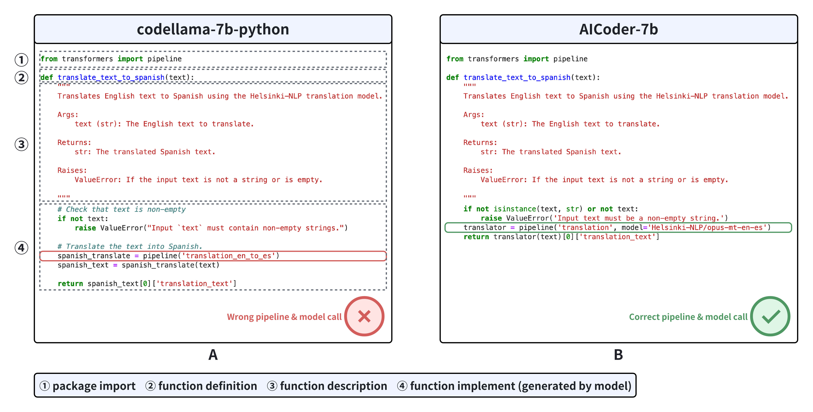
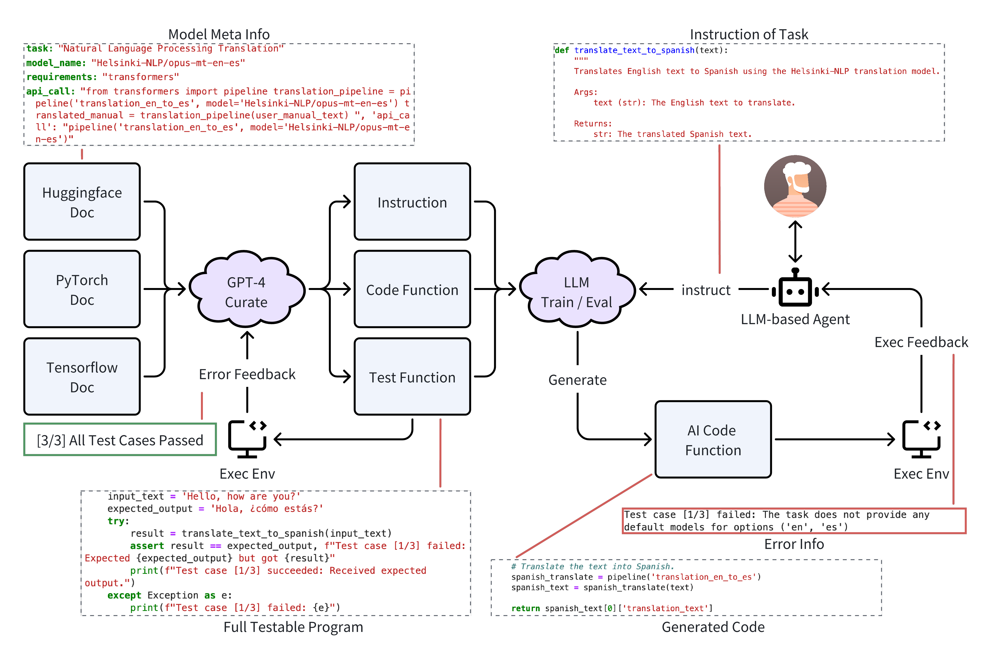
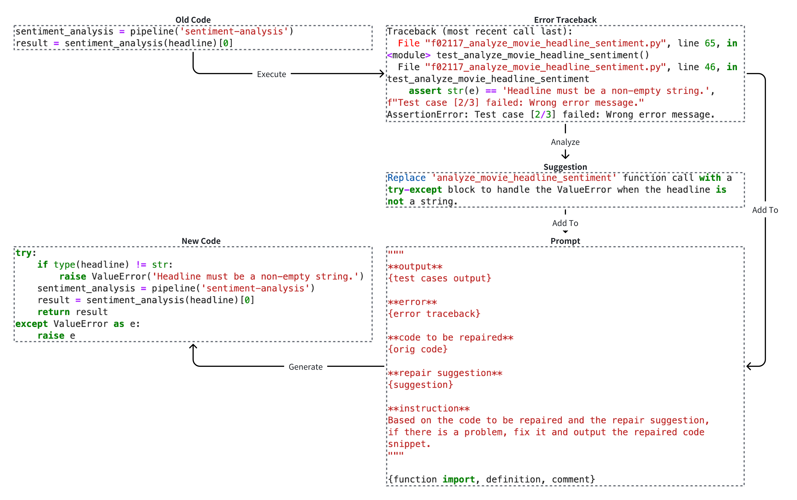

# AICoderEval：优化大型语言模型在AI领域的代码生成表现

发布时间：2024年06月07日

`Agent

理由：这篇论文主要介绍了CoderGen框架，这是一个基于代理的系统，用于帮助LLMs在AICoderEval数据集上生成与实际任务相关的代码。这里的“基于代理的系统”指的是使用代理（Agent）来增强LLMs的能力，因此归类为Agent。虽然论文中也提到了AICoderEval数据集和AICoder模型，但这些内容主要是为了支持代理系统的应用和评估，因此核心贡献在于代理系统的开发和应用。` `自动化软件开发` `人工智能`

> AICoderEval: Improving AI Domain Code Generation of Large Language Models

# 摘要

> 自动化代码生成是大型语言模型（LLMs）的核心能力，但在实际应用中评估这一能力颇具挑战。传统方法多聚焦于基础代码生成，如模型加载，而非针对实际任务的高级代码，如跨领域的图像转文本、文本分类等。为此，我们推出了AICoderEval数据集，基于HuggingFace、PyTorch和TensorFlow，专注于多领域的实际任务，并提供全面评估指标，旨在强化LLMs的特定任务代码生成能力。该数据集包含各任务的测试案例与完整程序，覆盖自然语言处理、计算机视觉及多模态学习等领域，并已开源于\url{https://huggingface.co/datasets/vixuowis/AICoderEval}。我们还开发了CoderGen框架，一个基于代理的系统，助力LLMs在AICoderEval上生成实际任务相关的代码。此外，我们训练了AICoder模型，一个在llama-3基础上优化的强大任务特定代码生成模型。实验显示，CoderGen显著提升了LLMs的特定任务代码生成能力（原始模型通过率提升12.00%，ReAct代理提升9.50%），而AICoder的表现也超越了现有代码生成LLMs，彰显了AICoderEval基准的卓越品质。

> Automated code generation is a pivotal capability of large language models (LLMs). However, assessing this capability in real-world scenarios remains challenging. Previous methods focus more on low-level code generation, such as model loading, instead of generating high-level codes catering for real-world tasks, such as image-to-text, text classification, in various domains. Therefore, we construct AICoderEval, a dataset focused on real-world tasks in various domains based on HuggingFace, PyTorch, and TensorFlow, along with comprehensive metrics for evaluation and enhancing LLMs' task-specific code generation capability. AICoderEval contains test cases and complete programs for automated evaluation of these tasks, covering domains such as natural language processing, computer vision, and multimodal learning. To facilitate research in this area, we open-source the AICoderEval dataset at \url{https://huggingface.co/datasets/vixuowis/AICoderEval}. After that, we propose CoderGen, an agent-based framework, to help LLMs generate codes related to real-world tasks on the constructed AICoderEval. Moreover, we train a more powerful task-specific code generation model, named AICoder, which is refined on llama-3 based on AICoderEval. Our experiments demonstrate the effectiveness of CoderGen in improving LLMs' task-specific code generation capability (by 12.00\% on pass@1 for original model and 9.50\% on pass@1 for ReAct Agent). AICoder also outperforms current code generation LLMs, indicating the great quality of the AICoderEval benchmark.

[Arxiv](https://arxiv.org/abs/2406.04712)