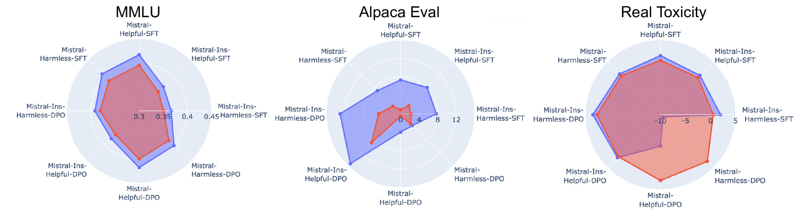
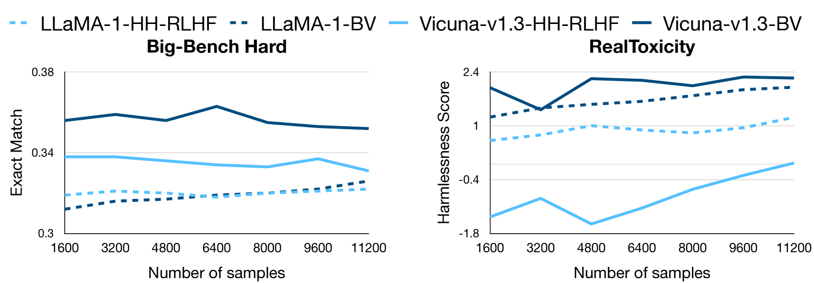
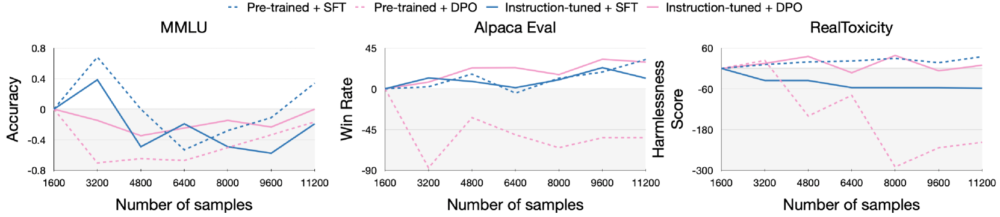
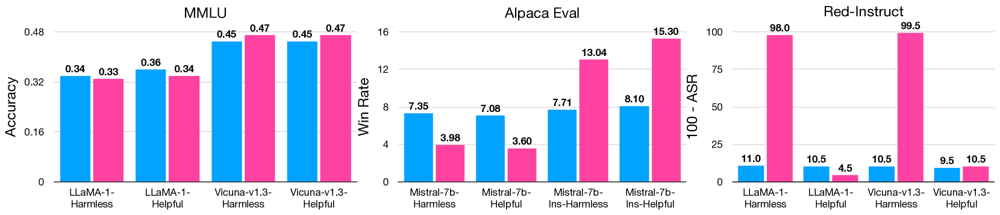
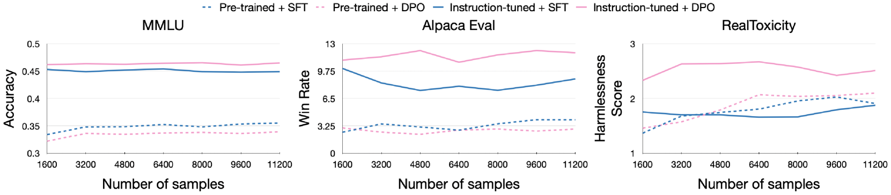
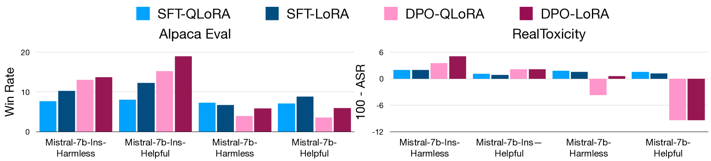

# 深入分析参数高效偏好对齐技术的利弊

发布时间：2024年06月07日

`LLM理论

理由：这篇论文主要探讨了大型语言模型（LLM）在微调过程中的关键因素，包括对齐数据集、对齐技术和模型的选择，以及这些因素对下游性能的影响。这些研究内容更偏向于理论分析和实验验证，而不是具体的应用或Agent行为，也不是关于RAG（Retrieval-Augmented Generation）模型的研究。因此，它更适合归类为LLM理论。` `机器学习`

> A Deep Dive into the Trade-Offs of Parameter-Efficient Preference Alignment Techniques

# 摘要

> 大型语言模型首先在海量数据上预训练，随后根据特定需求进行微调。尽管预训练因计算需求巨大而难以普及，但得益于LoRA和QLoRA等高效参数方法，微调已变得可行。对齐过程受多种因素影响，如数据量质、对齐技术和适配器等级，但这些因素对下游性能的具体影响尚未得到充分研究。为此，我们深入探讨了三个关键因素的选择对性能的影响：(i) 对齐数据集（HH-RLHF与BeaverTails），(ii) 对齐技术（SFT与DPO），及(iii) 模型（LLaMA-1、Vicuna-v1.3、Mistral-7b和Mistral-7b-Instruct）。通过超过300次的实验，我们发现了一些一致的趋势和意外结果，例如信息更丰富的数据有助于偏好对齐，监督微调在某些情况下优于偏好优化，以及对齐到特定偏好能显著提升下游任务性能。基于这些深入分析，我们提出了实用指南，以指导研究人员更高效地进行LLM的参数微调。

> Large language models are first pre-trained on trillions of tokens and then instruction-tuned or aligned to specific preferences. While pre-training remains out of reach for most researchers due to the compute required, fine-tuning has become affordable thanks to parameter-efficient methods such as LoRA and QLoRA. Alignment is known to be sensitive to the many factors involved, including the quantity and quality of data, the alignment method, and the adapter rank. However, there has not yet been an extensive study of their effect on downstream performance. To address this gap, we conduct an in-depth investigation of the impact of popular choices for three crucial axes: (i) the alignment dataset (HH-RLHF and BeaverTails), (ii) the alignment technique (SFT and DPO), and (iii) the model (LLaMA-1, Vicuna-v1.3, Mistral-7b, and Mistral-7b-Instruct). Our extensive setup spanning over 300 experiments reveals consistent trends and unexpected findings. We observe how more informative data helps with preference alignment, cases where supervised fine-tuning outperforms preference optimization, and how aligning to a distinct preference boosts performance on downstream tasks. Through our in-depth analyses, we put forward key guidelines to help researchers perform more effective parameter-efficient LLM alignment.

[Arxiv](https://arxiv.org/abs/2406.04879)