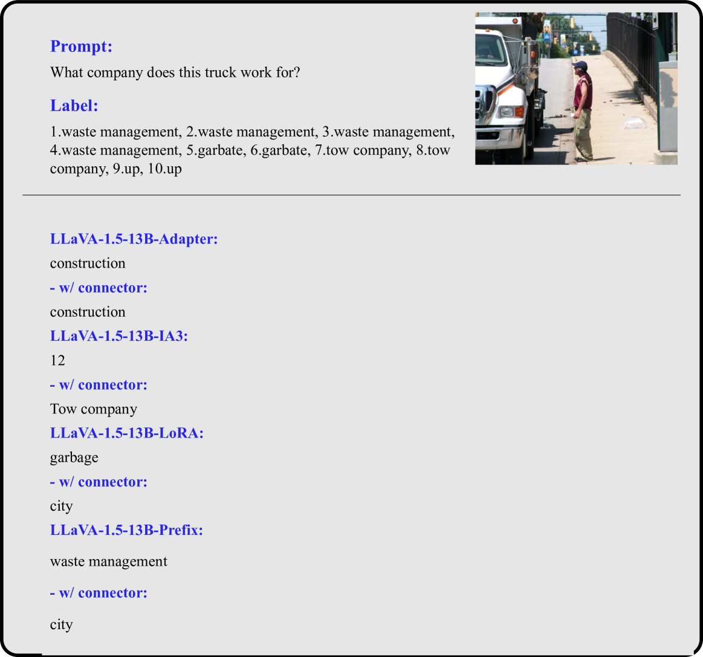
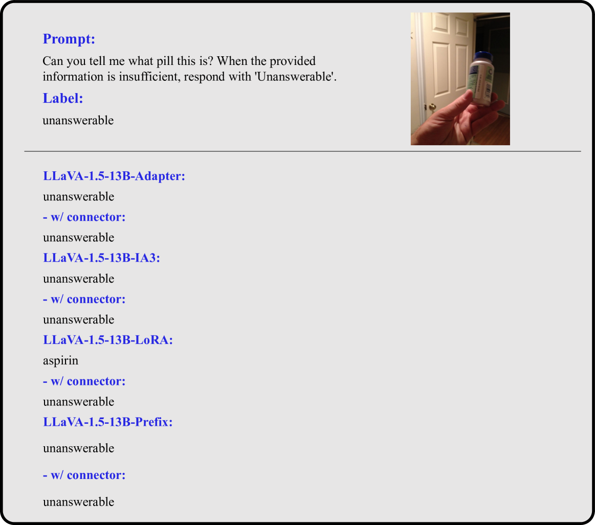

# 多模态大型语言模型参数高效微调的实证探索

发布时间：2024年06月07日

`LLM应用

理由：这篇论文主要探讨了多模态大型语言模型（MLLMs）在参数受限情况下的性能提升方法，即参数高效微调（PEFT）。论文通过实证研究分析了不同PEFT方法对模型性能的影响，并提供了具体的实验结果和分析。这属于对大型语言模型（LLM）在特定应用场景下的优化和改进，因此归类为LLM应用。` `人工智能` `机器学习`

> An Empirical Study on Parameter-Efficient Fine-Tuning for MultiModal Large Language Models

# 摘要

> 微调后的多模态大型语言模型（MLLMs）在多模态任务中表现出色，但面对数十亿参数的挑战，全面微调变得困难。为此，我们探索了参数高效微调（PEFT）方法，旨在提升在参数受限情况下的MLLMs性能。通过四种PEFT方法对开源MLLMs的LLM部分进行微调，我们进行了深入的实证研究，并全面分析了PEFT方法对模型、参数、模块位置、数据量、模型稳定性、泛化能力和幻觉的影响。在七个数据集上，我们发现适配器是最优的PEFT方法，而微调连接层在多数MLLMs中显著提升了性能。相关代码和数据已公开于https://github.com/alenai97/PEFT-MLLM.git。

> Multimodal large language models (MLLMs) fine-tuned with multimodal instruction datasets have demonstrated remarkable capabilities in multimodal tasks. However, fine-tuning all parameters of MLLMs has become challenging as they usually contain billions of parameters. To address this issue, we study parameter-efficient fine-tuning (PEFT) methods for MLLMs. We aim to identify effective methods for enhancing the performance of MLLMs in scenarios where only a limited number of parameters are trained. This paper conducts empirical studies using four popular PEFT methods to fine-tune the LLM component of open-source MLLMs. We present a comprehensive analysis that encompasses various aspects, including the impact of PEFT methods on various models, parameters and location of the PEFT module, size of fine-tuning data, model stability based on PEFT methods, MLLM's generalization, and hallucination. We evaluated four PEFT methods on seven datasets from two different categories: unseen and seen datasets. Across all experiments, we show that the adapter is the best-performing PEFT method. At the same time, fine-tuning the connector layers leads to improved performance in most MLLMs. Code and data are available at https://github.com/alenai97/PEFT-MLLM.git.

[Arxiv](https://arxiv.org/abs/2406.05130)