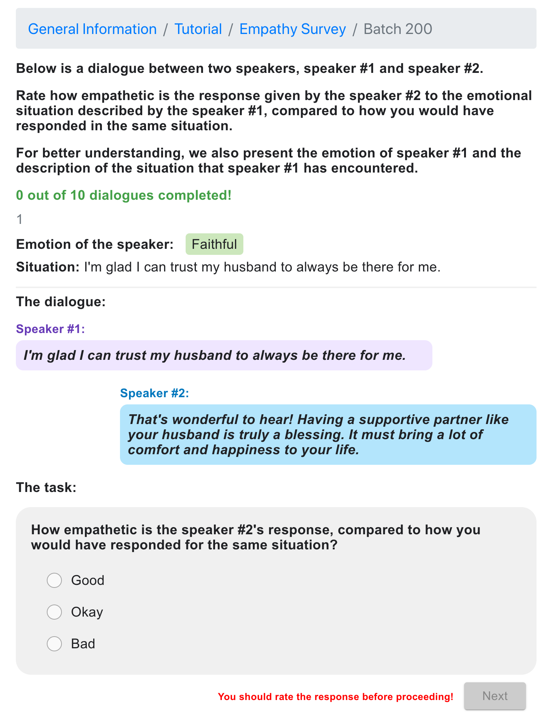

# 大型语言模型是否拥有超越人类的同理心？

发布时间：2024年06月07日

`LLM应用

这篇论文主要探讨了大型语言模型（LLMs）在情感识别和共情反应方面的能力，并通过实验对比了这些模型与人类的表现。研究特别关注了四种顶尖的LLMs（GPT-4、LLaMA-2-70B-Chat、Gemini-1.0-Pro和Mixtral-8x7B-Instruct）在处理不同情感对话提示时的共情反应质量。研究结果表明，这些LLMs在共情反应上能够显著超越人类，尤其是在GPT-4模型中表现最为突出。因此，这篇论文属于LLM应用分类，因为它专注于LLMs在实际应用场景中的性能评估和比较。` `情感分析` `人工智能`

> Are Large Language Models More Empathetic than Humans?

# 摘要

> 随着大型语言模型（LLMs）的兴起，探究它们在情感识别和共情反应等领域是否能超越人类已成为研究热点。本文深入探讨了GPT-4、LLaMA-2-70B-Chat、Gemini-1.0-Pro和Mixtral-8x7B-Instruct这四种顶尖LLMs的共情能力，并与人类表现进行了对比。通过一项涉及1000名参与者的跨组用户研究，我们评估了这些模型和人类对2000个涵盖32种不同正负面情感的对话提示的共情反应质量。研究结果显示，LLMs在共情反应上显著超越了人类，其中GPT-4表现最为出色，其“良好”评价的反应比人类基准高出约31%。紧随其后的是LLaMA-2、Mixtral-8x7B和Gemini-Pro，它们的“良好”评价分别提高了约24%、21%和10%。此外，我们还发现某些LLMs在回应特定情感时表现更为突出。本文提出的评估框架为未来评估新LLMs的共情能力提供了一种可扩展且灵活的方法，无需重复本研究。

> With the emergence of large language models (LLMs), investigating if they can surpass humans in areas such as emotion recognition and empathetic responding has become a focal point of research. This paper presents a comprehensive study exploring the empathetic responding capabilities of four state-of-the-art LLMs: GPT-4, LLaMA-2-70B-Chat, Gemini-1.0-Pro, and Mixtral-8x7B-Instruct in comparison to a human baseline. We engaged 1,000 participants in a between-subjects user study, assessing the empathetic quality of responses generated by humans and the four LLMs to 2,000 emotional dialogue prompts meticulously selected to cover a broad spectrum of 32 distinct positive and negative emotions. Our findings reveal a statistically significant superiority of the empathetic responding capability of LLMs over humans. GPT-4 emerged as the most empathetic, marking approximately 31% increase in responses rated as "Good" compared to the human benchmark. It was followed by LLaMA-2, Mixtral-8x7B, and Gemini-Pro, which showed increases of approximately 24%, 21%, and 10% in "Good" ratings, respectively. We further analyzed the response ratings at a finer granularity and discovered that some LLMs are significantly better at responding to specific emotions compared to others. The suggested evaluation framework offers a scalable and adaptable approach for assessing the empathy of new LLMs, avoiding the need to replicate this study's findings in future research.

[Arxiv](https://arxiv.org/abs/2406.05063)