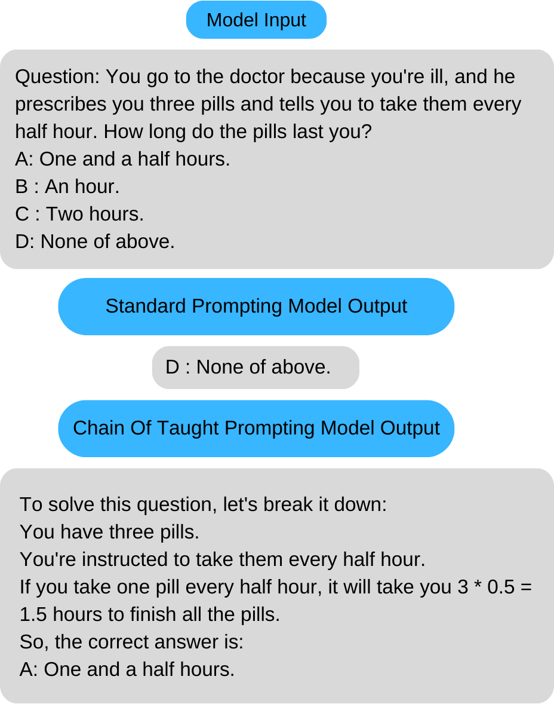
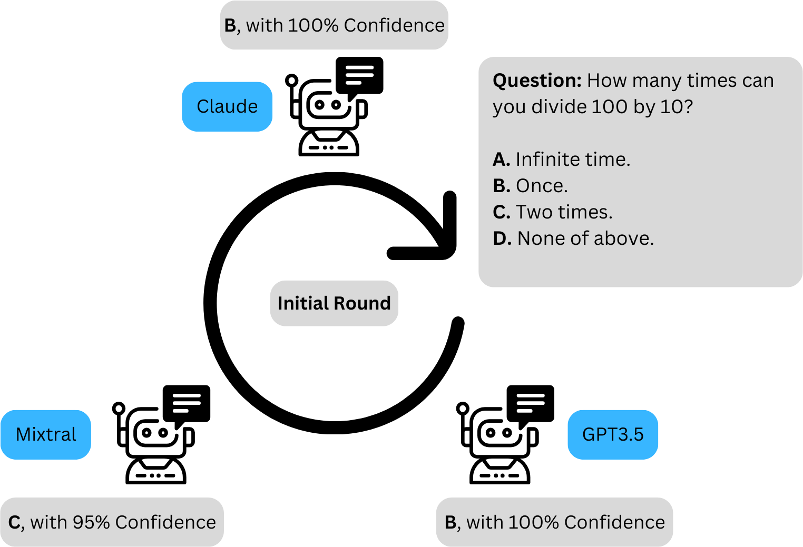
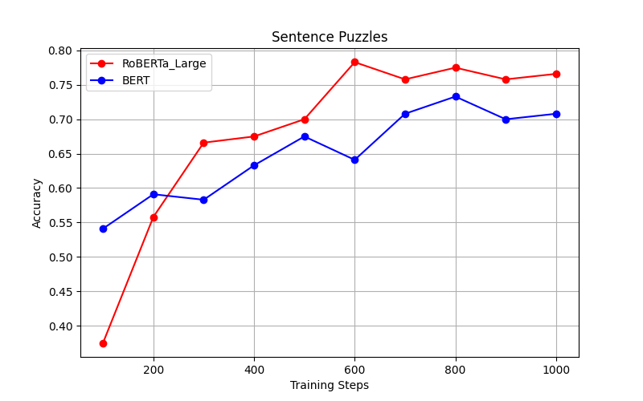
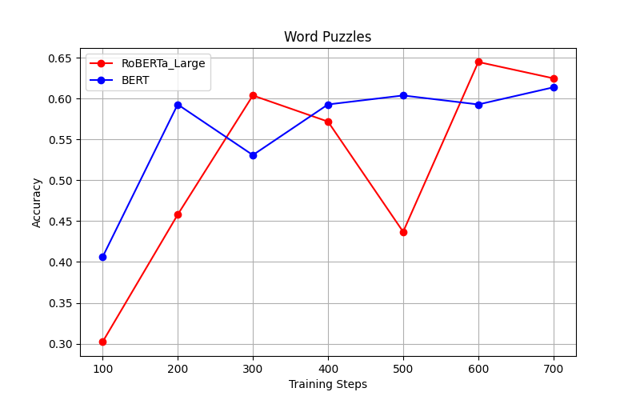
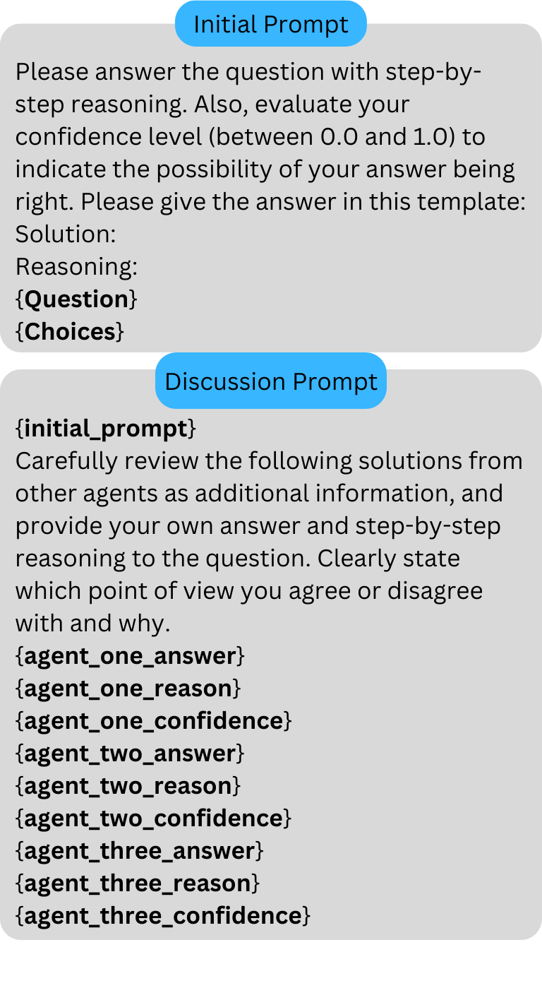

# BAMO 亮相 SemEval-2024 任务 9，推出名为“BRAINTEASER”的新挑战，旨在颠覆传统常识认知。

发布时间：2024年06月07日

`Agent

理由：这篇论文主要描述了一种针对特定任务（SemEval 2024 的 BRAINTEASER 任务）的策略，其中涉及使用多个语言模型（BERT、RoBERTa Large、GPT-3.5、Mixtral、Llama2）并通过多代理的“圆桌会议”方式达成共识答案。这种方法涉及多个模型的协同工作，类似于多代理系统的运作方式，因此更适合归类为Agent。虽然涉及到了LLM的应用，但核心在于多模型的协作和决策过程，这更符合Agent的定义。`

> BAMO at SemEval-2024 Task 9: BRAINTEASER: A Novel Task Defying Common Sense

# 摘要

> 本文介绍了我们针对 SemEval 2024 的 BRAINTEASER 任务的策略，该任务考验语言模型的创新思维。数据集中的多选题要求模型打破常规思考。我们微调了 BERT 和 RoBERTa Large 两个模型，并运用了链式思维零样本提示技术，涉及 GPT-3.5、Mixtral 和 Llama2 等六大语言模型。此外，我们采用 ReConcile 技术，通过多代理的“圆桌会议”方式，在三个精选模型中达成共识答案。我们的最佳方法在句子谜题子任务上取得了 85% 的准确率。

> This paper outlines our approach to SemEval 2024 Task 9, BRAINTEASER: A Novel Task Defying Common Sense. The task aims to evaluate the ability of language models to think creatively. The dataset comprises multi-choice questions that challenge models to think "outside of the box". We fine-tune 2 models, BERT and RoBERTa Large. Next, we employ a Chain of Thought (CoT) zero-shot prompting approach with 6 large language models, such as GPT-3.5, Mixtral, and Llama2. Finally, we utilize ReConcile, a technique that employs a "round table conference" approach with multiple agents for zero-shot learning, to generate consensus answers among 3 selected language models. Our best method achieves an overall accuracy of 85 percent on the sentence puzzles subtask.

[Arxiv](https://arxiv.org/abs/2406.04947)