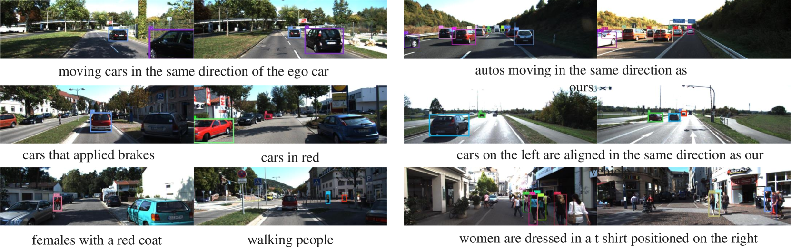
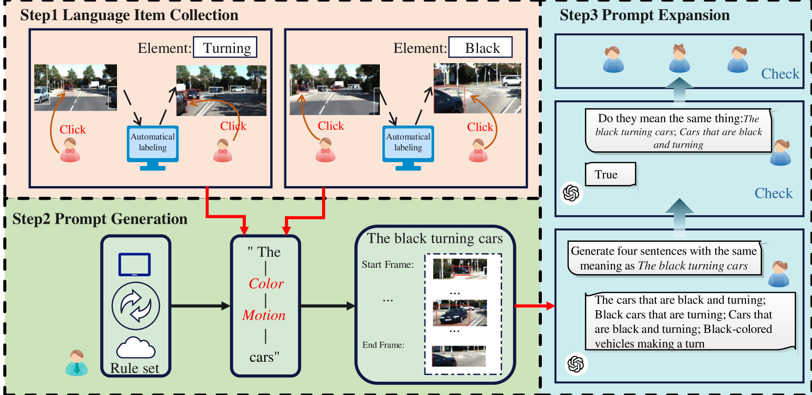
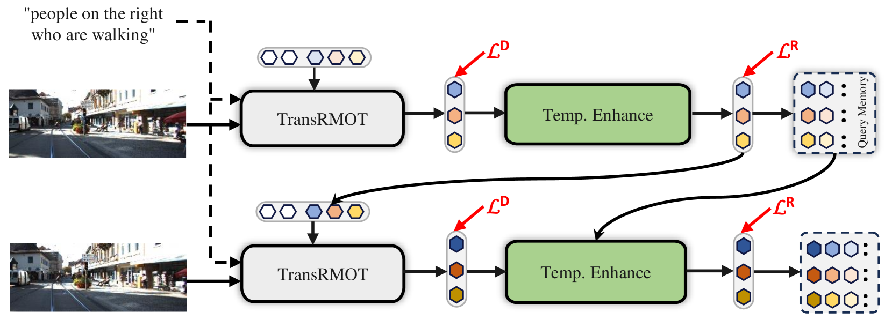

# 自举式多目标引用跟踪

发布时间：2024年06月07日

`Agent

理由：这篇论文主要关注的是多目标跟踪技术（RMOT），并引入了新的数据集和语言词汇来改进这一任务。论文中提到的“根据自然语言指令精准追踪多个目标”表明这是一个涉及智能代理（Agent）执行任务的研究，即代理需要理解和执行自然语言指令来完成跟踪任务。此外，论文中提到的“时间推进策略”和“端到端框架”的优化，进一步强调了这是一个关于智能代理如何有效执行任务的研究。因此，这篇论文更适合归类为Agent。` `自动驾驶` `计算机视觉`

> Bootstrapping Referring Multi-Object Tracking

# 摘要

> 参考多目标跟踪（RMOT）技术旨在根据自然语言指令精准追踪多个目标。现有的RMOT基准多依赖于人工标注和固定规则，这限制了其多样性和应用范围。本研究创新性地引入了大量具有区分性的语言词汇，以自动化这一任务。我们开发了Refer-KITTI-V2这一大规模数据集，初始包含2,719个手动注释，通过增加关键词和解决类别不平衡问题，使其更贴合真实世界。这些注释随后扩展至9,758个，利用大型语言模型生成了617个新词汇，显著超越了以往的RMOT基准。此外，我们还提出了一种简洁高效的时间推进策略，优化了RMOT的端到端框架，性能优于先前方法。源代码和数据集已公开于https://github.com/zyn213/TempRMOT。

> Referring multi-object tracking (RMOT) aims at detecting and tracking multiple objects following human instruction represented by a natural language expression. Existing RMOT benchmarks are usually formulated through manual annotations, integrated with static regulations. This approach results in a dearth of notable diversity and a constrained scope of implementation. In this work, our key idea is to bootstrap the task of referring multi-object tracking by introducing discriminative language words as much as possible. In specific, we first develop Refer-KITTI into a large-scale dataset, named Refer-KITTI-V2. It starts with 2,719 manual annotations, addressing the issue of class imbalance and introducing more keywords to make it closer to real-world scenarios compared to Refer-KITTI. They are further expanded to a total of 9,758 annotations by prompting large language models, which create 617 different words, surpassing previous RMOT benchmarks. In addition, the end-to-end framework in RMOT is also bootstrapped by a simple yet elegant temporal advancement strategy, which achieves better performance than previous approaches. The source code and dataset is available at https://github.com/zyn213/TempRMOT.

[Arxiv](https://arxiv.org/abs/2406.05039)