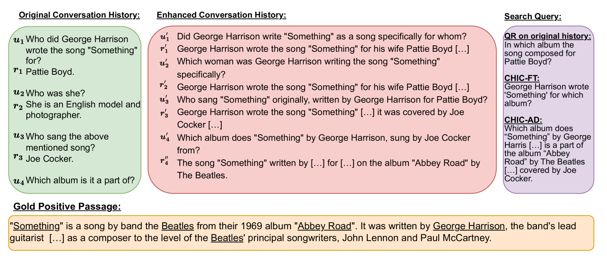

# CHIQ：提升对话搜索查询重写效果的上下文历史增强技术

发布时间：2024年06月07日

`LLM应用

这篇论文探讨了开源大型语言模型（LLMs）在对话搜索中的应用，特别是通过提出的CHIQ方法改进模糊查询重写。这种方法通过解析对话历史中的歧义并进行查询重写，展示了开源LLMs在对话搜索领域的有效性，并作为商业LLMs的替代方案。因此，这篇论文属于LLM应用分类。` `对话搜索` `开源软件`

> CHIQ: Contextual History Enhancement for Improving Query Rewriting in Conversational Search

# 摘要

> 本文探讨了开源大型语言模型（LLMs）在对话搜索中改进模糊查询重写的有效应用。我们提出的CHIQ方法，通过两步流程，先解析对话历史中的歧义，再进行查询重写，与以往依赖闭源LLMs直接生成搜索查询的做法不同。在五大权威基准测试中，CHIQ展现了顶尖性能，与闭源LLMs系统并驾齐驱。本研究标志着开源LLMs在对话搜索领域作为商业LLMs替代方案的首次尝试。相关数据、模型及源码将在接受后公开于https://github.com/fengranMark/CHIQ。

> In this paper, we study how open-source large language models (LLMs) can be effectively deployed for improving query rewriting in conversational search, especially for ambiguous queries. We introduce CHIQ, a two-step method that leverages the capabilities of LLMs to resolve ambiguities in the conversation history before query rewriting. This approach contrasts with prior studies that predominantly use closed-source LLMs to directly generate search queries from conversation history. We demonstrate on five well-established benchmarks that CHIQ leads to state-of-the-art results across most settings, showing highly competitive performances with systems leveraging closed-source LLMs. Our study provides a first step towards leveraging open-source LLMs in conversational search, as a competitive alternative to the prevailing reliance on commercial LLMs. Data, models, and source code will be publicly available upon acceptance at https://github.com/fengranMark/CHIQ.

[Arxiv](https://arxiv.org/abs/2406.05013)