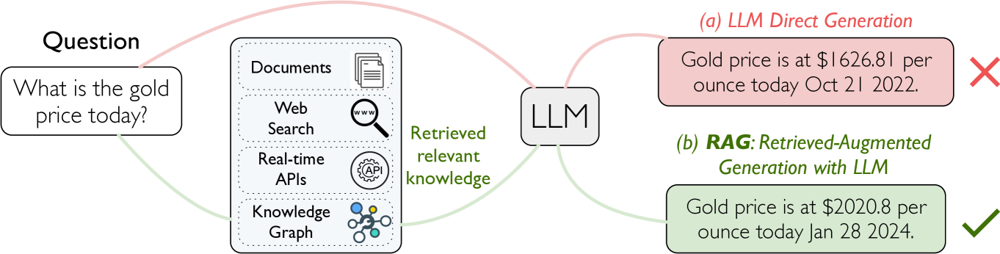
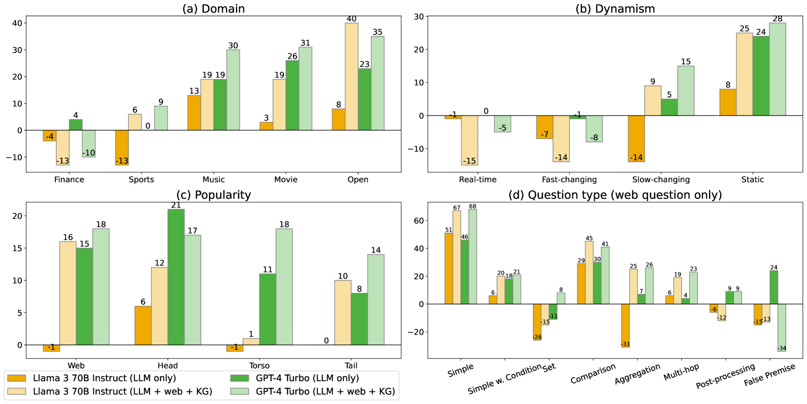
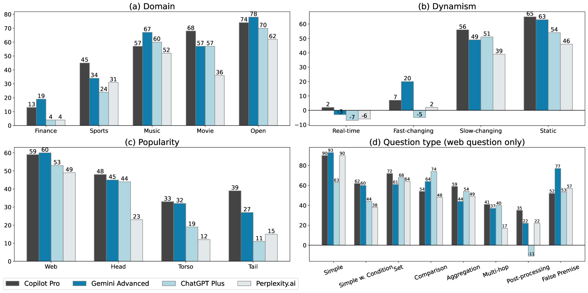

# CRAG - 全面评估 RAG 性能的基准

发布时间：2024年06月07日

`RAG

理由：这篇论文主要介绍了 Comprehensive RAG Benchmark (CRAG)，这是一个专门为评估 Retrieval-Augmented Generation (RAG) 模型在真实世界问答任务中的表现而设计的数据集。论文讨论了RAG模型在处理不同类型问题时的性能，并指出了未来研究的方向。因此，这篇论文更符合RAG分类，因为它专注于RAG模型的评估和改进，而不是Agent、LLM应用或LLM理论。` `问答系统` `数据集`

> CRAG -- Comprehensive RAG Benchmark

# 摘要

> 最近，Retrieval-Augmented Generation (RAG) 作为一种有前景的解决方案，旨在弥补大型语言模型 (LLM) 在知识储备上的不足。然而，现有的 RAG 数据集未能充分体现真实世界问答 (QA) 任务的多样性和动态性。为此，我们推出了 Comprehensive RAG Benchmark (CRAG)，这是一个包含 4,409 个问答对及模拟网络和知识图谱搜索的 API 的事实问答基准。CRAG 覆盖了五个领域和八种问题类型，反映了从流行到长尾的实体流行度变化，以及从年份到秒的时间动态性。我们的评估显示，尽管大多数先进的 LLM 在 CRAG 上的准确率不超过 34%，但引入 RAG 后，准确率仅提升至 44%。行业内顶尖的 RAG 解决方案在没有幻觉的情况下仅能回答 63% 的问题。CRAG 还揭示了在处理动态性更高、流行度更低或更复杂的事实问题时，准确度显著下降，指明了未来研究的方向。CRAG 基准已成为 2024 年 KDD Cup 挑战赛的基础，吸引了数千名参与者和在比赛前 50 天内的众多提交。我们致力于持续维护 CRAG，以支持研究社区在 RAG 和通用 QA 解决方案上的进步。

> Retrieval-Augmented Generation (RAG) has recently emerged as a promising solution to alleviate Large Language Model (LLM)'s deficiency in lack of knowledge. Existing RAG datasets, however, do not adequately represent the diverse and dynamic nature of real-world Question Answering (QA) tasks. To bridge this gap, we introduce the Comprehensive RAG Benchmark (CRAG), a factual question answering benchmark of 4,409 question-answer pairs and mock APIs to simulate web and Knowledge Graph (KG) search. CRAG is designed to encapsulate a diverse array of questions across five domains and eight question categories, reflecting varied entity popularity from popular to long-tail, and temporal dynamisms ranging from years to seconds. Our evaluation on this benchmark highlights the gap to fully trustworthy QA. Whereas most advanced LLMs achieve <=34% accuracy on CRAG, adding RAG in a straightforward manner improves the accuracy only to 44%. State-of-the-art industry RAG solutions only answer 63% questions without any hallucination. CRAG also reveals much lower accuracy in answering questions regarding facts with higher dynamism, lower popularity, or higher complexity, suggesting future research directions. The CRAG benchmark laid the groundwork for a KDD Cup 2024 challenge, attracting thousands of participants and submissions within the first 50 days of the competition. We commit to maintaining CRAG to serve research communities in advancing RAG solutions and general QA solutions.

[Arxiv](https://arxiv.org/abs/2406.04744)