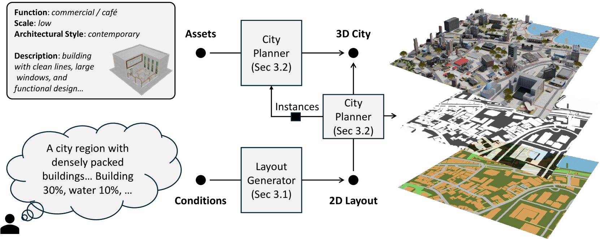
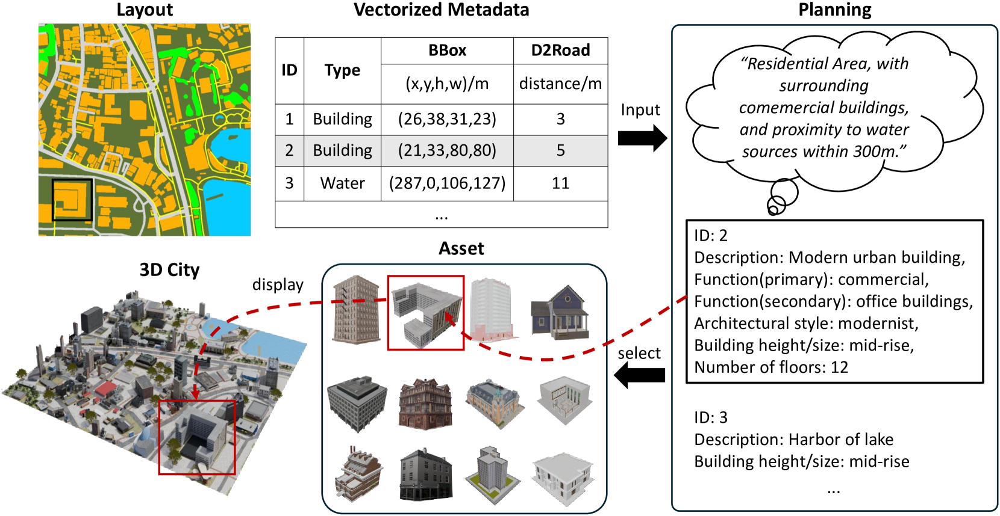
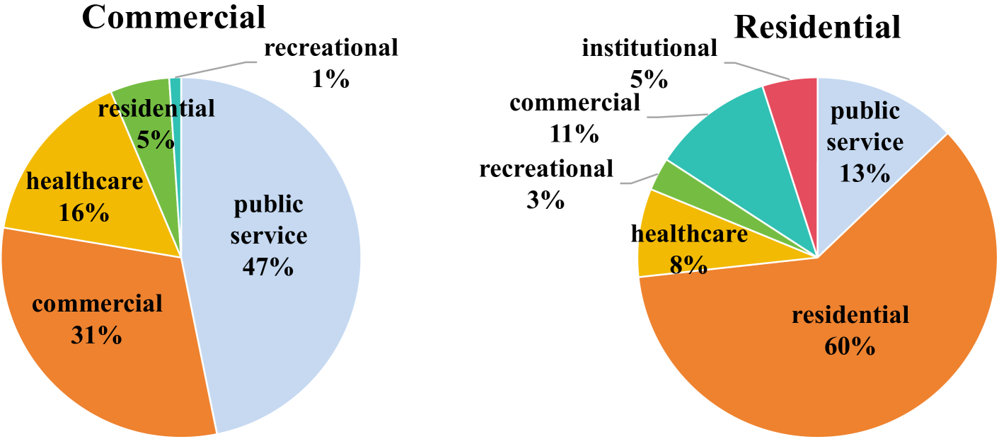
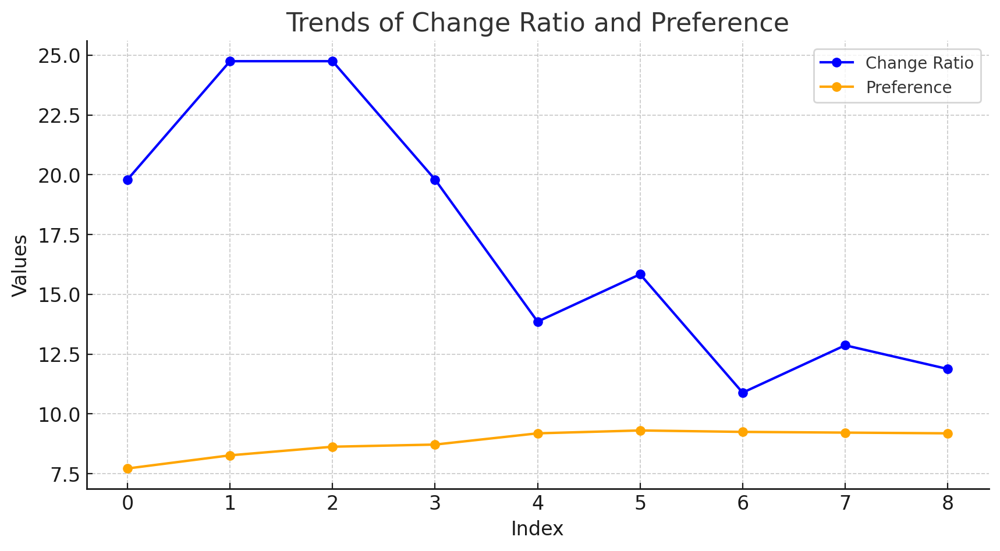
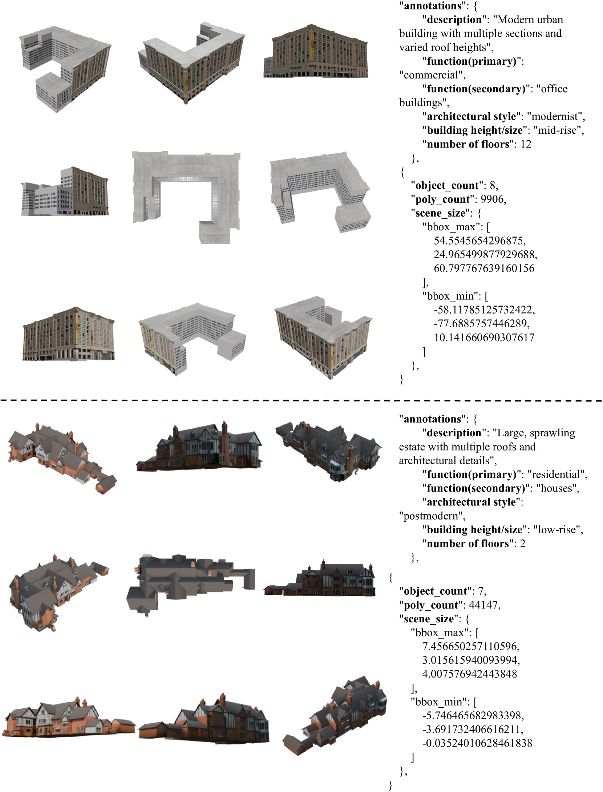

# CityCraft：打造真实3D城市的匠心之作

发布时间：2024年06月07日

`Agent

这篇论文介绍了一个名为 CityCraft 的框架，它通过使用扩散变换器模型和大型语言模型来生成多样化和高质量的城市场景。这个框架不仅涉及技术层面的创新，如使用扩散变换器模型来创造城市布局，还涉及智能规划土地用途和精确布置资产的步骤，这些都是通过一个智能系统（Agent）来实现的。因此，这篇论文更符合Agent分类，因为它描述了一个智能系统如何应用于城市场景生成，而不是仅仅讨论大型语言模型的理论或应用。` `自动驾驶` `智慧城市`

> CityCraft: A Real Crafter for 3D City Generation

# 摘要

> 城市场景生成在自动驾驶、智慧城市和交通模拟领域备受瞩目，它极大地促进了基础设施规划与监控的进步，但现有技术在多样性和真实感上仍有欠缺。为此，我们推出了CityCraft框架，它通过三个关键步骤提升城市生成的质量和多样性：首先，利用扩散变换器（DiT）模型创造多样且可控的二维城市布局；接着，大型语言模型（LLM）根据用户指令和语言指南，在布局内智能规划土地用途；最后，通过资产检索模块和Blender软件，精确布置资产并构建场景。此外，我们还贡献了两个新数据集：CityCraft-OSM包含城市区域的二维语义布局、卫星图像及详细注释；CityCraft-Buildings则提供了数千种高质量的三维建筑模型。CityCraft在生成逼真的三维城市方面达到了业界领先水平。

> City scene generation has gained significant attention in autonomous driving, smart city development, and traffic simulation. It helps enhance infrastructure planning and monitoring solutions. Existing methods have employed a two-stage process involving city layout generation, typically using Variational Autoencoders (VAEs), Generative Adversarial Networks (GANs), or Transformers, followed by neural rendering. These techniques often exhibit limited diversity and noticeable artifacts in the rendered city scenes. The rendered scenes lack variety, resembling the training images, resulting in monotonous styles. Additionally, these methods lack planning capabilities, leading to less realistic generated scenes. In this paper, we introduce CityCraft, an innovative framework designed to enhance both the diversity and quality of urban scene generation. Our approach integrates three key stages: initially, a diffusion transformer (DiT) model is deployed to generate diverse and controllable 2D city layouts. Subsequently, a Large Language Model(LLM) is utilized to strategically make land-use plans within these layouts based on user prompts and language guidelines. Based on the generated layout and city plan, we utilize the asset retrieval module and Blender for precise asset placement and scene construction. Furthermore, we contribute two new datasets to the field: 1)CityCraft-OSM dataset including 2D semantic layouts of urban areas, corresponding satellite images, and detailed annotations. 2) CityCraft-Buildings dataset, featuring thousands of diverse, high-quality 3D building assets. CityCraft achieves state-of-the-art performance in generating realistic 3D cities.

[Arxiv](https://arxiv.org/abs/2406.04983)