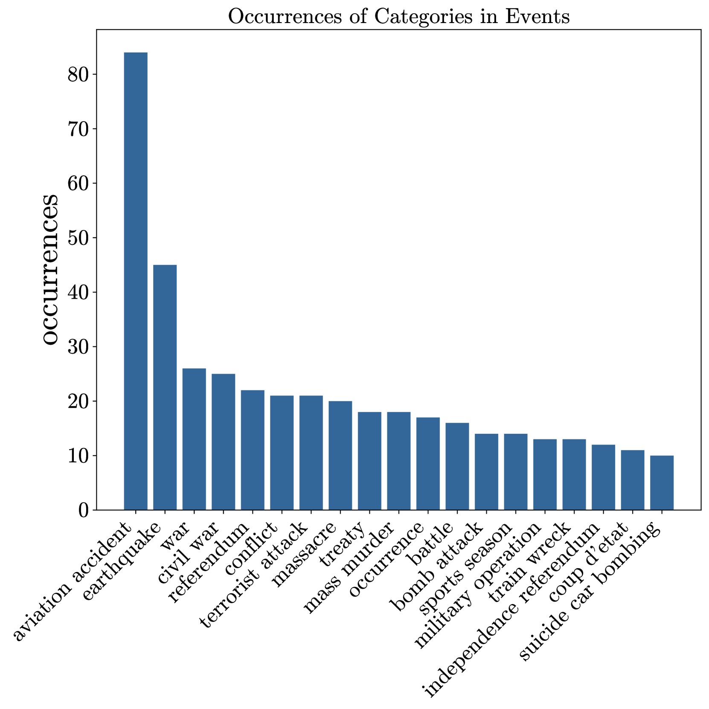

# ComplexTempQA：专为复杂时间问答任务设计的大型数据集

发布时间：2024年06月07日

`LLM应用

理由：这篇论文介绍了一个名为ComplexTempQA的大型数据集，专门设计来应对时间问答领域的挑战。该数据集的目的是为了评估和提升大型语言模型的时间推理能力，这是一个具体的应用场景，涉及到LLM在特定任务（时间问答）中的应用。因此，它属于LLM应用分类。` `问答系统` `时间推理`

> ComplexTempQA: A Large-Scale Dataset for Complex Temporal Question Answering

# 摘要

> 我们推出了ComplexTempQA，这是一个包含逾亿问答对的大型数据集，专为应对时间问答领域的挑战而设计。它在规模和覆盖面上远超HOTPOTQA、TORQUE和TEQUILA等现有基准。借助维基百科和Wikidata的丰富数据，该数据集跨越了二十年的问题，涵盖了广泛的主题。我们独创的分类法将问题细分为属性、比较和计数三大类，均围绕事件、实体和时间段。ComplexTempQA的独特之处在于其问题的高度复杂性，需要具备跨时间比较、时间聚合和多跳推理等高级回答技巧。每个问题都附有详尽的元数据，包括精确的时间范围，以便全面评估和提升大型语言模型的时间推理能力。ComplexTempQA不仅是开发精密AI模型的试验场，也是推动问答、信息检索和语言理解研究的前沿阵地。数据集和代码已开放获取于：https://github.com/DataScienceUIBK/ComplexTempQA。

> We introduce ComplexTempQA,a large-scale dataset consisting of over 100 million question-answer pairs designed to tackle the challenges in temporal question answering. ComplexTempQA significantly surpasses existing benchmarks like HOTPOTQA, TORQUE, and TEQUILA in scale and scope. Utilizing data from Wikipedia and Wikidata, the dataset covers questions spanning over two decades and offers an unmatched breadth of topics. We introduce a unique taxonomy that categorizes questions as attributes, comparisons, and counting questions, each revolving around events, entities, and time periods. One standout feature of ComplexTempQA is the high complexity of its questions, which demand effective capabilities for answering such as across-time comparison, temporal aggregation, and multi-hop reasoning involving temporal event ordering and entity recognition. Additionally, each question is accompanied by detailed metadata, including specific time scopes, allowing for comprehensive evaluation and enhancement of the temporal reasoning abilities of large language models. ComplexTempQA serves both as a testing ground for developing sophisticated AI models and as a foundation for advancing research in question answering, information retrieval, and language understanding. Dataset and code are freely available at: https://github.com/DataScienceUIBK/ComplexTempQA.

[Arxiv](https://arxiv.org/abs/2406.04866)