# 利用近似贪婪梯度下降策略进行语料库毒化

发布时间：2024年06月07日

`RAG

这篇论文主要讨论了针对密集检索器（如RAG系统中使用的）的语料库中毒攻击，并提出了一种新的攻击方法——近似贪婪梯度下降（AGGD）。这种攻击方法能够高效生成对抗性文章，从而影响系统的检索结果。因此，这篇论文的内容与RAG系统的安全性和对抗性攻击相关，属于RAG分类。` `信息安全` `人工智能`

> Corpus Poisoning via Approximate Greedy Gradient Descent

# 摘要

> 密集检索器不仅在信息检索中广泛应用，还成功扩展至语言模型等知识密集领域，如RAG系统。然而，这些系统近期被发现易受语料库中毒攻击，恶意用户只需注入少量对抗性文章，便能诱导系统在众多查询中将这些文章列为顶级结果。为深入了解此类攻击对密集检索器实际应用的限制，我们提出了一种名为近似贪婪梯度下降（AGGD）的新攻击方法，该方法基于HotFlip技术，能高效生成对抗性文章。通过采用更结构化的搜索替代随机令牌采样，AGGD能选择出比HotFlip更优质的令牌级扰动。实验证明，AGGD在多个数据集和检索器上均展现出高攻击成功率，并能适应未见过的查询和新领域。特别地，AGGD在攻击ANCE检索模型时表现卓越，与HotFlip相比，在NQ和MS MARCO数据集上的攻击成功率分别提升了17.6%和13.37%。此外，AGGD在其他对抗性攻击，如RAG系统的知识中毒中，也显示出替代HotFlip的潜力。

> Dense retrievers are widely used in information retrieval and have also been successfully extended to other knowledge intensive areas such as language models, e.g., Retrieval-Augmented Generation (RAG) systems. Unfortunately, they have recently been shown to be vulnerable to corpus poisoning attacks in which a malicious user injects a small fraction of adversarial passages into the retrieval corpus to trick the system into returning these passages among the top-ranked results for a broad set of user queries. Further study is needed to understand the extent to which these attacks could limit the deployment of dense retrievers in real-world applications. In this work, we propose Approximate Greedy Gradient Descent (AGGD), a new attack on dense retrieval systems based on the widely used HotFlip method for efficiently generating adversarial passages. We demonstrate that AGGD can select a higher quality set of token-level perturbations than HotFlip by replacing its random token sampling with a more structured search. Experimentally, we show that our method achieves a high attack success rate on several datasets and using several retrievers, and can generalize to unseen queries and new domains. Notably, our method is extremely effective in attacking the ANCE retrieval model, achieving attack success rates that are 17.6\% and 13.37\% higher on the NQ and MS MARCO datasets, respectively, compared to HotFlip. Additionally, we demonstrate AGGD's potential to replace HotFlip in other adversarial attacks, such as knowledge poisoning of RAG systems.\footnote{Code can be find in \url{https://github.com/JinyanSu1/AGGD}}

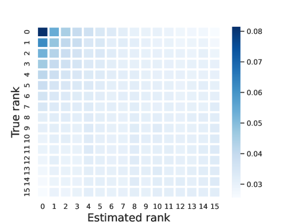

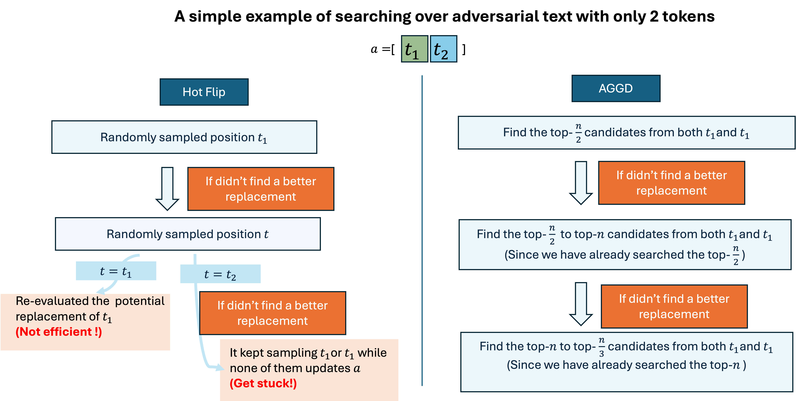

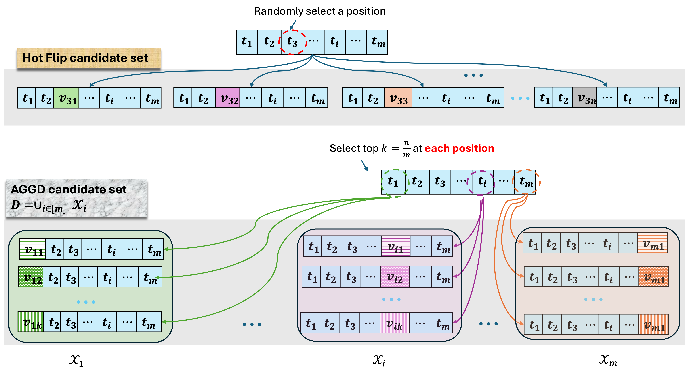

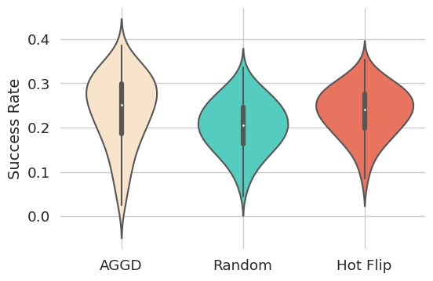

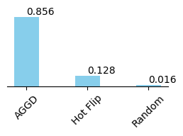

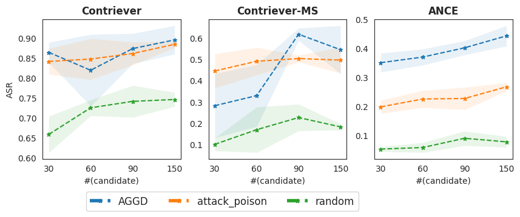

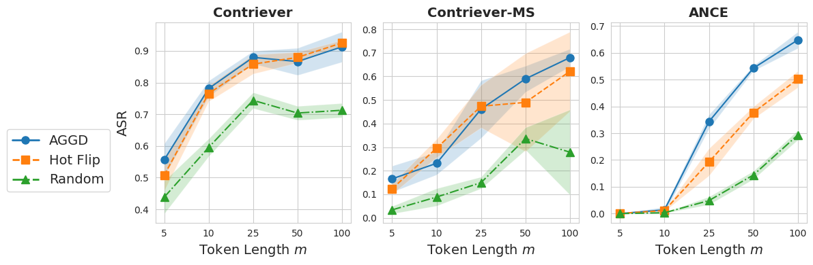

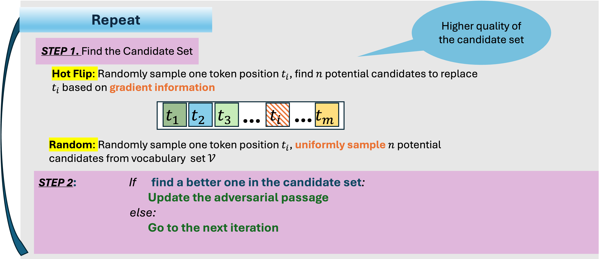

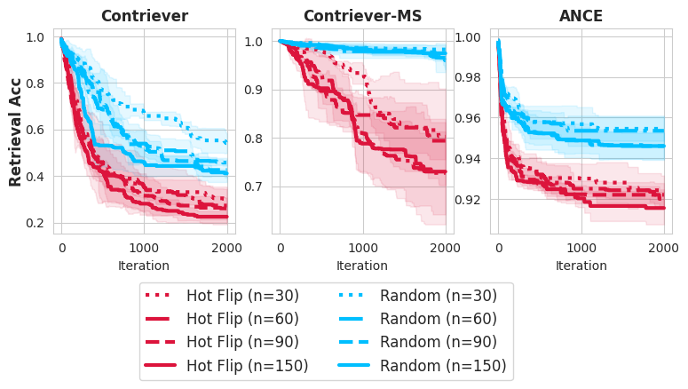

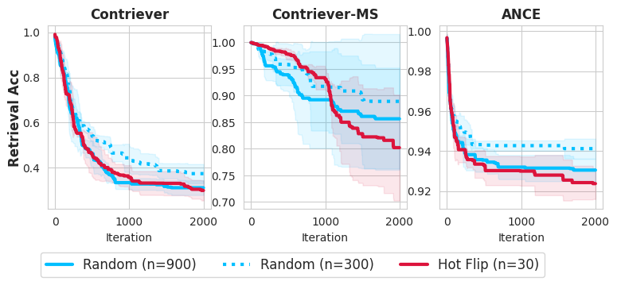

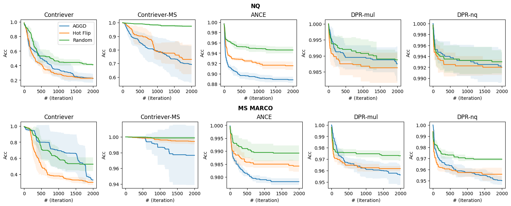

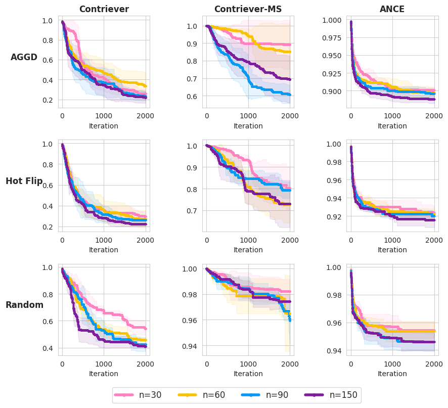

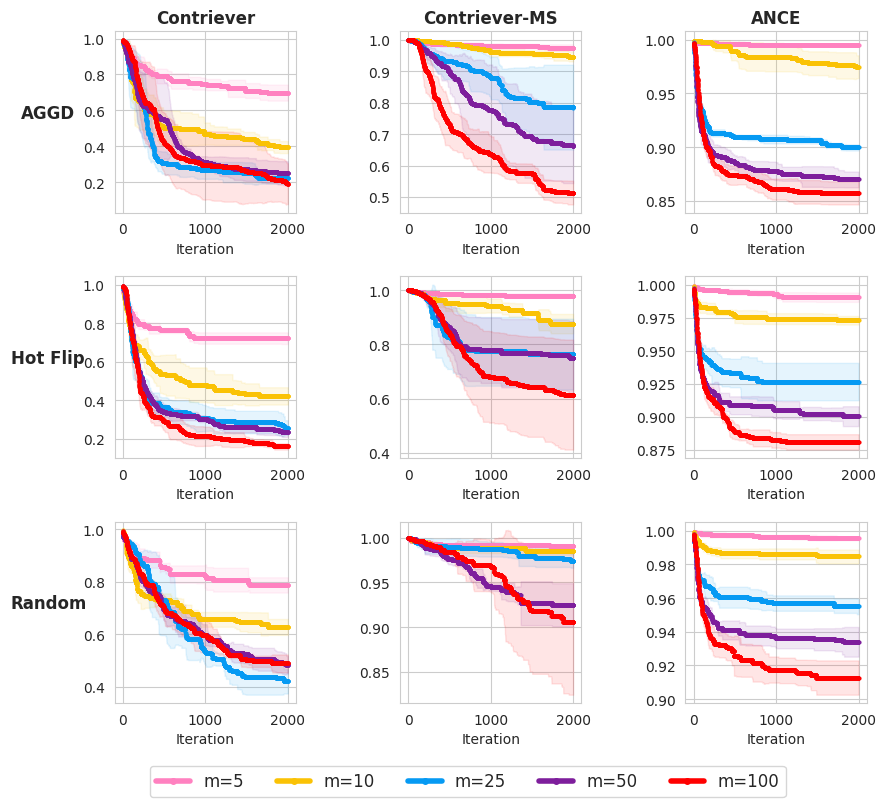

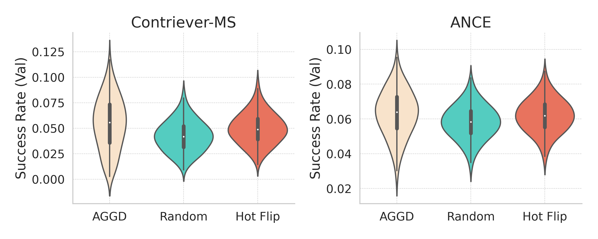

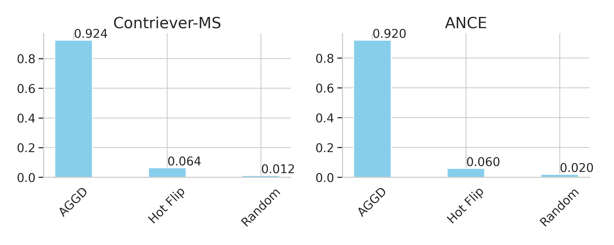

[Arxiv](https://arxiv.org/abs/2406.05087)