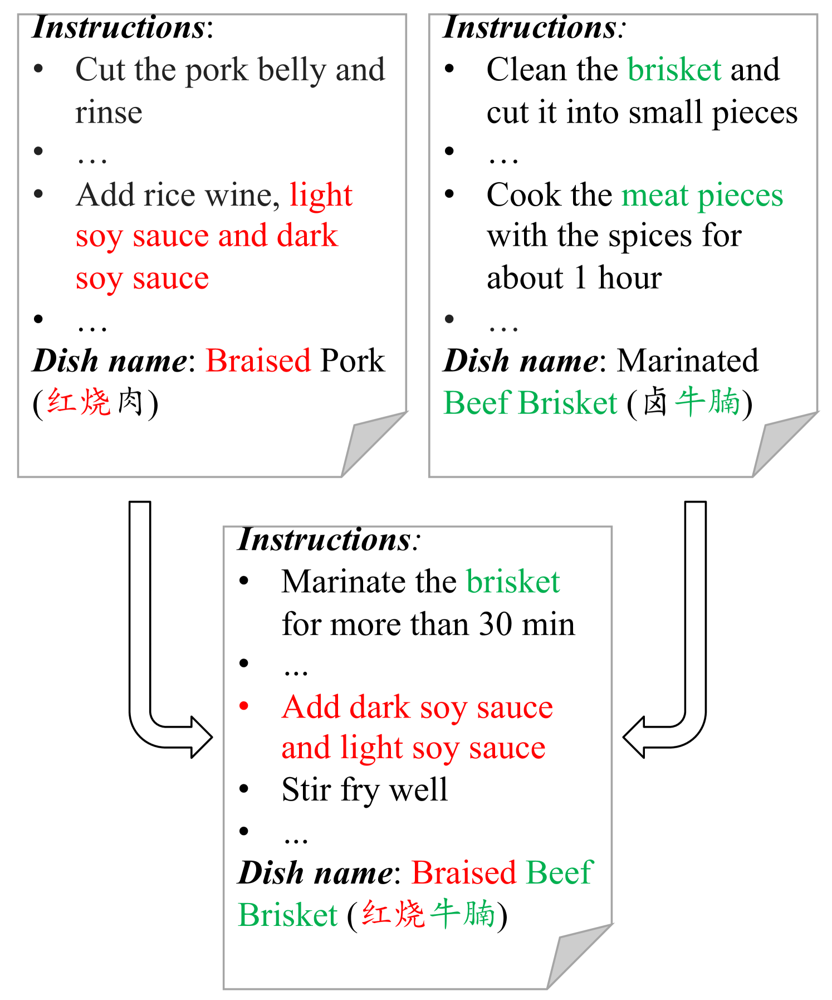
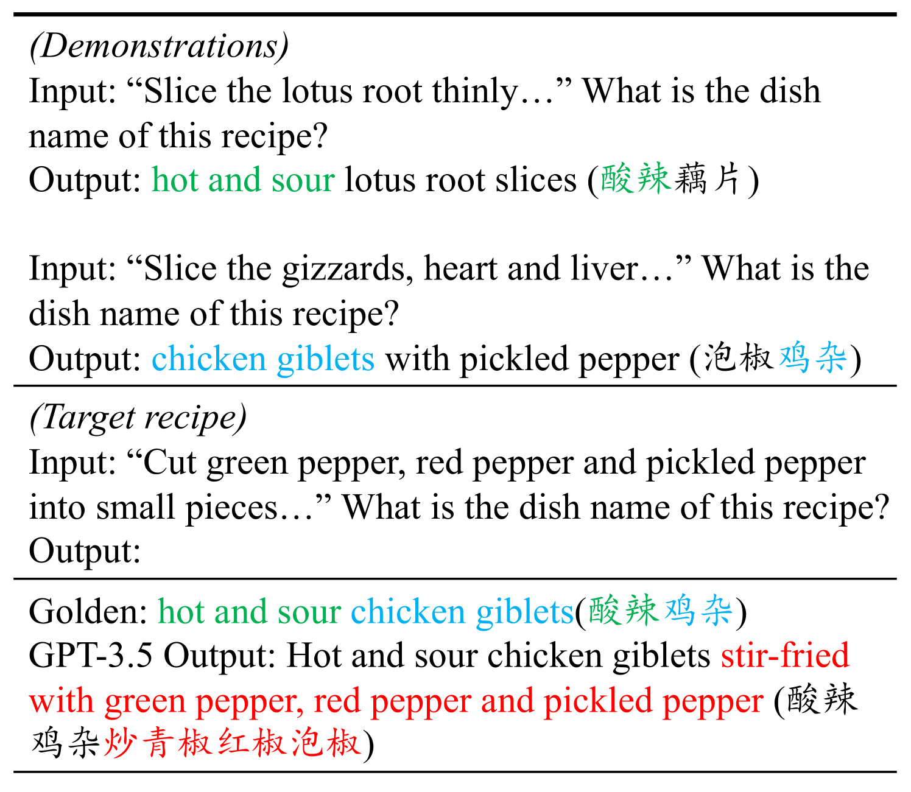
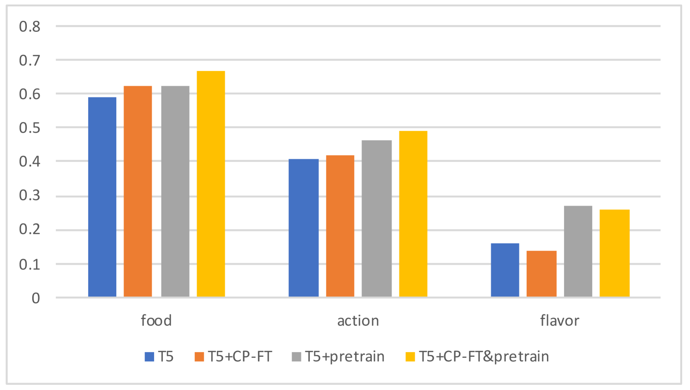
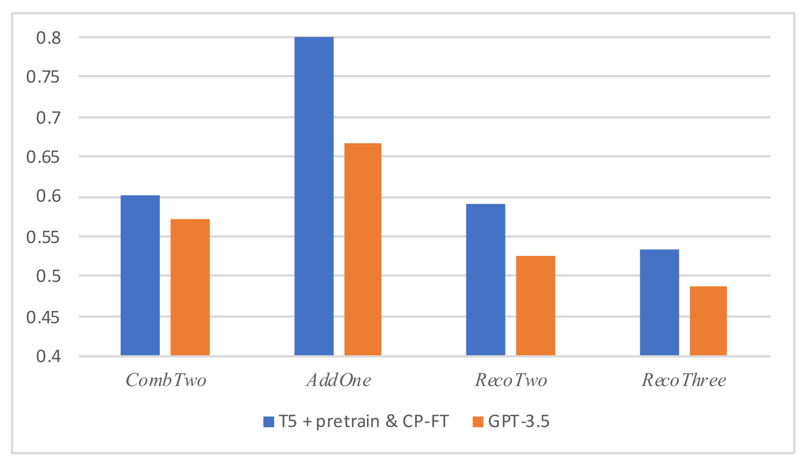
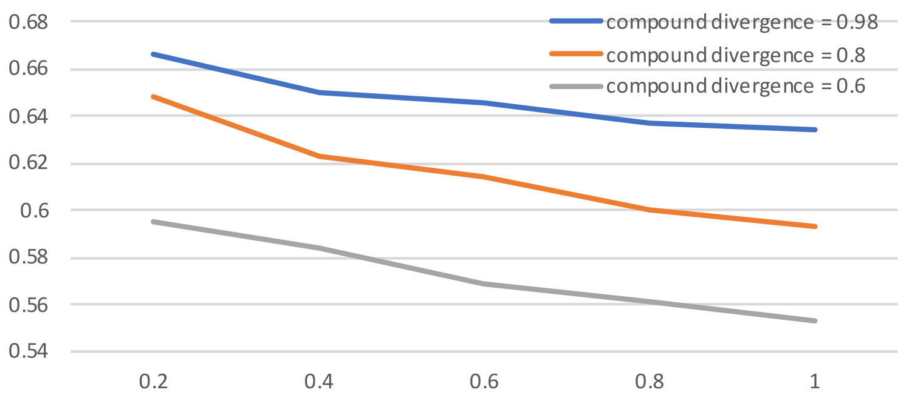

# DiNeR：专为评估组合泛化能力而设计的大型真实数据集

发布时间：2024年06月07日

`LLM应用

理由：这篇论文介绍了一个新的任务“菜名识别”（DiNeR），并构建了一个大规模的真实中文数据集，用于研究组合泛化。论文中提到了基于T5和大型语言模型（LLMs）设立的基准模型，这表明研究的重点是应用大型语言模型来解决实际的语言处理问题，而不是探讨LLM的理论基础或Agent的行为，也不是关于检索增强生成（RAG）的研究。因此，这篇论文最适合归类为“LLM应用”。`

> DiNeR: a Large Realistic Dataset for Evaluating Compositional Generalization

# 摘要

> 当前组合泛化数据集多为人工合成，缺乏自然语言的真实变异。尽管有尝试引入非合成数据，但仍面临数据量小或组合形式单一的问题。为此，我们推出了“菜名识别”（DiNeR）任务，并构建了一个包含3,811种菜肴和228,114份食谱的大规模真实中文数据集，涵盖丰富的语言现象。我们基于T5和LLMs设立了两个基准模型，旨在深入探讨组合泛化，并为菜名识别提供挑战与解决方案。相关代码和数据已公开于https://github.com/Jumpy-pku/DiNeR。

> Most of the existing compositional generalization datasets are synthetically-generated, resulting in a lack of natural language variation. While there have been recent attempts to introduce non-synthetic datasets for compositional generalization, they suffer from either limited data scale or a lack of diversity in the forms of combinations. To better investigate compositional generalization with more linguistic phenomena and compositional diversity, we propose the DIsh NamE Recognition (DiNeR) task and create a large realistic Chinese dataset. Given a recipe instruction, models are required to recognize the dish name composed of diverse combinations of food, actions, and flavors. Our dataset consists of 3,811 dishes and 228,114 recipes, and involves plenty of linguistic phenomena such as anaphora, omission and ambiguity. We provide two strong baselines based on T5 and large language models (LLMs). This work contributes a challenging task, baseline methods to tackle the task, and insights into compositional generalization in the context of dish name recognition. Code and data are available at https://github.com/Jumpy-pku/DiNeR.

[Arxiv](https://arxiv.org/abs/2406.04669)