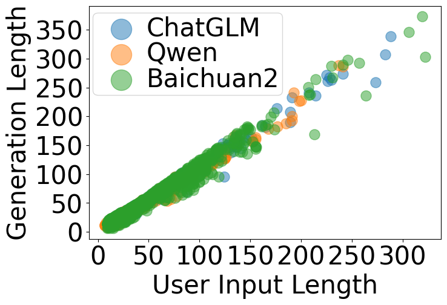
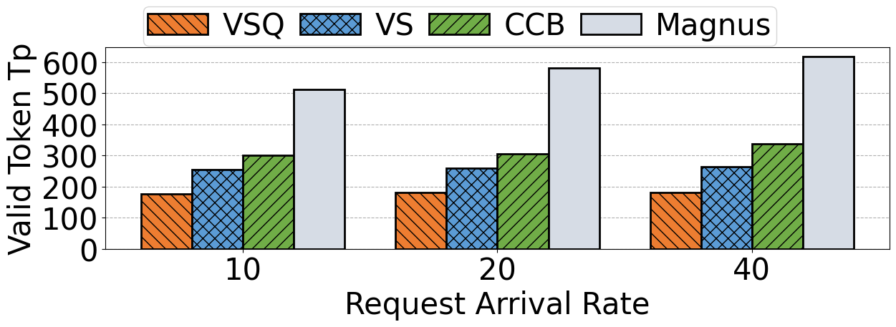

# 利用生成长度预测优化语言模型即服务（LMaaS）的批量服务效率

发布时间：2024年06月07日

`LLM应用

这篇论文主要讨论了在大型语言模型即服务（LMaaS）环境中，如何通过预测生成长度和自适应批量大小来优化请求处理，从而提高吞吐量和减少响应时间。这种方法直接应用于现有的LMaaS系统中，以改善其性能，因此属于LLM应用类别。` `云计算`

> Enabling Efficient Batch Serving for LMaaS via Generation Length Prediction

# 摘要

> 在当今的LMaaS环境中，大型语言模型通过API为各类应用提供服务。然而，现有系统因无法预知请求的生成长度，采用固定批量大小的FCFS策略，导致效率低下。一方面，短请求需等待长请求完成；另一方面，长请求占用更多内存，迫使系统采用小批量以防止OOM错误，限制了GPU的利用率。本文揭示了在LMaaS中，许多应用的生成长度与用户输入长度呈正相关。据此，我们开发了Magnus，它能根据用户输入、应用及用户语义特征精准预测生成长度，通过自适应批量大小将相似长度的请求批量处理，大幅提升吞吐量。Magnus还采用HRRN策略优化批次调度，显著缩短响应时间。实验结果显示，Magnus使吞吐量提升了234%，响应时间减少了89.7%。

> Nowadays, large language models (LLMs) are published as a service and can be accessed by various applications via APIs, also known as language-model-as-a-service (LMaaS). Without knowing the generation length of requests, existing serving systems serve requests in a first-come, first-served (FCFS) manner with a fixed batch size, which leads to two problems that affect batch serving efficiency. First, the generation lengths of requests in a batch vary, and requests with short generation lengths must wait for requests with long generation lengths to finish during the batch serving procedure. Second, requests with longer generation lengths consume more memory during serving. Without knowing the generation lengths of batched requests, the batch size is always set small to avoid the out-of-memory (OOM) error, thus preventing the GPU from being fully utilized. In this paper, we find that a significant number of popular applications in the LMaaS scenario have a positive correlation between the generation length and the length of raw user input. Based on this observation, we propose Magnus, which can accurately predict the request generation length with the user input length, application-level, and user-level semantic features. Accordingly, Magnus can achieve high request throughput by batching requests of similar generation lengths together with adaptive batch sizes. Besides, Magnus can also schedule batches with the highest response ratio next (HRRN) policy to reduce request response time. Experiments conducted on our testbed show that Magnus improves request throughput by up to 234\% and reduces response time by up to 89.7\% compared to baselines.

[Arxiv](https://arxiv.org/abs/2406.04785)