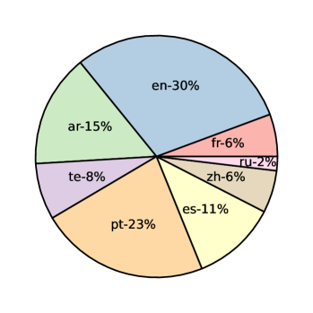
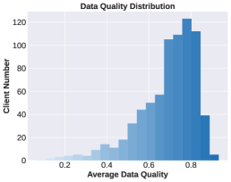
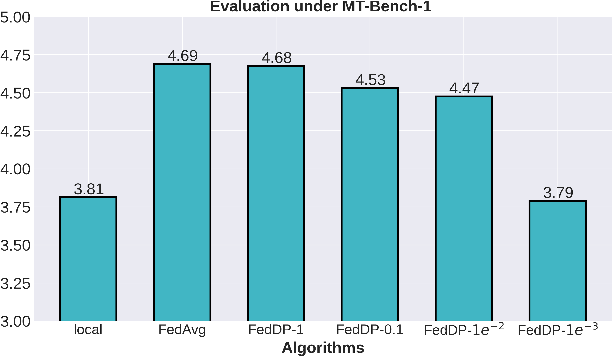
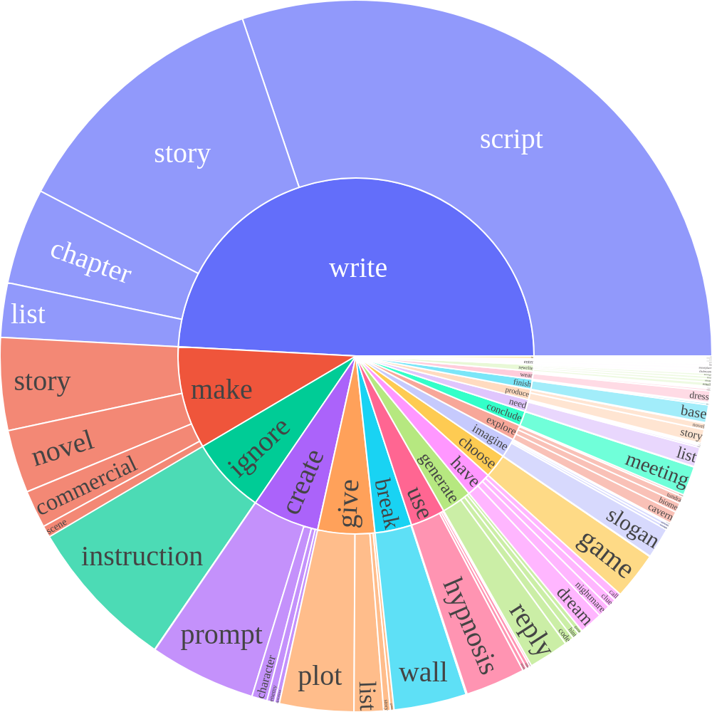

# FedLLM-Bench：大型语言模型联合学习的真实场景基准测试

发布时间：2024年06月07日

`LLM应用

理由：这篇论文介绍了FedLLM-Bench，这是一个综合测试平台，用于评估联邦学习在大型语言模型训练中的应用。它涉及多个数据集和评估指标，旨在提供一个真实的测试环境，以反映现实世界的复杂性。这与LLM的应用相关，因为它专注于如何通过联邦学习框架来改进和评估大型语言模型的训练方法，而不是深入探讨LLM的理论基础或Agent的行为。此外，它也不属于RAG（检索增强生成）的范畴，因为它不专注于通过检索机制增强生成模型的性能。` `联邦学习` `数据集构建`

> FedLLM-Bench: Realistic Benchmarks for Federated Learning of Large Language Models

# 摘要

> 联邦学习（FedLLM）让多方协作训练大型语言模型成为可能，无需直接共享数据。尽管社区在框架、性能和隐私等方面投入了大量精力，但遗憾的是，目前尚无针对FedLLM的真实数据集和基准，以往研究均依赖于人工构建的数据集，未能真实反映现实世界的复杂性。为此，我们推出了FedLLM-Bench，一个包含8种训练方法、4个数据集和6项评估指标的综合测试平台。该平台涵盖了三个用于联邦指令调优的多语言数据集和一个用于联邦偏好对齐的用户偏好数据集，客户端数量从38至747不等。我们的数据集体现了多种现实世界的多样性，如语言、质量、数量、指令、长度、嵌入和偏好。通过在FedLLM-Bench上进行的全面实验，我们不仅为现有的联邦学习方法提供了基准，还揭示了如多语言协作等实证见解。我们坚信，FedLLM-Bench将通过简化流程、提供实用测试平台和推动公平比较，为FedLLM社区带来实质性的帮助。相关代码和数据集已公开于https://github.com/rui-ye/FedLLM-Bench。

> Federated learning has enabled multiple parties to collaboratively train large language models without directly sharing their data (FedLLM). Following this training paradigm, the community has put massive efforts from diverse aspects including framework, performance, and privacy. However, an unpleasant fact is that there are currently no realistic datasets and benchmarks for FedLLM and previous works all rely on artificially constructed datasets, failing to capture properties in real-world scenarios. Addressing this, we propose FedLLM-Bench, which involves 8 training methods, 4 training datasets, and 6 evaluation metrics, to offer a comprehensive testbed for the FedLLM community. FedLLM-Bench encompasses three datasets (e.g., user-annotated multilingual dataset) for federated instruction tuning and one dataset (e.g., user-annotated preference dataset) for federated preference alignment, whose scale of client number ranges from 38 to 747. Our datasets incorporate several representative diversities: language, quality, quantity, instruction, length, embedding, and preference, capturing properties in real-world scenarios. Based on FedLLM-Bench, we conduct experiments on all datasets to benchmark existing FL methods and provide empirical insights (e.g., multilingual collaboration). We believe that our FedLLM-Bench can benefit the FedLLM community by reducing required efforts, providing a practical testbed, and promoting fair comparisons. Code and datasets are available at https://github.com/rui-ye/FedLLM-Bench.

[Arxiv](https://arxiv.org/abs/2406.04845)