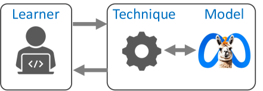

# 浏览器提示：评估语言模型在编程反馈生成中的基准测试

发布时间：2024年06月07日

`LLM应用

这篇论文主要探讨了大型语言模型（LLM）在编程教育中的应用，特别是在提供个性化反馈和提示方面的潜力。论文不仅关注了反馈的质量，还考虑了成本、时效和数据隐私等因素。通过利用浏览器内推理技术，论文提出了一种在浏览器中直接运行模型的方法，以降低成本并保护数据隐私。此外，论文还介绍了针对小模型的微调流程，并在Python编程数据集上进行了验证。这些内容都直接关联到LLM的具体应用场景，因此将其归类为LLM应用。` `编程教育` `人工智能教育`

> Hints-In-Browser: Benchmarking Language Models for Programming Feedback Generation

# 摘要

> 生成式AI和大型语言模型在编程教育中大有可为，它们能提供个性化反馈和提示，助力学习者。当前研究多聚焦于提升反馈质量，力求媲美人类导师。然而，在实际教育应用中，除了质量，还需考虑成本、时效和数据隐私等多重因素。本文对语言模型在编程反馈生成方面的表现进行了多维度评估，并利用浏览器内推理的新技术，直接在浏览器中运行模型，从而在成本和隐私保护上带来显著优势。我们基于GPT-4生成的数据，为兼容浏览器内推理的小模型设计了微调流程，并在三个Python编程数据集上验证了Llama3-8B和Phi3-3.8B 4位量化模型的效果。我们还将提供完整代码、网络应用及数据集，以推动浏览器内语言模型的研究。

> Generative AI and large language models hold great promise in enhancing programming education by generating individualized feedback and hints for learners. Recent works have primarily focused on improving the quality of generated feedback to achieve human tutors' quality. While quality is an important performance criterion, it is not the only criterion to optimize for real-world educational deployments. In this paper, we benchmark language models for programming feedback generation across several performance criteria, including quality, cost, time, and data privacy. The key idea is to leverage recent advances in the new paradigm of in-browser inference that allow running these models directly in the browser, thereby providing direct benefits across cost and data privacy. To boost the feedback quality of small models compatible with in-browser inference engines, we develop a fine-tuning pipeline based on GPT-4 generated synthetic data. We showcase the efficacy of fine-tuned Llama3-8B and Phi3-3.8B 4-bit quantized models using WebLLM's in-browser inference engine on three different Python programming datasets. We will release the full implementation along with a web app and datasets to facilitate further research on in-browser language models.

[Arxiv](https://arxiv.org/abs/2406.05053)