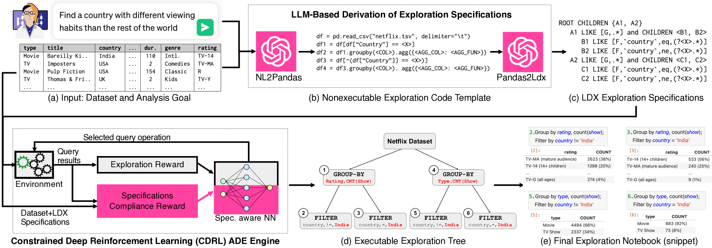
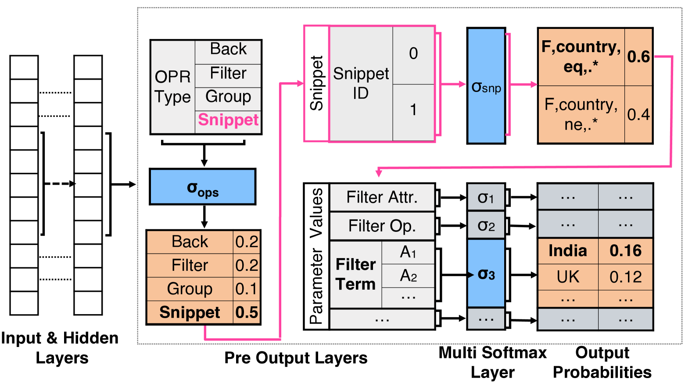
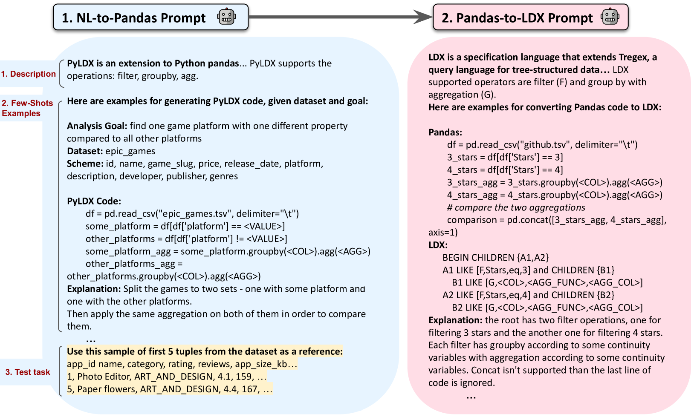
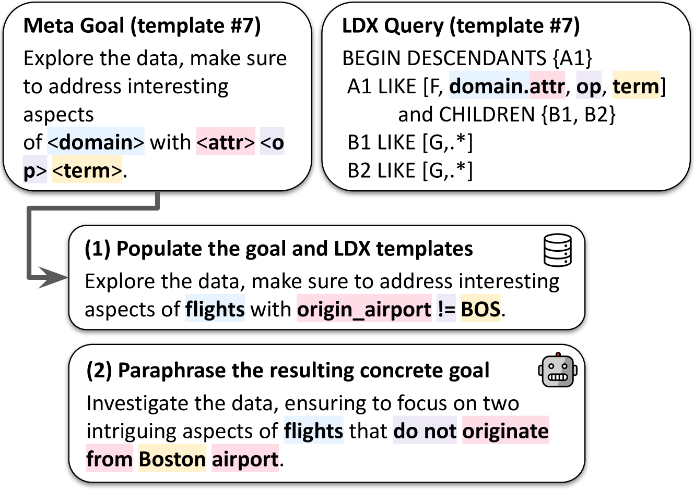
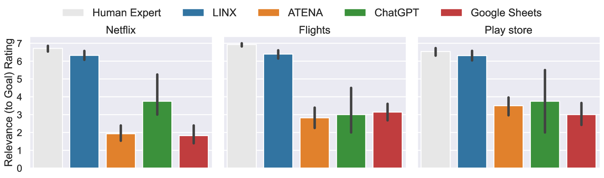
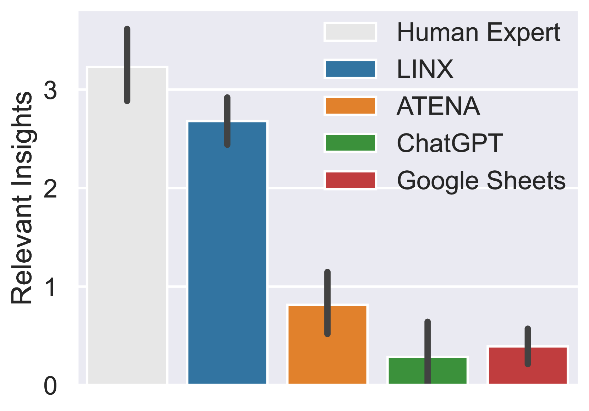
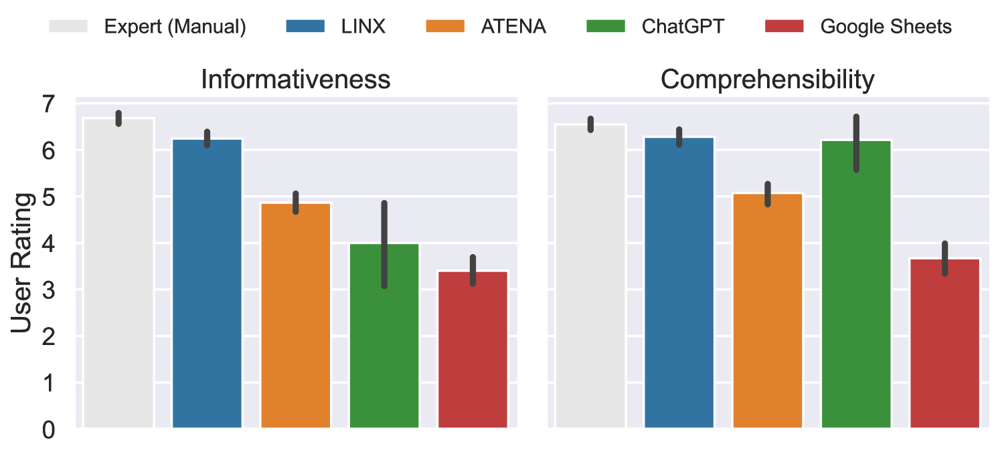
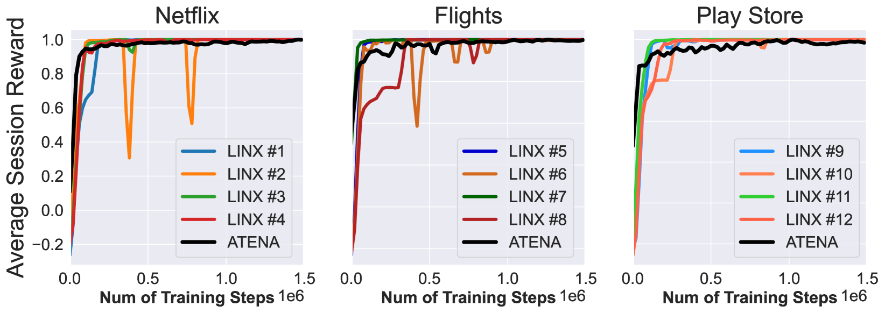
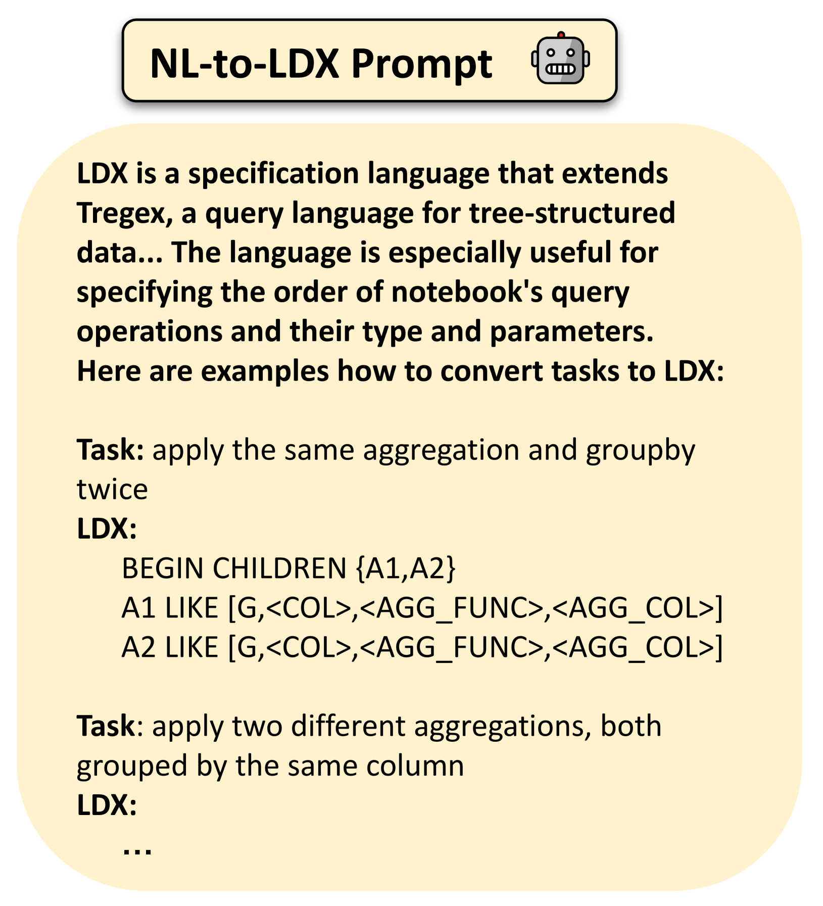

# LINX：语言驱动的目标导向自动数据探索生成系统。

发布时间：2024年06月07日

`Agent

这篇论文介绍了一个名为LINX的系统，它通过自然语言接口增强，专注于目标导向的数据探索。用户提供数据集和用自然语言描述的分析目标，LINX利用大型语言模型（LLM）理解分析目标，并据此制定探索会话的详细规范。这些规范随后被输入到一个基于约束深度强化学习（CDRL）的模块化ADE引擎中，该引擎能根据指令灵活调整输出。这个系统可以被视为一个Agent，因为它能够根据用户的目标自主地生成和调整探索会话，以帮助用户更好地理解和分析数据集。因此，这篇论文适合归类在Agent分类中。` `数据分析`

> LINX: A Language Driven Generative System for Goal-Oriented Automated Data Exploration

# 摘要

> 数据探索是一个充满挑战的过程，用户通过一系列查询的迭代应用来审视数据集。有时，用户是为了熟悉新数据集而进行探索，但更多时候，探索是为了解答特定的分析问题或达成目标。为此，研究者们设计了自动化数据探索（ADE）系统，旨在自动生成一系列展示数据特色的查询，以引导用户探索。但这些系统常受限于固定的目标函数，导致对同一数据集总是产生相同的探索路径，因此在解答具体数据问题时效果有限。为此，本文介绍了LINX系统，它通过自然语言接口增强，专注于目标导向的数据探索。用户只需提供数据集和用自然语言描述的分析目标，LINX便能生成一个贴合用户需求的个性化探索会话。它运用大型语言模型（LLM）理解分析目标，并据此制定探索会话的详细规范。这些规范随后被输入到一个基于约束深度强化学习（CDRL）的模块化ADE引擎中，该引擎能根据指令灵活调整输出。为了评估LINX的性能，我们创建了一个新的目标导向探索基准数据集，并进行了深入的用户研究。结果显示，LINX生成的探索笔记本在相关性和实用性上远超现有解决方案，包括ChatGPT、无目标ADE及商业系统。

> Data exploration is a challenging process in which users examine a dataset by iteratively employing a series of queries. While in some cases the user explores a new dataset to become familiar with it, more often, the exploration process is conducted with a specific analysis goal or question in mind. To assist users in exploring a new dataset, Automated Data Exploration (ADE) systems have been devised in previous work. These systems aim to auto-generate a full exploration session, containing a sequence of queries that showcase interesting elements of the data. However, existing ADE systems are often constrained by a predefined objective function, thus always generating the same session for a given dataset. Therefore, their effectiveness in goal-oriented exploration, in which users need to answer specific questions about the data, are extremely limited.
  To this end, this paper presents LINX, a generative system augmented with a natural language interface for goal-oriented ADE. Given an input dataset and an analytical goal described in natural language, LINX generates a personalized exploratory session that is relevant to the user's goal. LINX utilizes a Large Language Model (LLM) to interpret the input analysis goal, and then derive a set of specifications for the desired output exploration session. These specifications are then transferred to a novel, modular ADE engine based on Constrained Deep Reinforcement Learning (CDRL), which can adapt its output according to the specified instructions.
  To validate LINX's effectiveness, we introduce a new benchmark dataset for goal-oriented exploration and conduct an extensive user study. Our analysis underscores LINX's superior capability in producing exploratory notebooks that are significantly more relevant and beneficial than those generated by existing solutions, including ChatGPT, goal-agnostic ADE, and commercial systems.

[Arxiv](https://arxiv.org/abs/2406.05107)