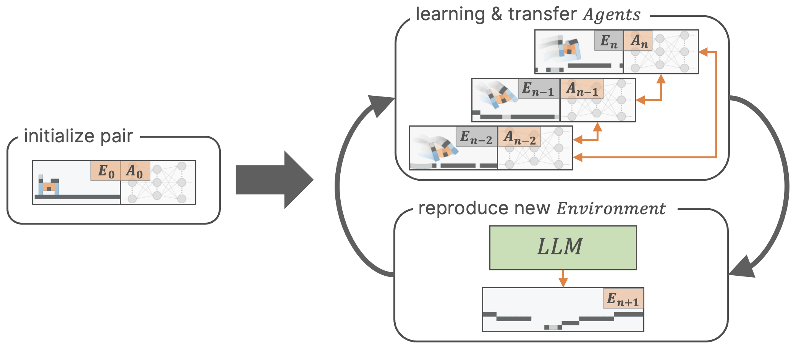
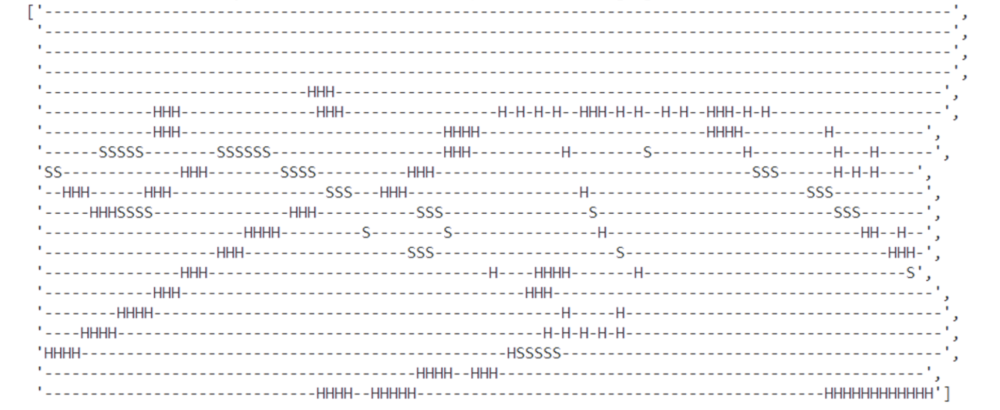
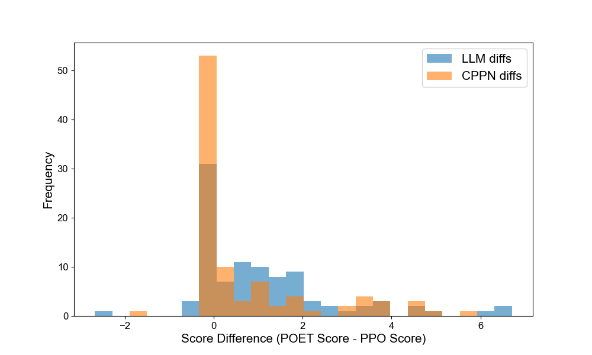

# LLM-POET：借助大型语言模型，探索复杂环境的演化之旅

发布时间：2024年06月07日

`Agent

理由：这篇论文介绍了一种新的算法LLM-POET，该算法利用大型语言模型（LLM）来生成和变异环境，以促进AI代理在复杂环境中的训练和技能掌握。这种方法直接关联到构建和优化AI代理的行为，特别是在开放式和复杂的环境中。因此，它更符合Agent分类，因为它专注于代理的开发和性能提升。` `人工智能` `机器学习`

> LLM-POET: Evolving Complex Environments using Large Language Models

# 摘要

> 在AI领域，构建能够无限制地创造复杂新颖行为的系统是一项艰巨任务。为此，研究者开发了如POET及其增强版等开放式算法，以持续产生新颖行为。但现有方法的局限在于难以持续创造复杂环境。本研究中，我们创新性地提出了LLM-POET算法，利用大型语言模型（LLM）来生成和变异环境。通过微调LLM，使其理解进化健身房环境的文本描述，我们成功用自然语言生成了多样复杂的环境。实验表明，LLM不仅环境多样性更胜一筹，其性能提升比传统CPPN方法高出34%，显示出代理在复杂环境中训练能更有效地掌握多样化技能。

> Creating systems capable of generating virtually infinite variations of complex and novel behaviour without predetermined goals or limits is a major challenge in the field of AI. This challenge has been addressed through the development of several open-ended algorithms that can continuously generate new and diverse behaviours, such as the POET and Enhanced-POET algorithms for co-evolving environments and agent behaviour. One of the challenges with existing methods however, is that they struggle to continuously generate complex environments. In this work, we propose LLM-POET, a modification of the POET algorithm where the environment is both created and mutated using a Large Language Model (LLM). By fine-tuning a LLM with text representations of Evolution Gym environments and captions that describe the environment, we were able to generate complex and diverse environments using natural language. We found that not only could the LLM produce a diverse range of environments, but compared to the CPPNs used in Enhanced-POET for environment generation, the LLM allowed for a 34% increase in the performance gain of co-evolution. This increased performance suggests that the agents were able to learn a more diverse set of skills by training on more complex environments.

[Arxiv](https://arxiv.org/abs/2406.04663)