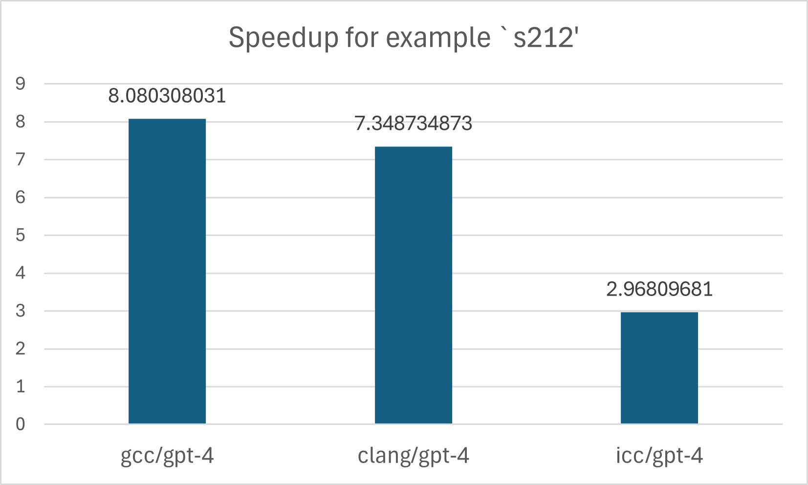
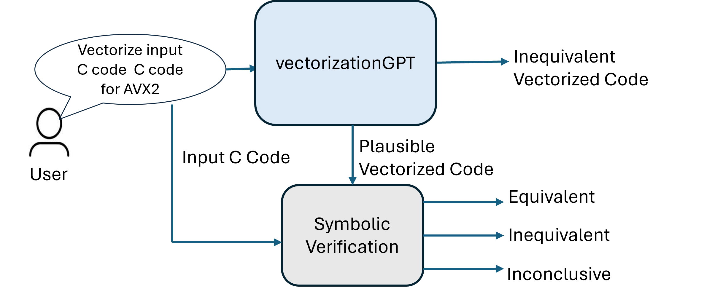
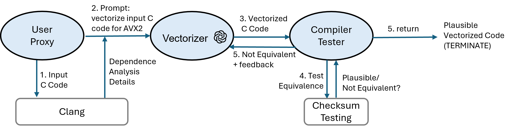
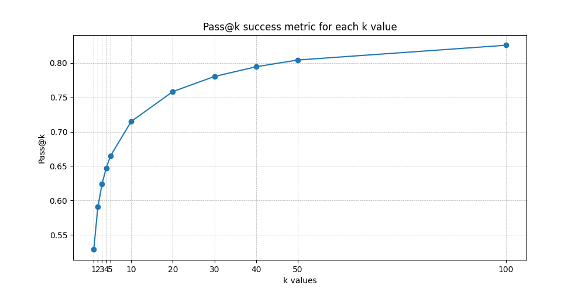
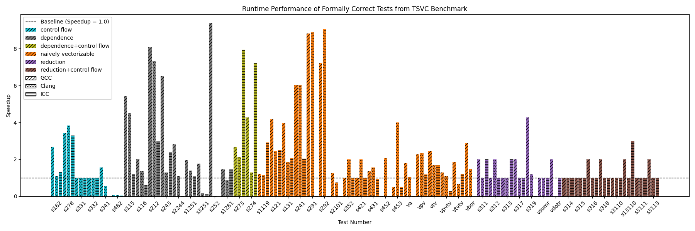

# LLM-Vectorizer：一款基于大型语言模型的验证循环向量化工具

发布时间：2024年06月07日

`Agent

理由：这篇论文主要探讨了大型语言模型（LLMs）如何通过一种创新的基于有限状态机多代理的方法，将处理单个数组元素的标量程序转化为高效的向量化代码。这种方法涉及多个代理（Agent）的协作，以生成和优化向量化代码。因此，这篇论文更符合Agent分类，因为它主要关注的是通过代理系统来解决编译器优化问题。` `高性能计算` `编译器优化`

> LLM-Vectorizer: LLM-based Verified Loop Vectorizer

# 摘要

> 向量化技术极大地优化了处理大数据数组的高性能计算应用。尽管自动向量化研究已有多年，编译器仍常错失优化良机。手动编写向量化代码虽可行，但复杂且易错，需要对特定架构和编译器有深入了解。本论文探讨了大型语言模型（LLMs）如何将处理单个数组元素的标量程序转化为高效的向量化代码。我们提出了一种创新的基于有限状态机多代理的方法，结合LLMs和测试反馈，成功生成了向量化代码。实验结果显示，LLMs生成的代码在运行速度上比Intel Compiler、GCC和Clang等顶尖编译器快1.1倍至9.4倍。为确保生成的向量化代码正确无误，我们采用了领先的LLVM IR有界转换验证工具Alive2，并针对我们的基准数据集优化了其可扩展性。最终，我们的方法在TSVC基准数据集上验证了38.2%的向量化代码为正确。

> Vectorization is a powerful optimization technique that significantly boosts the performance of high performance computing applications operating on large data arrays. Despite decades of research on auto-vectorization, compilers frequently miss opportunities to vectorize code. On the other hand, writing vectorized code manually using compiler intrinsics is still a complex, error-prone task that demands deep knowledge of specific architecture and compilers.
  In this paper, we evaluate the potential of large-language models (LLMs) to generate vectorized (Single Instruction Multiple Data) code from scalar programs that process individual array elements. We propose a novel finite-state machine multi-agents based approach that harnesses LLMs and test-based feedback to generate vectorized code. Our findings indicate that LLMs are capable of producing high performance vectorized code with run-time speedup ranging from 1.1x to 9.4x as compared to the state-of-the-art compilers such as Intel Compiler, GCC, and Clang.
  To verify the correctness of vectorized code, we use Alive2, a leading bounded translation validation tool for LLVM IR. We describe a few domain-specific techniques to improve the scalability of Alive2 on our benchmark dataset. Overall, our approach is able to verify 38.2% of vectorizations as correct on the TSVC benchmark dataset.

[Arxiv](https://arxiv.org/abs/2406.04693)