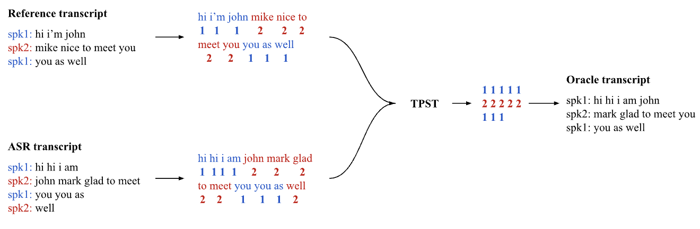

# 大型语言模型驱动的说话人日志校正：一种普适性解决方案

发布时间：2024年06月07日

`LLM应用

这篇论文探讨了如何利用大型语言模型（LLMs）作为后处理手段来提高说话人分割聚类的准确性。通过微调LLMs并构建集成模型，研究者们展示了如何提升分割聚类的性能，尤其是在与特定自动语音识别（ASR）工具结合使用时。这种方法的应用性质和对LLMs的实际使用表明，它属于“LLM应用”类别。` `语音识别` `对话分析`

> LLM-based speaker diarization correction: A generalizable approach

# 摘要

> 说话人分割聚类对于解读自动语音识别（ASR）工具转录的对话至关重要。尽管分割聚类技术有所进步，但准确性仍待提高。本研究探索了利用大型语言模型（LLMs）作为后处理手段来校正分割聚类。LLMs通过Fisher语料库（包含大量转录对话的数据集）进行了微调。实验结果显示，微调后的LLMs能显著提升分割聚类的准确性，但这一提升仅限于使用与微调时相同ASR工具的转录。为克服这一局限，我们构建了一个集成模型，它融合了三个分别针对不同ASR工具转录进行微调的模型的权重。集成模型表现优于单一ASR特定模型，预示着一种通用且与ASR无关的方法可能实现。我们计划通过公开API使这些模型对第三方应用开放。

> Speaker diarization is necessary for interpreting conversations transcribed using automated speech recognition (ASR) tools. Despite significant developments in diarization methods, diarization accuracy remains an issue. Here, we investigate the use of large language models (LLMs) for diarization correction as a post-processing step. LLMs were fine-tuned using the Fisher corpus, a large dataset of transcribed conversations. The ability of the models to improve diarization accuracy in a holdout dataset was measured. We report that fine-tuned LLMs can markedly improve diarization accuracy. However, model performance is constrained to transcripts produced using the same ASR tool as the transcripts used for fine-tuning, limiting generalizability. To address this constraint, an ensemble model was developed by combining weights from three separate models, each fine-tuned using transcripts from a different ASR tool. The ensemble model demonstrated better overall performance than each of the ASR-specific models, suggesting that a generalizable and ASR-agnostic approach may be achievable. We hope to make these models accessible through public-facing APIs for use by third-party applications.

[Arxiv](https://arxiv.org/abs/2406.04927)