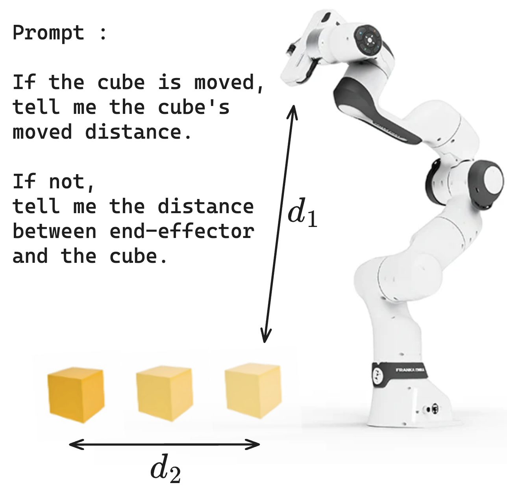
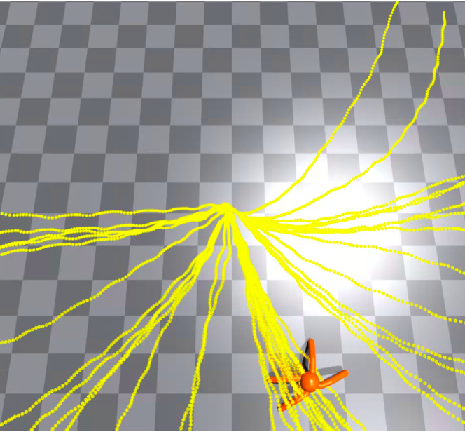

# 语言引导下的技能探索

发布时间：2024年06月07日

`Agent

这篇论文主要探讨了如何利用大型语言模型（LLMs）的语义知识来提升代理（Agent）的技能发现过程中的语义多样性。论文提出了一种名为语言引导技能发现（LGSD）的新框架，该框架通过用户提示输入来最大化技能间的语义差异，并指导代理在特定的语义子空间内探索多样化的状态。这种方法特别关注于提升技能的“语义多样性”，并通过实验证明了其在发现多样化技能方面的有效性。因此，这篇论文更符合Agent分类，因为它主要关注的是如何通过语言模型来增强代理的行为和技能发现。` `机器人技术` `人工智能`

> Language Guided Skill Discovery

# 摘要

> 技能发现方法让代理无需明确奖励就能学习各种新兴行为。为了确保这些技能能有效应对未知任务，关键在于构建一个语义丰富的技能库。现有方法有的通过判别器区分技能，有的则扩大状态覆盖范围，但均未直接关注技能的“语义多样性”。我们推测，借助大型语言模型（LLMs）的语义知识，能提升行为结果的语义多样性。为此，我们提出了语言引导技能发现（LGSD）框架，旨在最大化技能间的语义差异。LGSD接受用户提示输入，输出一组语义独特的技能。提示用于限定搜索空间至期望的语义子空间，LLM的输出则指导代理在子空间内探索语义多样的状态。实验证明，通过调整提示，LGSD能让腿式机器人在平面上访问不同的用户指定区域。与机器人手臂操作环境中的五种现有方法相比，LGSD在发现更多样化技能方面表现更佳。此外，LGSD还提供了一种简便方式，通过自然语言利用已学技能。

> Skill discovery methods enable agents to learn diverse emergent behaviors without explicit rewards. To make learned skills useful for unknown downstream tasks, obtaining a semantically diverse repertoire of skills is essential. While some approaches introduce a discriminator to distinguish skills and others aim to increase state coverage, no existing work directly addresses the "semantic diversity" of skills. We hypothesize that leveraging the semantic knowledge of large language models (LLMs) can lead us to improve semantic diversity of resulting behaviors. In this sense, we introduce Language Guided Skill Discovery (LGSD), a skill discovery framework that aims to directly maximize the semantic diversity between skills. LGSD takes user prompts as input and outputs a set of semantically distinctive skills. The prompts serve as a means to constrain the search space into a semantically desired subspace, and the generated LLM outputs guide the agent to visit semantically diverse states within the subspace. We demonstrate that LGSD enables legged robots to visit different user-intended areas on a plane by simply changing the prompt. Furthermore, we show that language guidance aids in discovering more diverse skills compared to five existing skill discovery methods in robot-arm manipulation environments. Lastly, LGSD provides a simple way of utilizing learned skills via natural language.

[Arxiv](https://arxiv.org/abs/2406.06615)