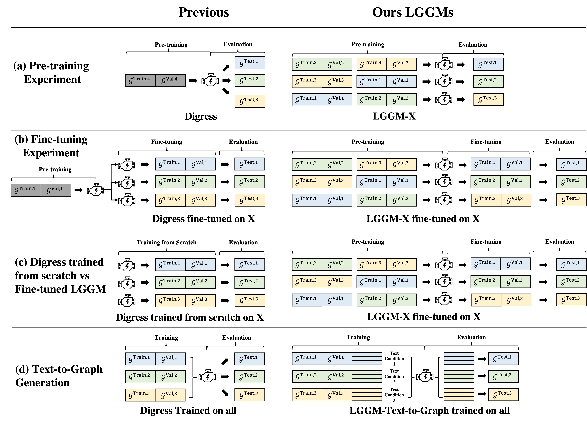

# 生成图模型巨擘

发布时间：2024年06月07日

`LLM应用

理由：这篇论文介绍了大型图生成模型（LGGM），它通过在多个领域的图数据集上进行训练，实现了在零-shot生成方面的优越性能，并且能够根据文本提示生成图。这种模型利用了底层语言模型的知识，为用户提供了对生成图的精细控制。这与LLM（大型语言模型）的应用紧密相关，因为它展示了如何将LLM的能力扩展到图生成领域，从而推动了LLM在多模态和跨领域应用中的发展。因此，这篇论文属于LLM应用类别。` `图生成` `跨领域应用`

> Large Generative Graph Models

# 摘要

> 诸如GPT、Stable Diffusion、Sora和Suno等大型生成模型（LGMs），通过在来自多个领域的多样化且精心策划的语言、图像、视频和音频数据集上进行训练，实现了创造性和合理内容的生成。然而，以往的图生成模型（如GraphRNN、MDVAE等）每次仅针对单一数据集训练，未能达到LGMs在其他领域的革命性成就。为此，我们推出了大型图生成模型（LGGM），它基于来自13个不同领域的5000多个图的大量语料库进行训练。实证显示，预训练的LGGM在零-shot生成方面超越了现有模型，并且能够轻松适应特定领域的图，展现出比从头训练的模型更佳的性能，成为实际应用的理想起点。借鉴Stable Diffusion，我们还赋予LGGM根据文本提示生成图的能力，如网络描述和统计信息，从而利用底层语言模型的丰富知识，为用户提供对生成图的精细控制。相关代码、模型和数据集已发布于https://lggm-lg.github.io/。

> Large Generative Models (LGMs) such as GPT, Stable Diffusion, Sora, and Suno are trained on a huge amount of language corpus, images, videos, and audio that are extremely diverse from numerous domains. This training paradigm over diverse well-curated data lies at the heart of generating creative and sensible content. However, all previous graph generative models (e.g., GraphRNN, MDVAE, MoFlow, GDSS, and DiGress) have been trained only on one dataset each time, which cannot replicate the revolutionary success achieved by LGMs in other fields. To remedy this crucial gap, we propose a new class of graph generative model called Large Graph Generative Model (LGGM) that is trained on a large corpus of graphs (over 5000 graphs) from 13 different domains. We empirically demonstrate that the pre-trained LGGM has superior zero-shot generative capability to existing graph generative models. Furthermore, our pre-trained LGGM can be easily fine-tuned with graphs from target domains and demonstrate even better performance than those directly trained from scratch, behaving as a solid starting point for real-world customization. Inspired by Stable Diffusion, we further equip LGGM with the capability to generate graphs given text prompts (Text-to-Graph), such as the description of the network name and domain (i.e., "The power-1138-bus graph represents a network of buses in a power distribution system."), and network statistics (i.e., "The graph has a low average degree, suitable for modeling social media interactions."). This Text-to-Graph capability integrates the extensive world knowledge in the underlying language model, offering users fine-grained control of the generated graphs. We release the code, the model checkpoint, and the datasets at https://lggm-lg.github.io/.

[Arxiv](https://arxiv.org/abs/2406.05109)