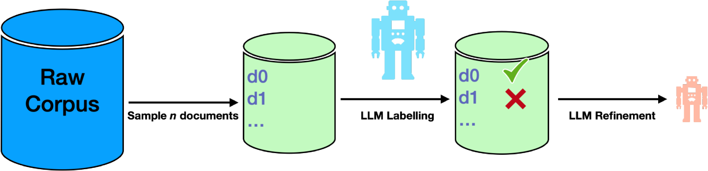
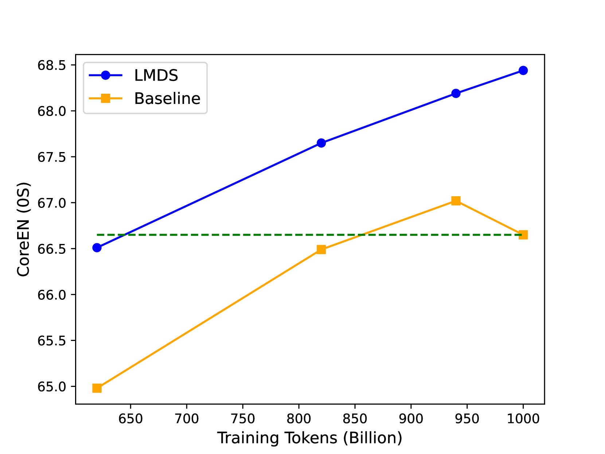
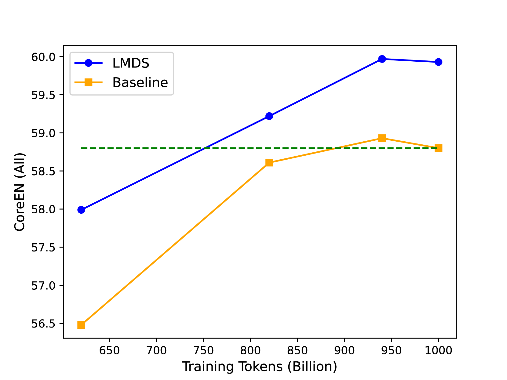
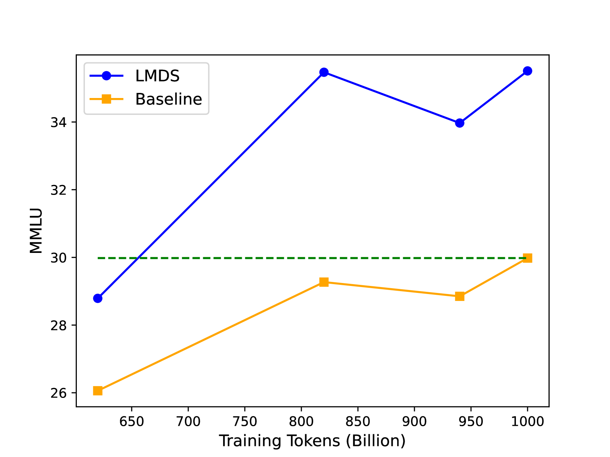
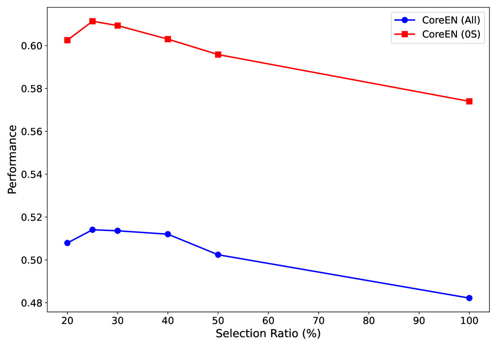

# 借助大型语言模型进行文档筛选

发布时间：2024年06月07日

`LLM应用

这篇论文主要探讨了如何通过精心挑选文档来减少大型语言模型（LLM）预训练过程中的计算资源消耗，同时保持模型质量。研究中使用了LLM作为文档评分工具，并将评分结果用于指导大规模语料库的筛选，从而在减少计算资源的同时保持模型性能。这种方法涉及到了LLM的具体应用，即在预训练阶段优化数据选择，因此属于LLM应用分类。` `机器学习`

> Large Language Model-guided Document Selection

# 摘要

> 大型语言模型（LLM）的预训练耗费巨大计算资源，但新研究表明，精心挑选文档可大幅减少计算需求，同时保持模型质量。借鉴Gunasekar等人的研究，我们发现特定领域文档选择过程可解释，而Gilardi等人的研究则显示，经过指令微调的LLM在零-shot数据标注上表现出色。因此，我们采用提示的LLM作为文档评分工具，将评分结果提炼为分类器模型，并应用于大规模筛选后的网络爬虫语料库。根据分类器建议，我们剔除了75%的语料，仅用剩余数据训练LLM。结果显示：1. 通过过滤，我们能在最多节省30%的计算资源下，与全量语料训练的模型在多基准上质量相当；2. 更高级的LLM标注器和分类器能产生更稳定、不受提示影响的结果；3. 情境学习能显著提升标注模型的性能。我们采用开源资源，确保研究可复现。

> Large Language Model (LLM) pre-training exhausts an ever growing compute budget, yet recent research has demonstrated that careful document selection enables comparable model quality with only a fraction of the FLOPs. Inspired by efforts suggesting that domain-specific training document selection is in fact an interpretable process [Gunasekar et al., 2023], as well as research showing that instruction-finetuned LLMs are adept zero-shot data labelers [Gilardi et al.,2023], we explore a promising direction for scalable general-domain document selection; employing a prompted LLM as a document grader, we distill quality labels into a classifier model, which is applied at scale to a large, and already heavily-filtered, web-crawl-derived corpus autonomously. Following the guidance of this classifier, we drop 75% of the corpus and train LLMs on the remaining data. Results across multiple benchmarks show that: 1. Filtering allows us to quality-match a model trained on the full corpus across diverse benchmarks with at most 70% of the FLOPs, 2. More capable LLM labelers and classifier models lead to better results that are less sensitive to the labeler's prompt, 3. In-context learning helps to boost the performance of less-capable labeling models. In all cases we use open-source datasets, models, recipes, and evaluation frameworks, so that results can be reproduced by the community.

[Arxiv](https://arxiv.org/abs/2406.04638)