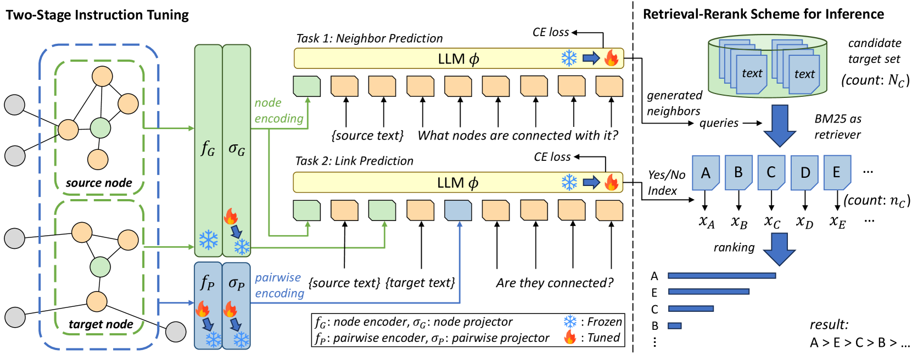
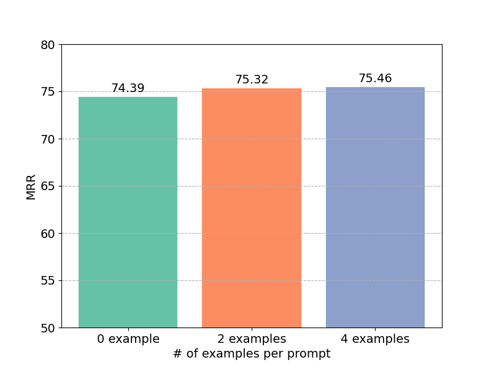
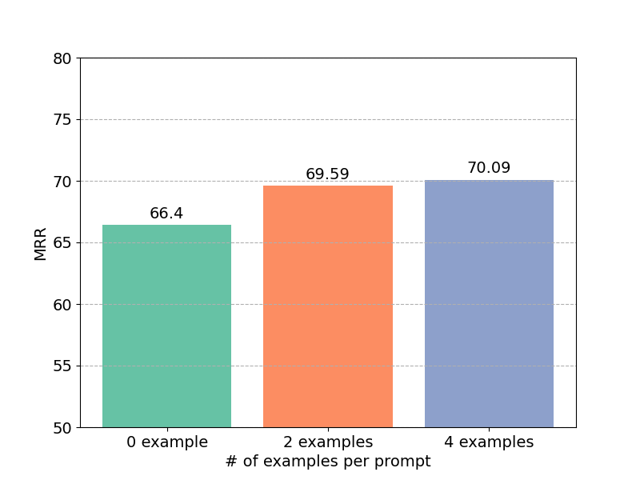
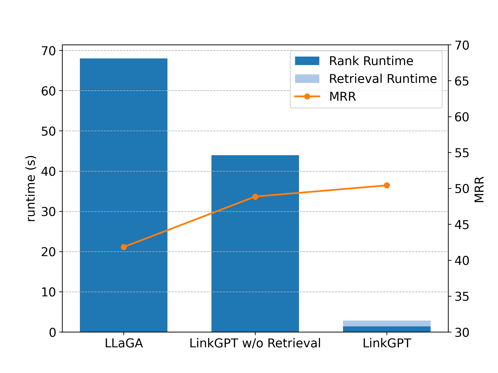
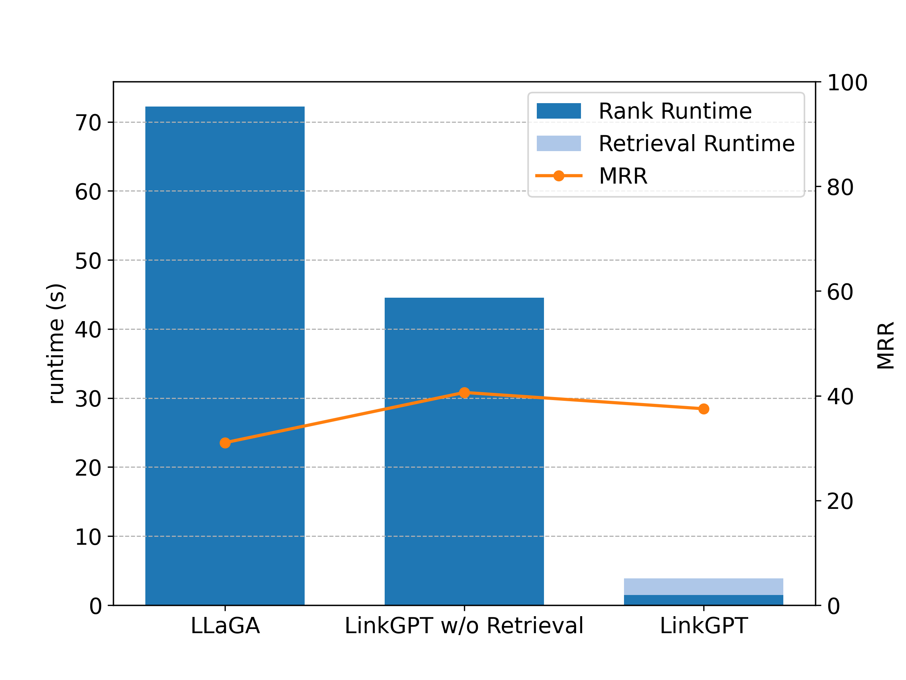
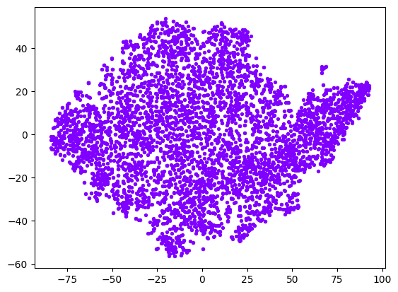
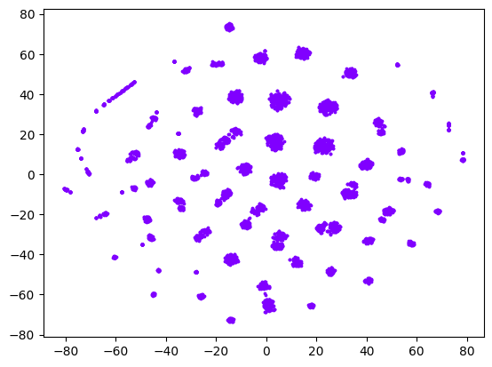

# LinkGPT：训练大型语言模型，精准预测缺失链接

发布时间：2024年06月07日

`LLM应用

这篇论文探讨了大型语言模型（LLMs）在链接预测（LP）任务中的应用，特别是针对文本属性图（TAGs）。论文提出了一种新的任务和方法（LinkGPT），专门设计用于预测图中节点间的缺失链接，并解决了将结构信息融入LLMs以及训练LLMs进行LP的计算难题。此外，论文还介绍了检索-重排序机制以提高推理效率，并通过实验展示了LinkGPT在性能和泛化能力上的优越性。因此，这篇论文属于LLM应用类别，因为它专注于LLMs在特定任务（链接预测）中的实际应用和优化。` `图数据分析` `机器学习`

> LinkGPT: Teaching Large Language Models To Predict Missing Links

# 摘要

> 大型语言模型（LLMs）在语言和视觉任务上表现出色，近期更是在基于图的任务，尤其是文本属性图（TAGs）上引起了广泛关注。尽管如此，LLMs在链接预测（LP）领域的应用仍未得到充分研究。本研究提出了一项创新任务，旨在利用LLMs预测图中节点间的缺失链接，考验其在结构化数据上的推理能力及基于已学模式推断新事实的能力。此任务面临两大挑战：一是如何将关键的成对结构信息有效融入LLMs；二是如何克服训练LLMs进行LP时的计算难题。为此，我们开发了LinkGPT，这是首个专为LP任务设计的端到端训练LLM。通过两阶段指令调优策略，我们首先微调成对编码器、投影器和节点投影器，随后进一步微调LLMs以进行链接预测。为提升推理效率，我们采用了检索-重排序机制。实验结果显示，LinkGPT不仅在真实世界图上性能卓越，还在零样本和少样本学习中展现了出色的泛化能力，大幅超越现有标准。在推理阶段，LinkGPT实现了10倍的速度提升，同时保持了高链接预测准确性。

> Large Language Models (LLMs) have shown promising results on various language and vision tasks. Recently, there has been growing interest in applying LLMs to graph-based tasks, particularly on Text-Attributed Graphs (TAGs). However, most studies have focused on node classification, while the use of LLMs for link prediction (LP) remains understudied. In this work, we propose a new task on LLMs, where the objective is to leverage LLMs to predict missing links between nodes in a graph. This task evaluates an LLM's ability to reason over structured data and infer new facts based on learned patterns. This new task poses two key challenges: (1) How to effectively integrate pairwise structural information into the LLMs, which is known to be crucial for LP performance, and (2) how to solve the computational bottleneck when teaching LLMs to perform LP. To address these challenges, we propose LinkGPT, the first end-to-end trained LLM for LP tasks. To effectively enhance the LLM's ability to understand the underlying structure, we design a two-stage instruction tuning approach where the first stage fine-tunes the pairwise encoder, projector, and node projector, and the second stage further fine-tunes the LLMs to predict links. To address the efficiency challenges at inference time, we introduce a retrieval-reranking scheme. Experiments show that LinkGPT can achieve state-of-the-art performance on real-world graphs as well as superior generalization in zero-shot and few-shot learning, surpassing existing benchmarks. At inference time, it can achieve $10\times$ speedup while maintaining high LP accuracy.

[Arxiv](https://arxiv.org/abs/2406.04640)