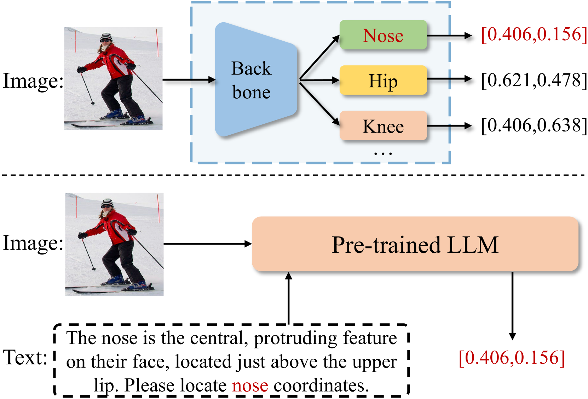
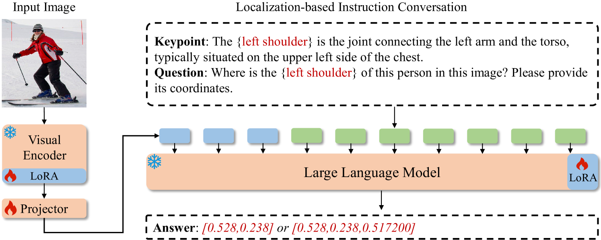
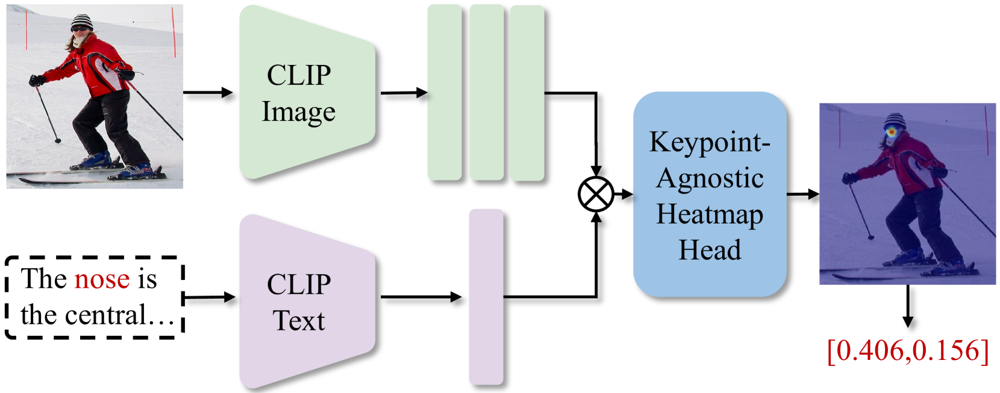
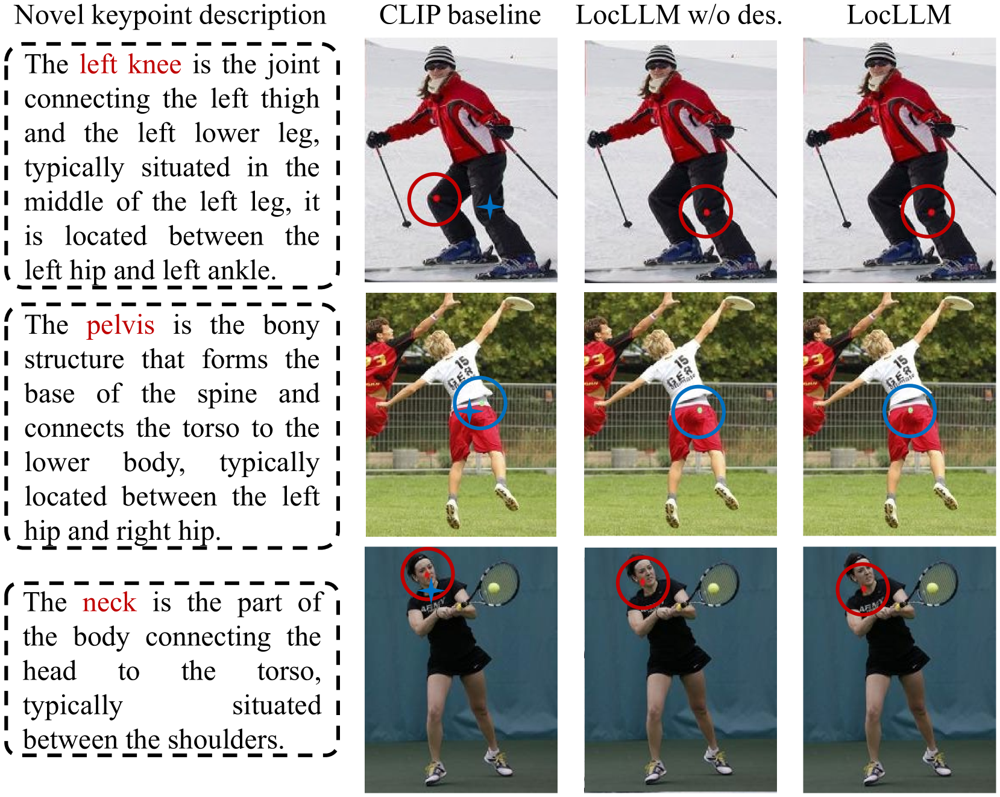

# LocLLM：借助大型语言模型，探索人体关键点定位的泛化能力

发布时间：2024年06月07日

`LLM应用

这篇论文介绍了一种名为LocLLM的新模型，它是基于大型语言模型（LLM）的关键点定位模型。该模型通过结合LLM的推理能力和文本中的关键点信息，实现了对关键点的精确定位。论文中提到，LocLLM能够接受图像和文本指令，并输出精确的关键点坐标，这在关键点定位领域是一个创新的应用。此外，LocLLM在跨数据集定位中展现了其灵活性和通用性，甚至能够识别训练中未见的新关键点类型。因此，这篇论文属于LLM应用分类。` `计算机视觉` `人机交互`

> LocLLM: Exploiting Generalizable Human Keypoint Localization via Large Language Model

# 摘要

> 现有模型在关键点定位上的能力受限于训练数据的关键点先验，为此，我们提出了一种新视角：通过文本描述中的线索推理关键点位置。LocLLM作为首个基于LLM的关键点定位模型，不仅接受图像和文本指令，还能输出精确的关键点坐标。它巧妙地结合了LLM的强大推理能力和文本中的关键点信息，实现了精准定位。通过构建指令对话，我们将关键点描述与图像坐标紧密关联，并在高效训练流程中微调模型。LocLLM在2D/3D关键点定位基准上大放异彩，更因其融入语言线索而在跨数据集定位中展现出无与伦比的灵活性和通用性，甚至能识别训练中未见的新关键点类型。

> The capacity of existing human keypoint localization models is limited by keypoint priors provided by the training data. To alleviate this restriction and pursue more general model, this work studies keypoint localization from a different perspective by reasoning locations based on keypiont clues in text descriptions. We propose LocLLM, the first Large-Language Model (LLM) based keypoint localization model that takes images and text instructions as inputs and outputs the desired keypoint coordinates. LocLLM leverages the strong reasoning capability of LLM and clues of keypoint type, location, and relationship in textual descriptions for keypoint localization. To effectively tune LocLLM, we construct localization-based instruction conversations to connect keypoint description with corresponding coordinates in input image, and fine-tune the whole model in a parameter-efficient training pipeline. LocLLM shows remarkable performance on standard 2D/3D keypoint localization benchmarks. Moreover, incorporating language clues into the localization makes LocLLM show superior flexibility and generalizable capability in cross dataset keypoint localization, and even detecting novel type of keypoints unseen during training.

[Arxiv](https://arxiv.org/abs/2406.04659)