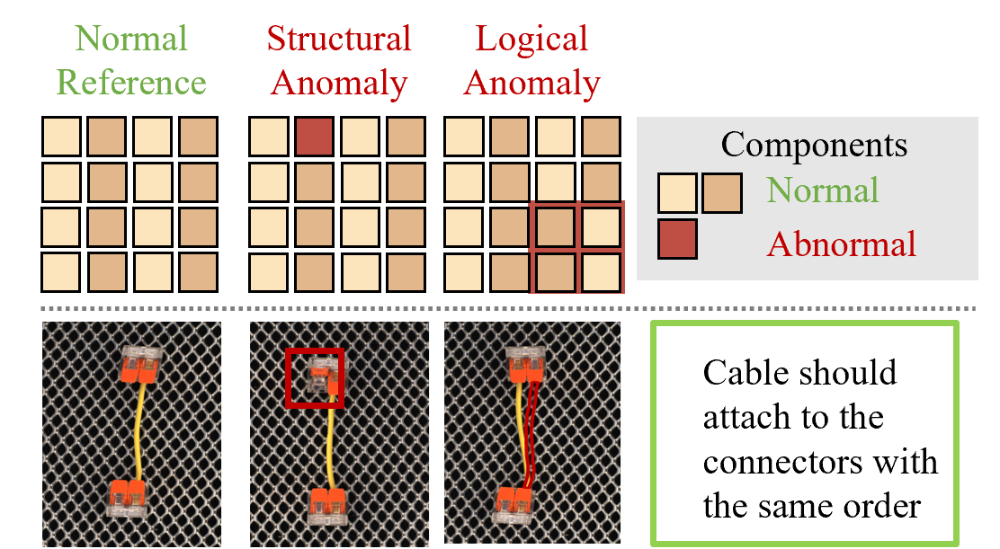

# 逻辑码：大型语言模型驱动的逻辑异常检测框架

发布时间：2024年06月07日

`LLM应用

这篇论文介绍了 LogiCode 框架，它利用大型语言模型（LLMs）来精准识别工业环境中的逻辑异常。这种方法超越了以往仅关注结构不一致的局限，通过 LLMs 的逻辑推理能力自动生成 Python 代码，有效定位各种异常。论文还引入了新的数据集和基准来评估 LogiCode 的性能，显示其在逻辑异常检测方面的显著提升和详细异常解释的能力。这表明了 LLMs 在特定行业应用中的实际应用和影响，因此属于LLM应用分类。` `异常检测`

> LogiCode: an LLM-Driven Framework for Logical Anomaly Detection

# 摘要

> 本文推出的 LogiCode 框架，利用大型语言模型（LLMs）精准识别工业环境中的逻辑异常，超越了以往仅关注结构不一致的局限。LogiCode 通过 LLMs 的逻辑推理能力，自动生成 Python 代码，有效定位如组件数量错误或缺失元素等异常，极大推进了异常检测技术的发展。为全面评估 LogiCode 的性能，包括分类准确性、代码生成成功率和推理精度，本文还引入了“LOCO-Annotations”数据集和“LogiBench”基准。研究显示，LogiCode 不仅显著提升了逻辑异常检测的准确性，还提供了详尽的异常解释，标志着工业异常检测向更智能、基于 LLM 的方法迈进，对特定行业应用具有深远影响。

> This paper presents LogiCode, a novel framework that leverages Large Language Models (LLMs) for identifying logical anomalies in industrial settings, moving beyond traditional focus on structural inconsistencies. By harnessing LLMs for logical reasoning, LogiCode autonomously generates Python codes to pinpoint anomalies such as incorrect component quantities or missing elements, marking a significant leap forward in anomaly detection technologies. A custom dataset "LOCO-Annotations" and a benchmark "LogiBench" are introduced to evaluate the LogiCode's performance across various metrics including binary classification accuracy, code generation success rate, and precision in reasoning. Findings demonstrate LogiCode's enhanced interpretability, significantly improving the accuracy of logical anomaly detection and offering detailed explanations for identified anomalies. This represents a notable shift towards more intelligent, LLM-driven approaches in industrial anomaly detection, promising substantial impacts on industry-specific applications.

[Arxiv](https://arxiv.org/abs/2406.04687)