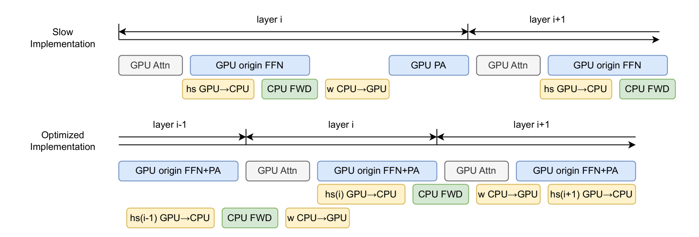

# MEFT：借助稀疏适配器，实现内存高效微调

发布时间：2024年06月07日

`LLM应用

这篇论文主要探讨了在资源受限的环境下，如何通过创新的机制（如使用内存高效的适配器和类似混合专家的架构）来提升大型语言模型（LLMs）的微调效果。这种方法特别关注于提高模型在复杂、知识密集型任务上的性能，同时减少对额外可训练参数的依赖。论文中提到的技术细节和实验结果表明，即使在资源有限的情况下，这种方法也能有效地提升LLMs的性能。因此，这篇论文属于LLM应用分类，因为它专注于实际应用中的技术改进和优化。` `人工智能` `高性能计算`

> MEFT: Memory-Efficient Fine-Tuning through Sparse Adapter

# 摘要

> 参数高效的微调（PEFT）虽有助于在资源受限时微调大型语言模型（LLMs），但在处理复杂、知识密集型任务时，其性能受限于模型容量——这源于额外可训练参数的稀缺。为此，我们创新性地采用了一种机制，通过使用更大但内存高效的适配器来提升LLMs的微调效果。这一突破得益于LLMs中前馈网络（FFNs）的激活稀疏性，以及CPU内存相对于GPU的显著优势。我们巧妙地在CPU上存储并更新这些大型适配器的参数。此外，我们还引入了类似混合专家（MoE）的架构，以减少CPU的不必要计算，并降低GPU与CPU间的通信负担，特别是在PCI Express（PCIe）带宽有限的情况下。即便在资源更为紧张的环境（如仅有24GB内存的单GPU配置），我们的方法也能实现与更大内存配置相媲美的微调成果，且对训练效率的影响在可接受范围内。我们的代码已公开于https://github.com/CURRENTF/MEFT。

> Parameter-Efficient Fine-tuning (PEFT) facilitates the fine-tuning of Large Language Models (LLMs) under limited resources. However, the fine-tuning performance with PEFT on complex, knowledge-intensive tasks is limited due to the constrained model capacity, which originates from the limited number of additional trainable parameters. To overcome this limitation, we introduce a novel mechanism that fine-tunes LLMs with adapters of larger size yet memory-efficient. This is achieved by leveraging the inherent activation sparsity in the Feed-Forward Networks (FFNs) of LLMs and utilizing the larger capacity of Central Processing Unit (CPU) memory compared to Graphics Processing Unit (GPU). We store and update the parameters of larger adapters on the CPU. Moreover, we employ a Mixture of Experts (MoE)-like architecture to mitigate unnecessary CPU computations and reduce the communication volume between the GPU and CPU. This is particularly beneficial over the limited bandwidth of PCI Express (PCIe). Our method can achieve fine-tuning results comparable to those obtained with larger memory capacities, even when operating under more limited resources such as a 24GB memory single GPU setup, with acceptable loss in training efficiency. Our codes are available at https://github.com/CURRENTF/MEFT.

[Arxiv](https://arxiv.org/abs/2406.04984)