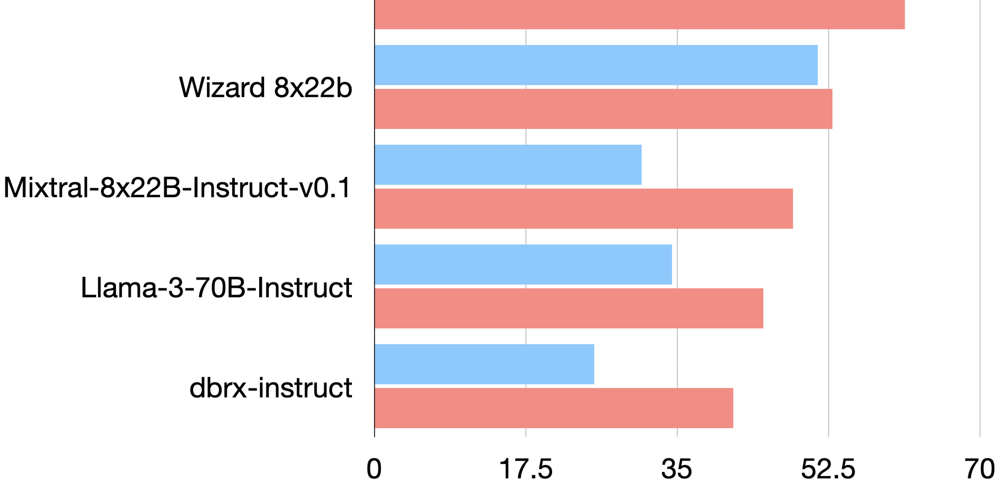
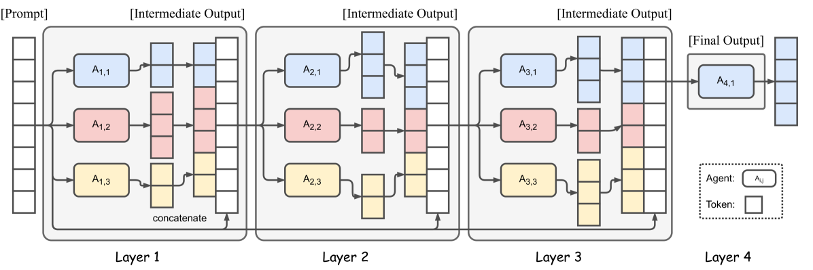
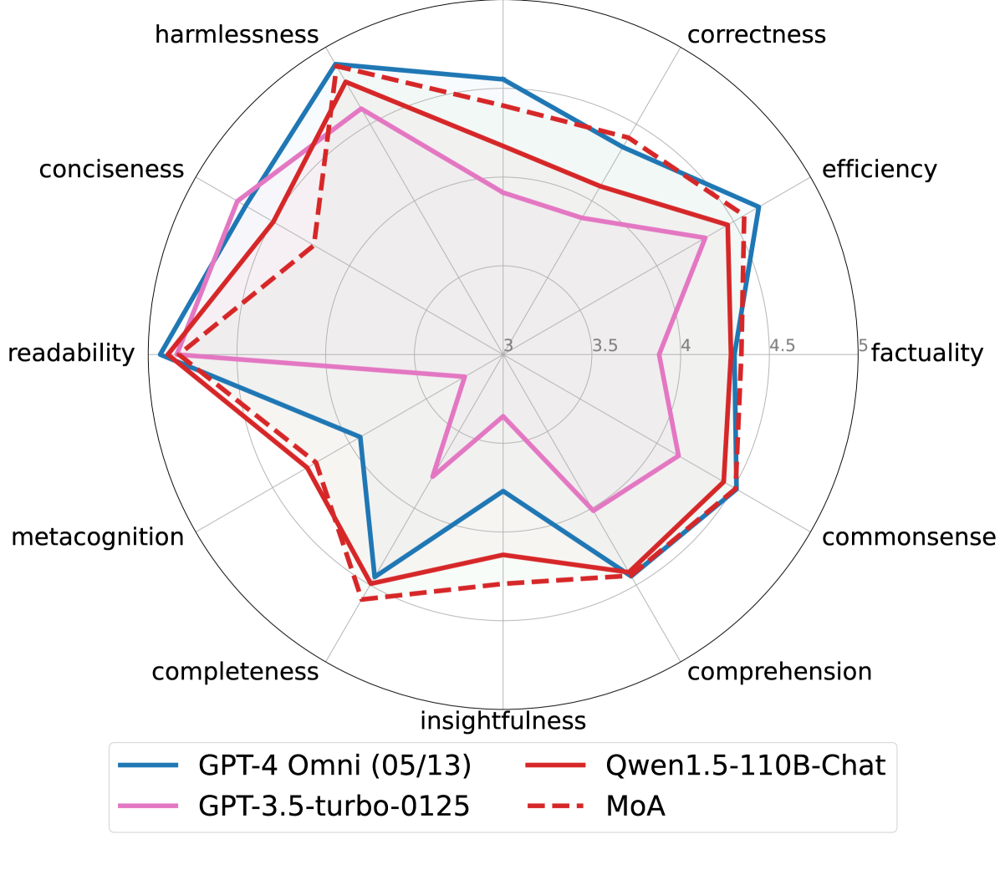
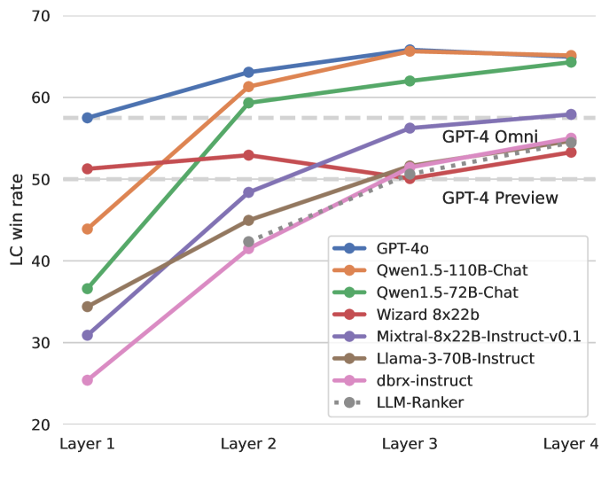
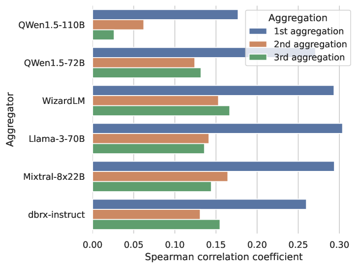
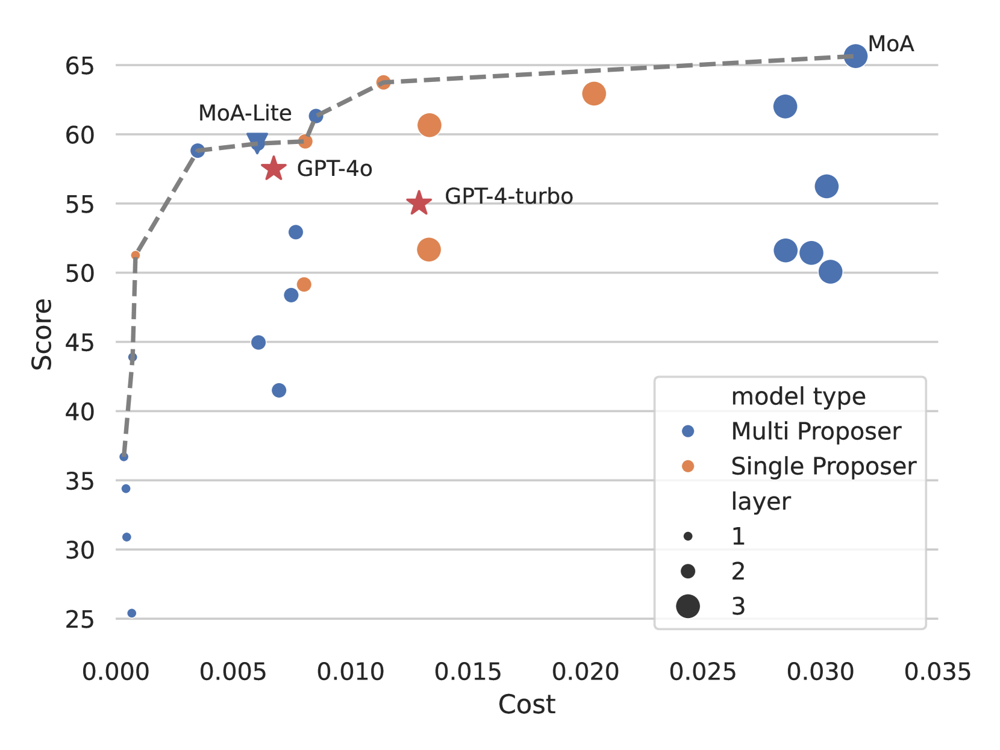
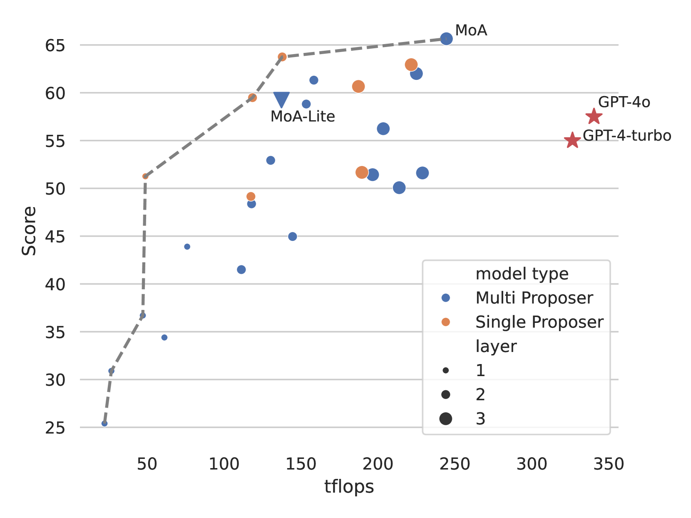
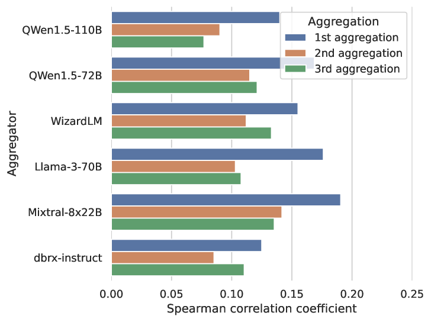
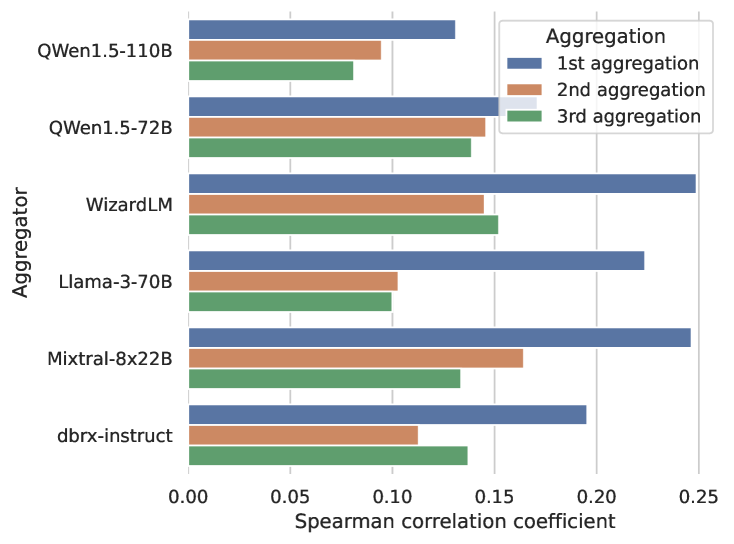

# 混合代理策略提升大型语言模型性能

发布时间：2024年06月07日

`Agent

理由：这篇论文主要介绍了一种创新的代理混合（MoA）方法，该方法通过构建分层架构，集成多个LLM代理来提升响应质量。这种方法涉及多个代理的协同工作，因此属于Agent分类。虽然这种方法也涉及到LLM的应用，但其核心在于代理的设计和集成，而不是LLM的具体应用或理论研究，因此不适合归类于LLM应用或LLM理论。此外，该论文并未特别关注检索增强生成（RAG）技术，因此也不属于RAG分类。` `人工智能`

> Mixture-of-Agents Enhances Large Language Model Capabilities

# 摘要

> 大型语言模型（LLMs）在自然语言理解和生成方面的最新进展令人瞩目。随着LLMs数量的增加，如何整合这些模型的集体智慧成为了一个前沿课题。为此，我们提出了一种创新的代理混合（MoA）方法，通过构建分层架构，每一层集成多个LLM代理，每个代理利用前一层的输出作为辅助，共同提升响应质量。我们的MoA模型在AlpacaEval 2.0、MT-Bench和FLASK等评测中取得了顶尖成绩，超越了GPT-4 Omni。例如，仅依赖开源LLMs的MoA在AlpacaEval 2.0上以65.1%的得分大幅领先，相比之下，GPT-4 Omni的得分为57.5%。

> Recent advances in large language models (LLMs) demonstrate substantial capabilities in natural language understanding and generation tasks. With the growing number of LLMs, how to harness the collective expertise of multiple LLMs is an exciting open direction. Toward this goal, we propose a new approach that leverages the collective strengths of multiple LLMs through a Mixture-of-Agents (MoA) methodology. In our approach, we construct a layered MoA architecture wherein each layer comprises multiple LLM agents. Each agent takes all the outputs from agents in the previous layer as auxiliary information in generating its response. MoA models achieves state-of-art performance on AlpacaEval 2.0, MT-Bench and FLASK, surpassing GPT-4 Omni. For example, our MoA using only open-source LLMs is the leader of AlpacaEval 2.0 by a substantial gap, achieving a score of 65.1% compared to 57.5% by GPT-4 Omni.

[Arxiv](https://arxiv.org/abs/2406.04692)