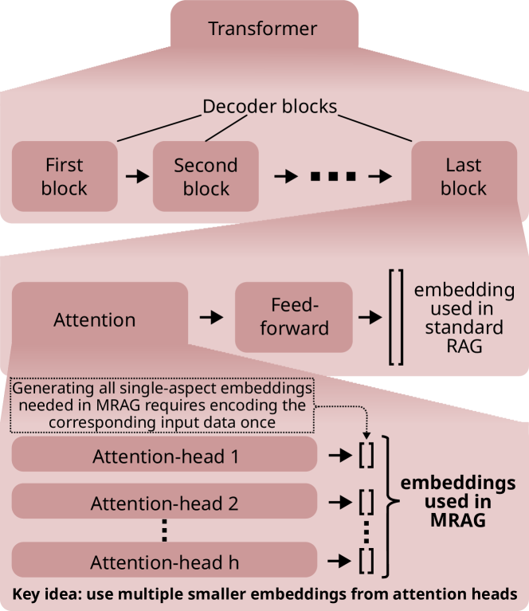
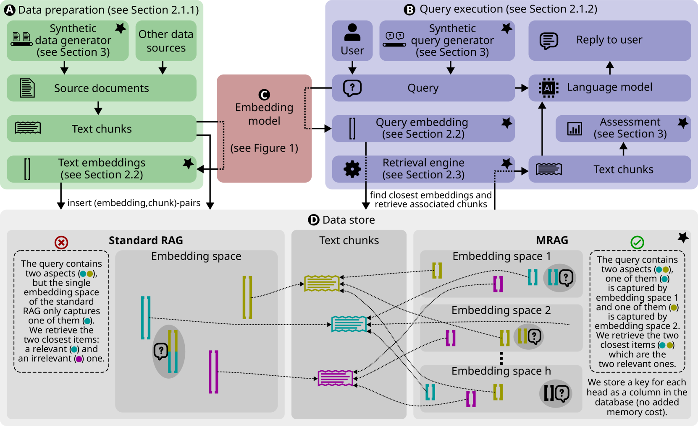
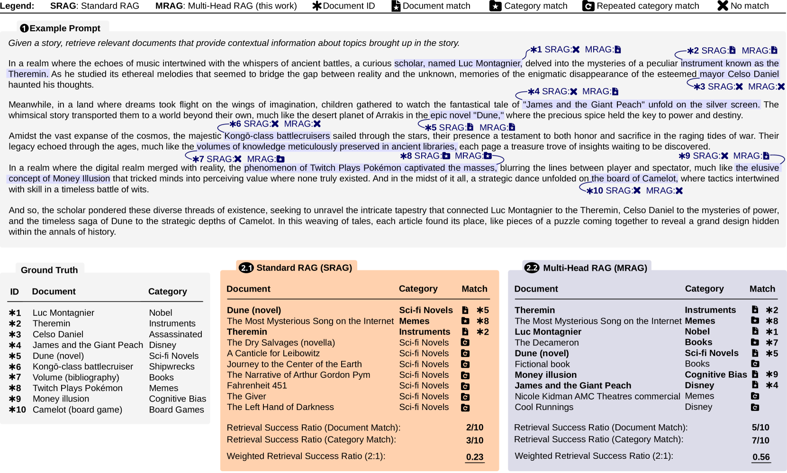
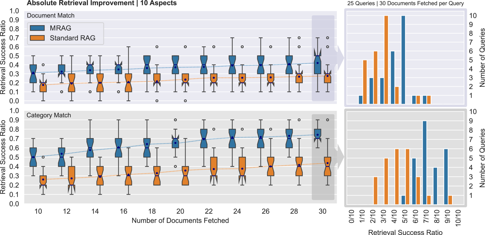
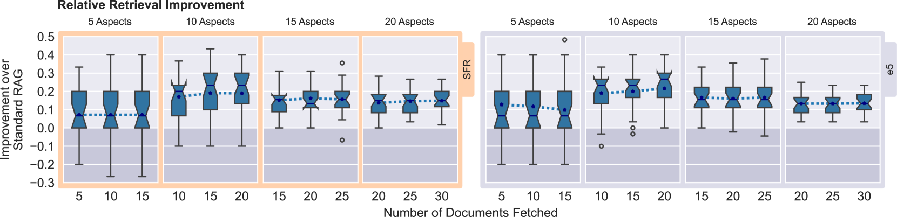
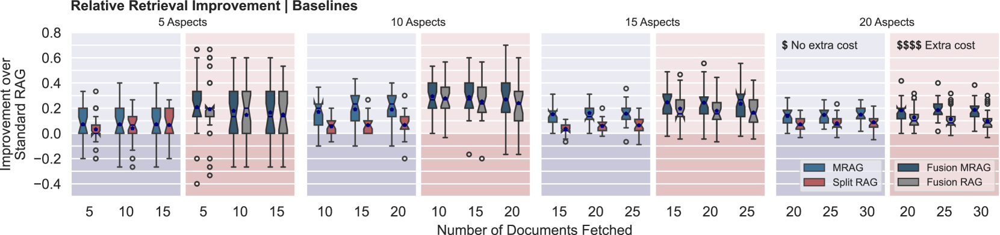
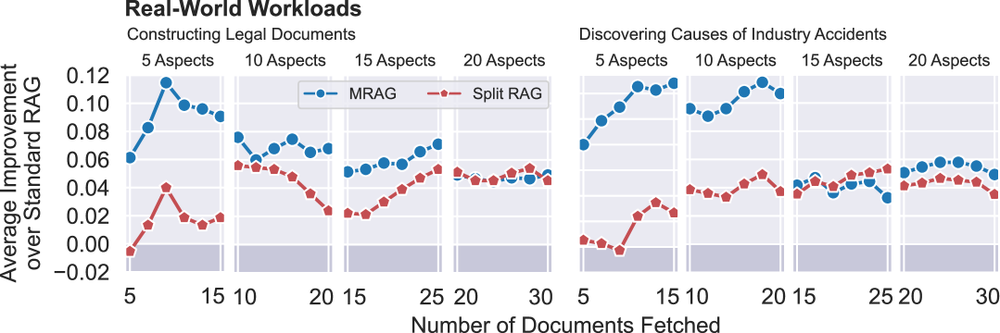
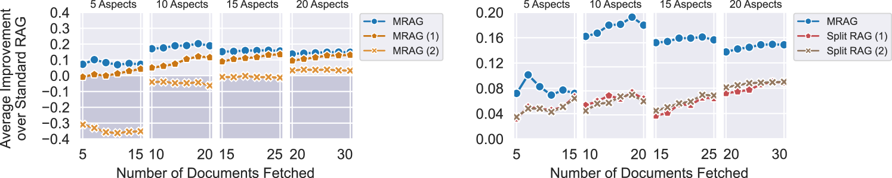

# 多头部RAG：利用大型语言模型攻克多维度难题

发布时间：2024年06月07日

`RAG

这篇论文主要介绍了一种改进的Retrieval Augmented Generation (RAG) 方法，即Multi-Head RAG (MRAG)，用于提高处理多文档查询时的检索精度和相关性。MRAG通过利用Transformer的多头注意力机制来生成更全面的嵌入，以更好地捕捉数据和查询的多维度特征。这种方法特别针对现有RAG系统在处理复杂查询时的不足，提出了一种创新的技术解决方案。因此，这篇论文应归类于RAG。` `问答系统` `信息检索`

> Multi-Head RAG: Solving Multi-Aspect Problems with LLMs

# 摘要

> Retrieval Augmented Generation (RAG) 通过在 LLM 中引入文档检索，提升了响应的准确性和相关性。然而，现有 RAG 方案未能有效处理需要检索内容差异显著的多文档查询，这类查询虽常见却极具挑战。为此，本文提出了 Multi-Head RAG (MRAG)，一种创新方法，它利用 Transformer 多头注意力层的激活而非解码层作为检索键，以捕捉数据的多面性。MRAG 通过不同注意力头的学习，生成能代表数据和查询多维度的嵌入，显著提升了复杂查询的检索精度，相关性提升高达 20%。此外，MRAG 可轻松融入现有 RAG 系统，并适用于多种数据存储环境。

> Retrieval Augmented Generation (RAG) enhances the abilities of Large Language Models (LLMs) by enabling the retrieval of documents into the LLM context to provide more accurate and relevant responses. Existing RAG solutions do not focus on queries that may require fetching multiple documents with substantially different contents. Such queries occur frequently, but are challenging because the embeddings of these documents may be distant in the embedding space, making it hard to retrieve them all. This paper introduces Multi-Head RAG (MRAG), a novel scheme designed to address this gap with a simple yet powerful idea: leveraging activations of Transformer's multi-head attention layer, instead of the decoder layer, as keys for fetching multi-aspect documents. The driving motivation is that different attention heads can learn to capture different data aspects. Harnessing the corresponding activations results in embeddings that represent various facets of data items and queries, improving the retrieval accuracy for complex queries. We provide an evaluation methodology and metrics, synthetic datasets, and real-world use cases to demonstrate MRAG's effectiveness, showing improvements of up to 20% in relevance over standard RAG baselines. MRAG can be seamlessly integrated with existing RAG frameworks and benchmarking tools like RAGAS as well as different classes of data stores.

[Arxiv](https://arxiv.org/abs/2406.05085)