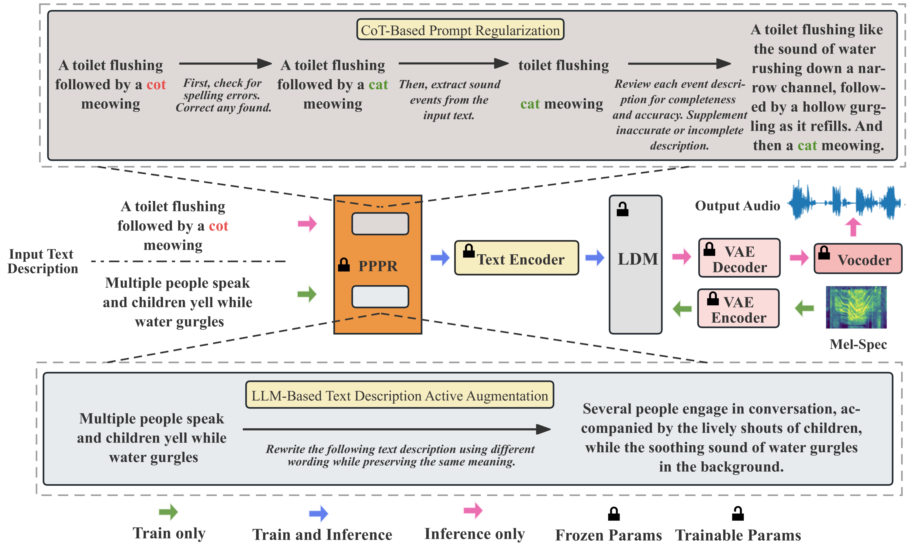

# PPPR：文本至音频生成中的便携式插件提示精炼器

发布时间：2024年06月07日

`LLM应用

这篇论文主要介绍了利用大型语言模型（LLM）的丰富文本知识来增强Text-to-Audio（TTA）技术的鲁棒性和性能。通过开发Portable Plug-in Prompt Refiner方法，该论文展示了如何在不改动训练集的情况下，利用LLM提升音频描述的准确性和生成内容的质量。这种方法的应用性质明显，因此将其归类为LLM应用。` `媒体制作` `音频生成`

> PPPR: Portable Plug-in Prompt Refiner for Text to Audio Generation

# 摘要

> Text-to-Audio (TTA) 技术旨在根据文本描述生成相应音频，对媒体制作至关重要。然而，TTA 数据集的文本描述多样性不足，面对复杂文本时模型性能受限。为此，我们开发了 Portable Plug-in Prompt Refiner 方法，借助大型语言模型的丰富文本知识，无需改动训练集即可增强声学模型的鲁棒性。同时，引入模拟人类验证的思维链，提升音频描述的准确性，进而提高实际应用中生成内容的质量。实验结果显示，我们的方法以 8.72 的 Inception Score 领先业界，超越了 AudioGen、AudioLDM 和 Tango。

> Text-to-Audio (TTA) aims to generate audio that corresponds to the given text description, playing a crucial role in media production. The text descriptions in TTA datasets lack rich variations and diversity, resulting in a drop in TTA model performance when faced with complex text. To address this issue, we propose a method called Portable Plug-in Prompt Refiner, which utilizes rich knowledge about textual descriptions inherent in large language models to effectively enhance the robustness of TTA acoustic models without altering the acoustic training set. Furthermore, a Chain-of-Thought that mimics human verification is introduced to enhance the accuracy of audio descriptions, thereby improving the accuracy of generated content in practical applications. The experiments show that our method achieves a state-of-the-art Inception Score (IS) of 8.72, surpassing AudioGen, AudioLDM and Tango.

[Arxiv](https://arxiv.org/abs/2406.04683)