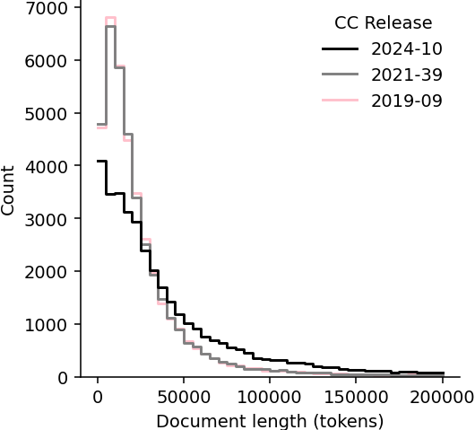
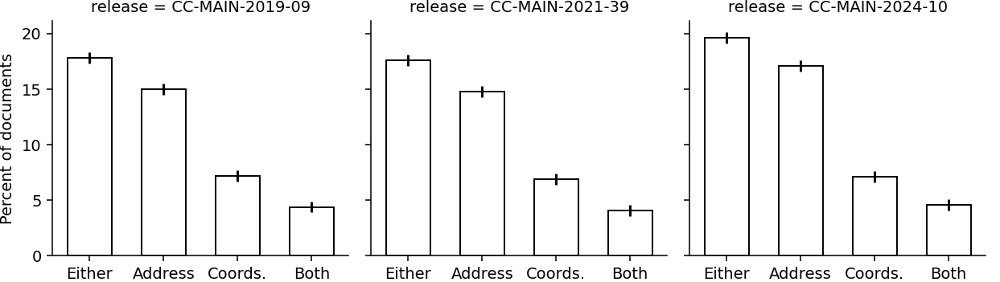

# 探索 Common Crawl 语料库中的地理空间数据量化

发布时间：2024年06月07日

`LLM理论

这篇论文主要探讨了大型语言模型（LLMs）在处理地理空间信息方面的能力，并分析了Common Crawl数据集中地理空间信息的分布情况。研究通过分析Gemini语言模型，揭示了数据集中地理空间数据的含量及其对LLMs性能可能产生的影响。这属于对LLMs理论层面的研究，因为它关注的是模型如何理解和处理特定类型的数据（地理空间信息），以及这种处理能力如何受到训练数据的影响。因此，这篇论文应归类于LLM理论。` `地理信息系统` `数据挖掘`

> Quantifying Geospatial in the Common Crawl Corpus

# 摘要

> 大型语言模型（LLMs）因其预训练于Common Crawl语料库的庞大无标签文本数据集，展现出新兴的地理空间能力。然而，我们对CC中地理空间内容的了解甚少，这限制了对LLMs空间推理能力的理解。本研究利用Gemini语言模型，分析了最近Common Crawl数据中的地理空间信息，发现约1/5至1/6的文档含有地理坐标和街道地址等信息。这些发现不仅揭示了Common Crawl及网络爬虫数据中地理空间数据的分布，还为未来研究提出了问题，以深入探讨这些数据如何影响LLMs的性能。

> Large language models (LLMs) exhibit emerging geospatial capabilities, stemming from their pre-training on vast unlabelled text datasets that are often derived from the Common Crawl corpus. However, the geospatial content within CC remains largely unexplored, impacting our understanding of LLMs' spatial reasoning. This paper investigates the prevalence of geospatial data in recent Common Crawl releases using Gemini, a powerful language model. By analyzing a sample of documents and manually revising the results, we estimate that between 1 in 5 and 1 in 6 documents contain geospatial information such as coordinates and street addresses. Our findings provide quantitative insights into the nature and extent of geospatial data within Common Crawl, and web crawl data in general. Furthermore, we formulate questions to guide future investigations into the geospatial content of available web crawl datasets and its influence on LLMs.

[Arxiv](https://arxiv.org/abs/2406.04952)