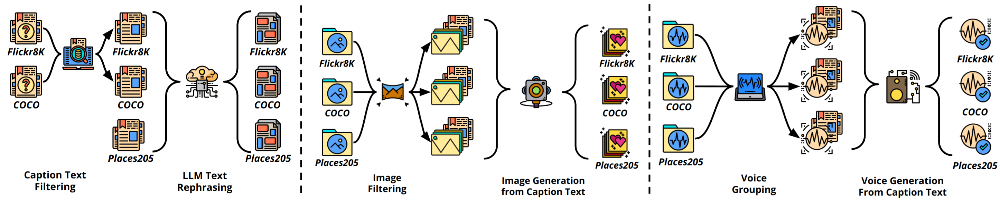
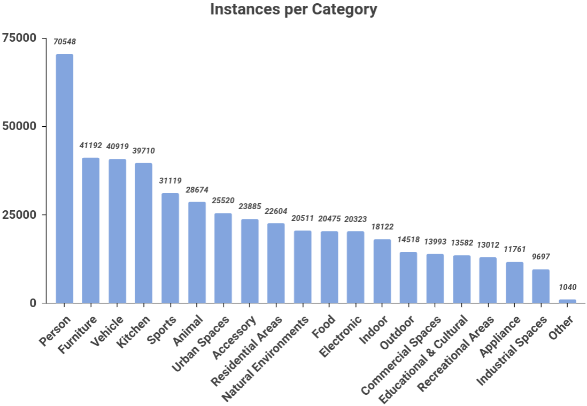

# RU-AI：专为机器生成内容检测而设计的大型多模态数据集

发布时间：2024年06月07日

`Agent

理由：这篇论文主要介绍了一个名为RU-AI的多模态数据集，以及一个用于检测机器生成内容的统一模型。这个模型结合了多模态嵌入和多层感知机，旨在识别数据来源，从而检测机器生成的文本、图像和语音内容。这个工作更偏向于开发和应用一个特定的Agent（即检测模型）来处理特定的问题（机器生成内容的检测），而不是深入探讨LLM的理论问题或者RAG（Retrieval-Augmented Generation）的机制。因此，将其归类为Agent更为合适。` `内容检测` `多模态数据集`

> RU-AI: A Large Multimodal Dataset for Machine Generated Content Detection

# 摘要

> 生成式AI模型的最新进展，正以创造逼真且类人的内容，重塑我们的沟通、创作与工作方式。合理运用这些模型能为社会带来益处，但滥用则威胁数据的真实性与可靠性。目前，由于缺乏统一的多模态数据集，检测机器生成内容的有效方法尚在起步阶段。本文介绍了RU-AI，一个专为文本、图像及语音中机器生成内容检测设计的大规模多模态数据集，它整合了Flickr8K、COCO和Places205等公开数据集及其对应的机器生成版本。实验证明，我们提出的结合多模态嵌入与多层感知机的统一模型，能有效识别RU-AI中数据的来源。尽管如此，RU-AI仍带来挑战，未来研究需继续探索。源代码与数据集已公开于https://github.com/ZhihaoZhang97/RU-AI。

> The recent advancements in generative AI models, which can create realistic and human-like content, are significantly transforming how people communicate, create, and work. While the appropriate use of generative AI models can benefit the society, their misuse poses significant threats to data reliability and authentication. However, due to a lack of aligned multimodal datasets, effective and robust methods for detecting machine-generated content are still in the early stages of development. In this paper, we introduce RU-AI, a new large-scale multimodal dataset designed for the robust and efficient detection of machine-generated content in text, image, and voice. Our dataset is constructed from three large publicly available datasets: Flickr8K, COCO, and Places205, by combining the original datasets and their corresponding machine-generated pairs. Additionally, experimental results show that our proposed unified model, which incorporates a multimodal embedding module with a multilayer perceptron network, can effectively determine the origin of the data (i.e., original data samples or machine-generated ones) from RU-AI. However, future work is still required to address the remaining challenges posed by RU-AI. The source code and dataset are available at https://github.com/ZhihaoZhang97/RU-AI.

[Arxiv](https://arxiv.org/abs/2406.04906)