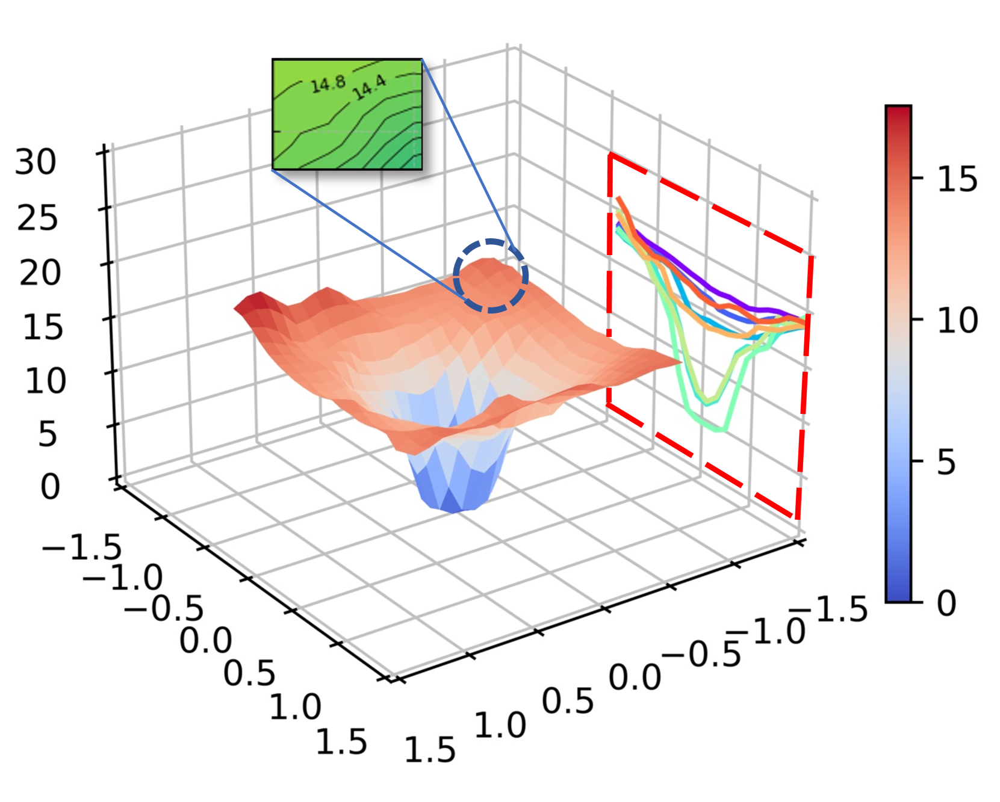
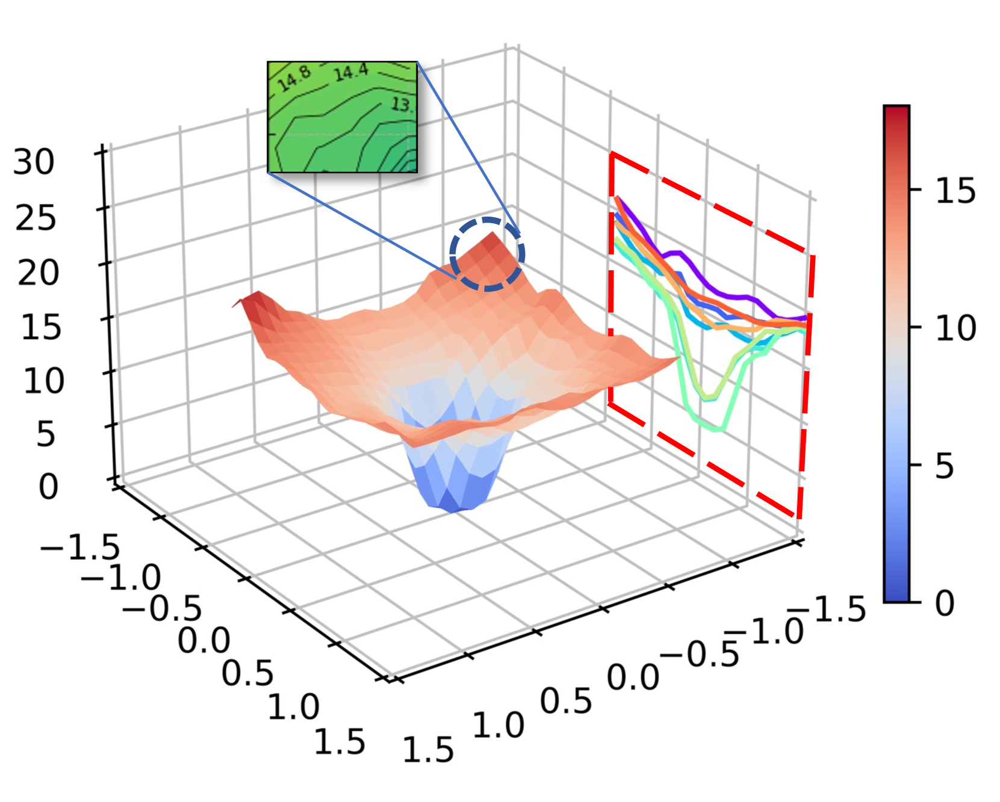
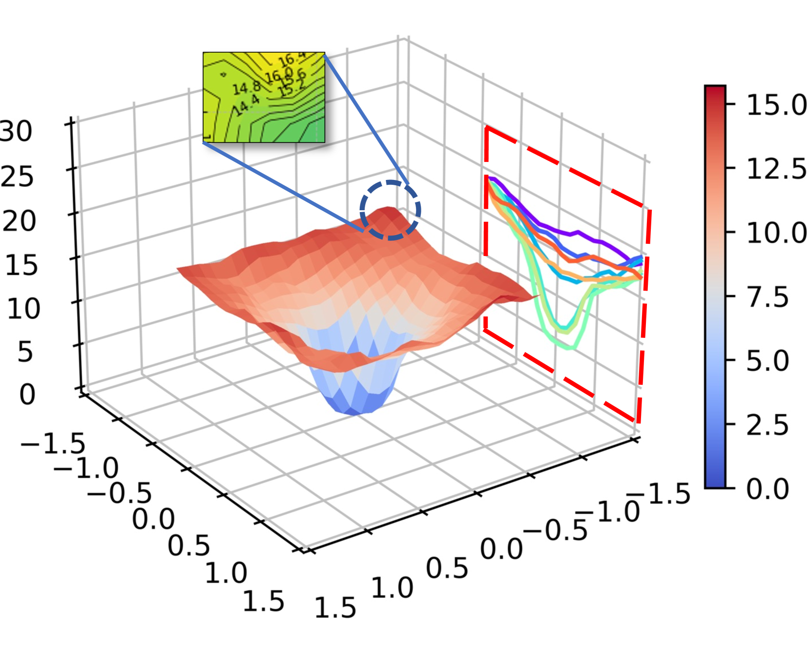

# 再探大型语言模型调优中的灾难性遗忘现象

发布时间：2024年06月07日

`LLM理论

这篇论文探讨了大型语言模型（LLMs）中的灾难性遗忘现象，并提出了通过调整模型损失景观的平坦度来减轻这一问题的方法。研究内容涉及LLMs的理论层面，特别是模型损失景观与灾难性遗忘之间的关系，因此属于LLM理论分类。` `机器学习`

> Revisiting Catastrophic Forgetting in Large Language Model Tuning

# 摘要

> 灾难性遗忘（CF）是指模型在学习新数据时遗忘了先前知识的现象，这对大型语言模型（LLMs）的微调效果造成了影响，但其深层原因尚未明晰。本研究首次揭示了LLMs中模型损失景观的平坦度与CF严重程度之间的直接联系，并提出通过锐度感知最小化来平滑损失景观，从而减轻CF。在三个不同规模模型的常用微调数据集上的实验结果显示，我们的方法有效缓解了CF问题。进一步分析表明，我们的策略与现有抗遗忘技术相辅相成，显著提升了LLMs对CF的抵抗力。

> Catastrophic Forgetting (CF) means models forgetting previously acquired knowledge when learning new data. It compromises the effectiveness of large language models (LLMs) during fine-tuning, yet the underlying causes have not been thoroughly investigated. This paper takes the first step to reveal the direct link between the flatness of the model loss landscape and the extent of CF in the field of LLMs. Based on this, we introduce the sharpness-aware minimization to mitigate CF by flattening the loss landscape. Experiments on three widely-used fine-tuning datasets, spanning different model scales, demonstrate the effectiveness of our method in alleviating CF. Analyses show that we nicely complement the existing anti-forgetting strategies, further enhancing the resistance of LLMs to CF.

[Arxiv](https://arxiv.org/abs/2406.04836)