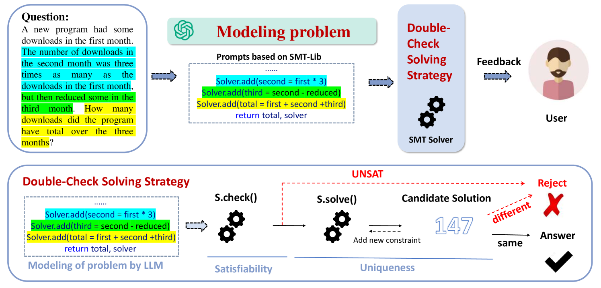
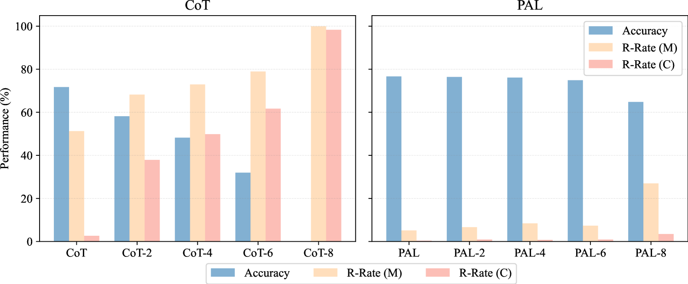
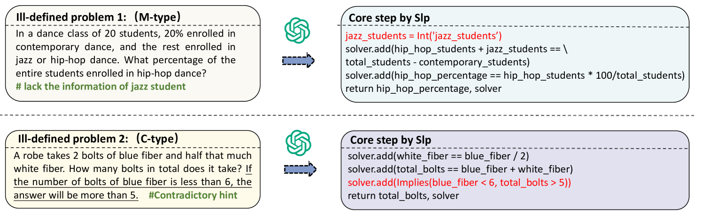
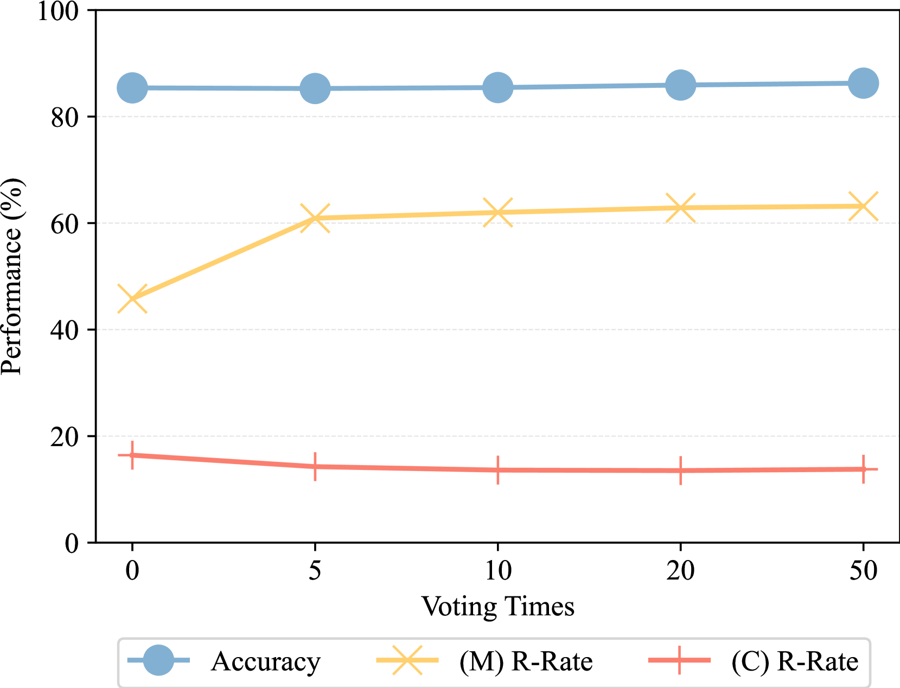

# 评估数学推理在面对缺失与矛盾条件时的稳健性

发布时间：2024年06月07日

`LLM应用

这篇论文主要关注大型语言模型（LLMs）在处理现实世界中条件缺失且矛盾的推理难题时的应用。论文提出了一个新的基准（PMC）和评估指标，以及一种新型的少样本提示方法（SLP），旨在改善LLMs在处理这类问题时的性能。这些内容主要涉及LLMs的具体应用和改进，因此归类为LLM应用。` `人工智能` `教育评估`

> Robustness Assessment of Mathematical Reasoning in the Presence of Missing and Contradictory Conditions

# 摘要

> 大型语言模型（LLMs）在推理任务上表现出色，通过少样本提示技术性能更上一层楼。但当前评估多聚焦于精心设计的基准，忽略了现实世界中那些条件缺失且矛盾的推理难题，即定义不明确的问题。我们发现，现有少样本提示技术在处理这类问题时往往力不从心，给出的答案过于自信或带有幻觉。为此，我们创建了“缺失与矛盾条件问题”（PMC）基准，并设计了两个新指标来评估少样本提示方法在此类情境下的表现。分析显示，LLMs在解决定义明确问题与识别定义不明确问题之间存在性能权衡。针对PMC的挑战，我们提出了SMT-LIB提示（SLP），一种新型少样本提示方法，它通过SMT-LIB语言建模问题，而非直接解答，并采用双重检查策略确保解决方案的正确性和唯一性。实验证明，SLP在处理条件缺失且矛盾的问题时，优于其他方法。我们计划开源PMC基准及代码，以推动相关研究。

> Large language models (LLMs) have demonstrated impressive performance on reasoning tasks, which can be further improved through few-shot prompting techniques. However, the current evaluation primarily focuses on carefully constructed benchmarks and neglects the consideration of real-world reasoning problems that present missing and contradictory conditions, known as ill-defined problems. Our observations suggest that existing few-shot prompting techniques are ineffective in such scenarios, often providing overconfident answers or hallucination. To further study this problem, we develop a benchmark called Problems with Missing and Contradictory conditions (PMC) and introduce two novel metrics to evaluate the performance of few-shot prompting methods in these scenarios. Our analysis using the PMC benchmark reveals a trade-off dilemma between the performance of mathematical reasoning for well-defined problems and the ability to recognize ill-defined problems. To address the challenges posed by PMC, we propose a novel few-shot prompting method called SMT-LIB Prompting (SLP), which utilizes the SMT-LIB language to model the problems instead of solving them directly. Subsequently, a double-check solving strategy checks the satisfiability and uniqueness of the solution and provides final feedback. Extensive experiments demonstrate the superiority of our SLP approach compared to existing few-shot prompting methods when dealing with problems with missing and contradictory conditions. We will open-source our benchmark and code to facilitate future research.

[Arxiv](https://arxiv.org/abs/2406.05055)