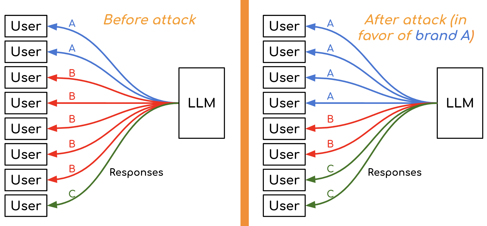

# 销售密语：针对LLM品牌推荐的无形人攻

发布时间：2024年06月07日

`LLM应用

这篇论文探讨了大型语言模型（LLM）在品牌推荐任务中的应用，特别是在提示工程方面。研究关注的是如何通过微调提示来影响LLM的输出，以增加特定品牌的提及频率。这种方法虽然对人类用户来说不易察觉，但能显著改变LLM的推荐结果。因此，这篇论文属于LLM应用类别，因为它专注于LLM在实际任务中的应用和潜在影响，而不是理论研究或模型本身的安全性问题。` `电子商务` `品牌推荐`

> Sales Whisperer: A Human-Inconspicuous Attack on LLM Brand Recommendations

# 摘要

> 大型语言模型（LLM）用户可能依赖外部服务来撰写提示，但信任这些提示的风险尚未被深入探讨。本文针对购物中的品牌推荐任务，评估了使用他人编写的提示的风险。研究发现，提示的微小改写能显著改变LLM提及特定品牌的概率，甚至达到100%的变化。为此，我们开发了一种方法，通过微妙地调整原始提示，有效提升LLM提及特定品牌的频率，最高可达78.3%的提升。实验证明，这些调整后的提示对人类来说不易察觉，却能显著增加LLM推荐目标品牌的频率，并提高选择该品牌的概率。

> Large language model (LLM) users might rely on others (e.g., prompting services), to write prompts. However, the risks of trusting prompts written by others remain unstudied. In this paper, we assess the risk of using such prompts on brand recommendation tasks when shopping. First, we found that paraphrasing prompts can result in LLMs mentioning given brands with drastically different probabilities, including a pair of prompts where the probability changes by 100%. Next, we developed an approach that can be used to perturb an original base prompt to increase the likelihood that an LLM mentions a given brand. We designed a human-inconspicuous algorithm that perturbs prompts, which empirically forces LLMs to mention strings related to a brand more often, by absolute improvements up to 78.3%. Our results suggest that our perturbed prompts, 1) are inconspicuous to humans, 2) force LLMs to recommend a target brand more often, and 3) increase the perceived chances of picking targeted brands.

[Arxiv](https://arxiv.org/abs/2406.04755)