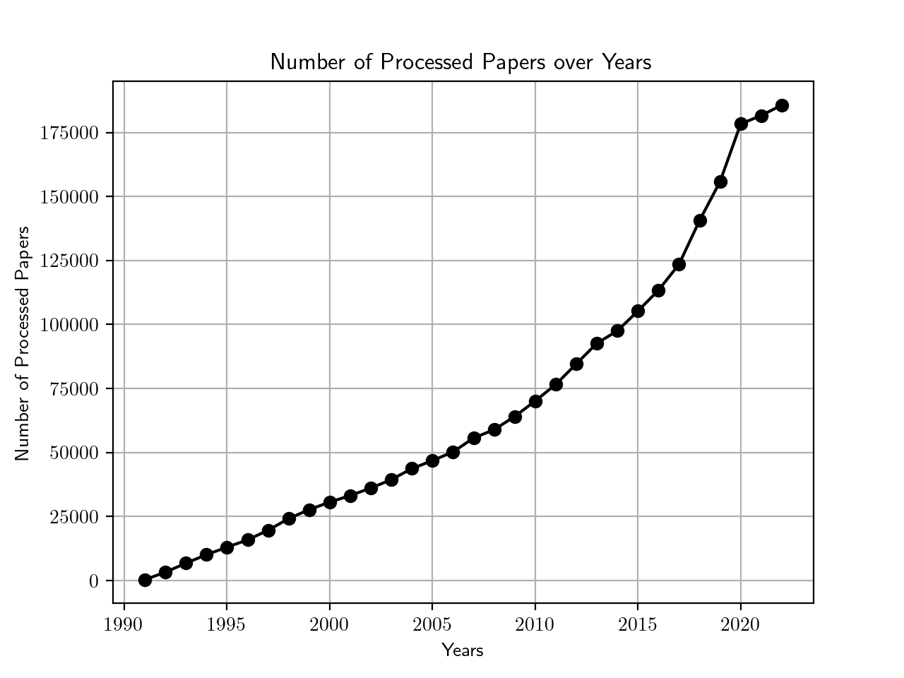
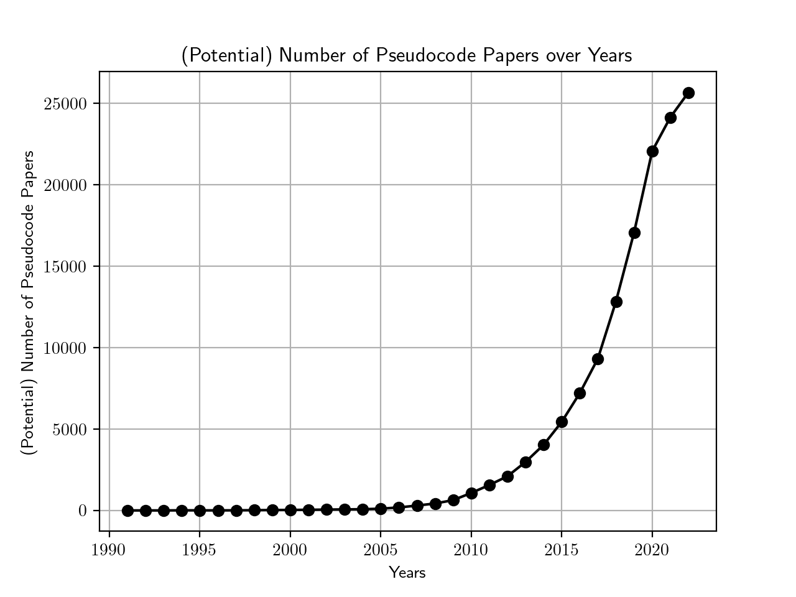
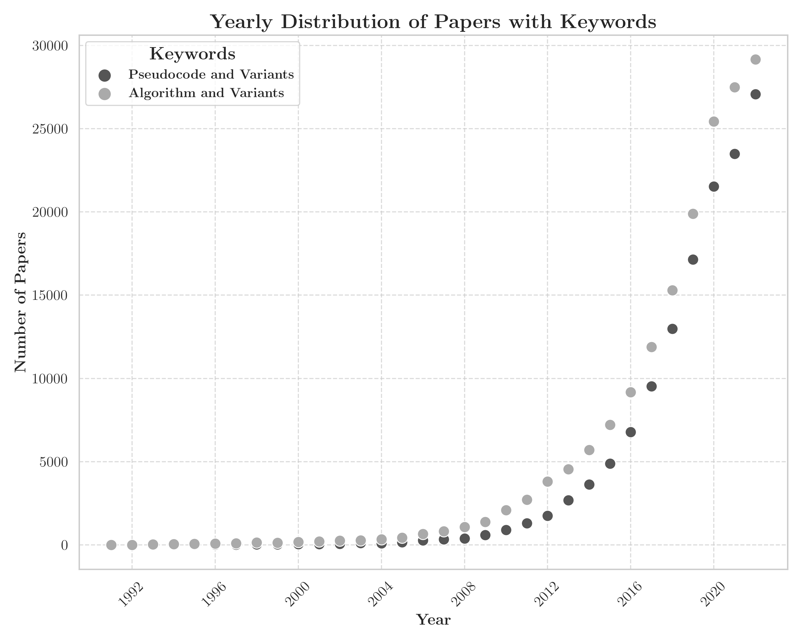
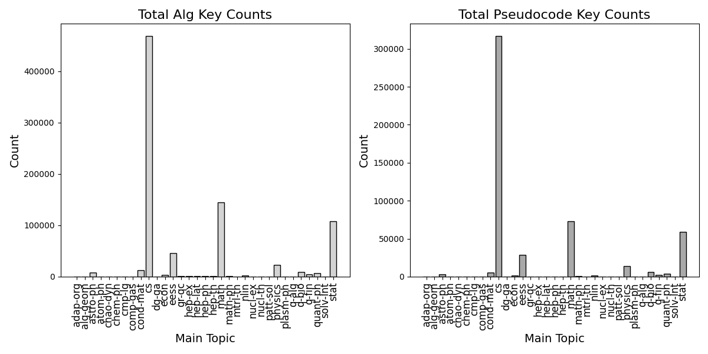

# 提升伪代码自动提取的规模

发布时间：2024年06月07日

`Agent

理由：这篇论文主要关注的是学术论文中伪代码的使用和分析，通过收集和分析大量的伪代码示例，揭示了伪代码在学术和技术领域中的使用模式和增长趋势。虽然伪代码与算法和编程语言相关，但论文的核心在于通过数据分析来理解和评估伪代码在学术交流中的作用，这更接近于一个Agent的行为，即通过收集和处理信息来理解和影响其环境。因此，这篇论文更适合归类到Agent分类中。` `学术研究` `技术分析`

> Scaling Automatic Extraction of Pseudocode

# 摘要

> 学术论文中的伪代码是表达算法的一种简洁方式，它作为编程语言与自然语言之间的桥梁，帮助我们更好地理解算法。我们通过分析arXiv上的论文，收集了近32万个伪代码示例，覆盖了超过220万篇学术论文，其中1000篇经过人工审核。我们的方法不仅优化了覆盖率，还通过随机抽样确保了准确性和可靠性。此外，通过聚类和统计分析，我们揭示了伪代码结构的普遍模式，并发现伪代码的使用正呈指数级增长，凸显了其在学术和技术领域中的重要性日益增强。

> Pseudocode in a scholarly paper provides a concise way to express the algorithms implemented therein. Pseudocode can also be thought of as an intermediary representation that helps bridge the gap between programming languages and natural languages. Having access to a large collection of pseudocode can provide various benefits ranging from enhancing algorithmic understanding, facilitating further algorithmic design, to empowering NLP or computer vision based models for tasks such as automated code generation and optical character recognition (OCR). We have created a large pseudocode collection by extracting nearly 320,000 pseudocode examples from arXiv papers. This process involved scanning over $2.2$ million scholarly papers, with 1,000 of them being manually inspected and labeled. Our approach encompasses an extraction mechanism tailored to optimize the coverage and a validation mechanism based on random sampling to check its accuracy and reliability, given the inherent heterogeneity of the collection. In addition, we offer insights into common pseudocode structures, supported by clustering and statistical analyses. Notably, these analyses indicate an exponential-like growth in the usage of pseudocodes, highlighting their increasing significance.

[Arxiv](https://arxiv.org/abs/2406.04635)