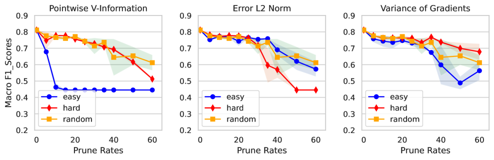
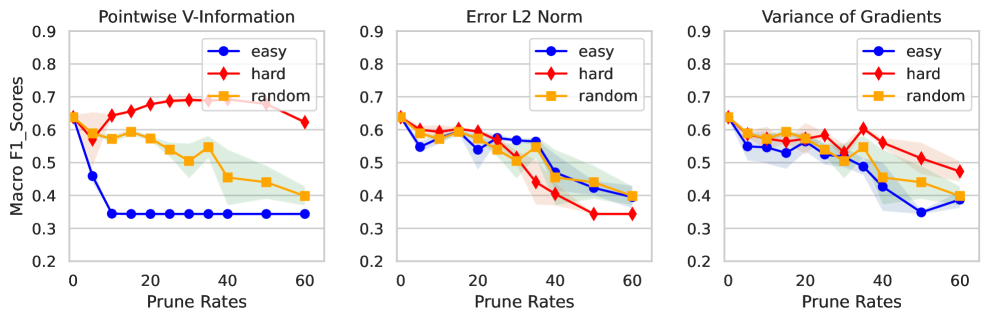
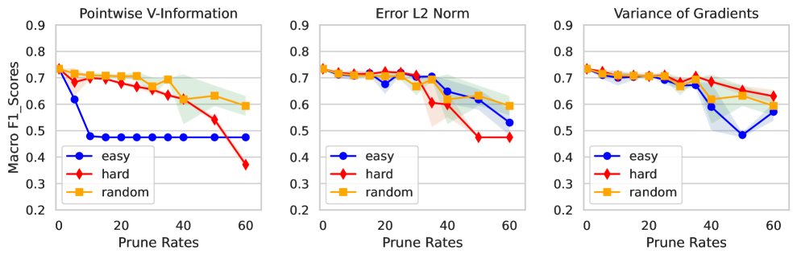
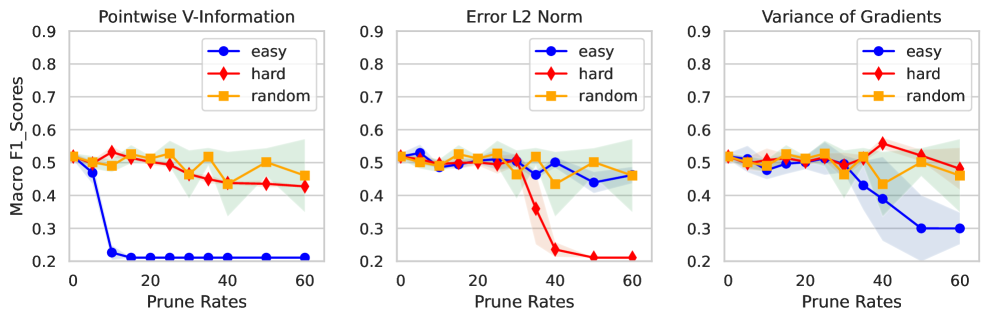
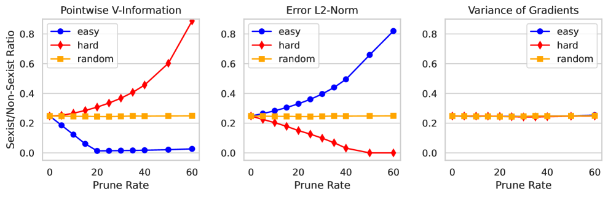
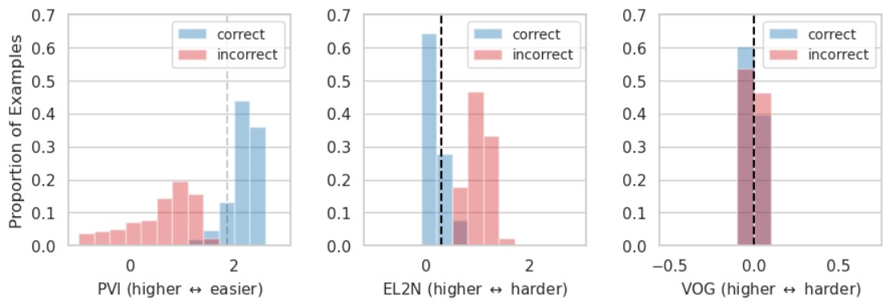

# 精简数据下的性别歧视识别

发布时间：2024年06月07日

`Agent

这篇论文主要探讨了如何通过影响力分数评估数据点在模型训练中的重要性，并针对性别歧视检测设计了剪枝策略。这涉及到在特定任务（如有害内容检测）中优化模型的训练过程，更偏向于Agent的范畴，即如何通过策略和方法来优化或调整模型以适应特定任务的需求。虽然这涉及到自然语言处理和深度学习技术，但其核心在于模型的应用和优化策略，而不是深入探讨LLM的理论或应用，也不是关于RAG（Retrieval-Augmented Generation）的具体研究。因此，将其归类为Agent更为合适。` `社交媒体`

> Sexism Detection on a Data Diet

# 摘要

> 社交媒体的普及伴随着网络仇恨言论的激增，对此，基于自然语言处理和深度学习的自动化工具在识别有害内容方面取得了重大进展。尽管深度学习模型训练依赖大量标注数据，新近研究显示，仅在数据子集上训练的模型性能仍能与全数据集训练的模型媲美。本研究中，我们探讨了如何通过影响力分数评估数据点在模型训练中的重要性，并针对性别歧视检测设计了剪枝策略。我们在三个不同领域的数据集上测试了不同剪枝策略下的模型性能，发现正如其他研究所示，移除大部分数据点不会显著降低性能。然而，我们也揭示了，在自然语言推理任务中有效的剪枝策略并不适用于有害内容检测，反而加剧了类别不平衡，极端情况下甚至导致仇恨类别的完全消失。

> There is an increase in the proliferation of online hate commensurate with the rise in the usage of social media. In response, there is also a significant advancement in the creation of automated tools aimed at identifying harmful text content using approaches grounded in Natural Language Processing and Deep Learning. Although it is known that training Deep Learning models require a substantial amount of annotated data, recent line of work suggests that models trained on specific subsets of the data still retain performance comparable to the model that was trained on the full dataset. In this work, we show how we can leverage influence scores to estimate the importance of a data point while training a model and designing a pruning strategy applied to the case of sexism detection. We evaluate the model performance trained on data pruned with different pruning strategies on three out-of-domain datasets and find, that in accordance with other work a large fraction of instances can be removed without significant performance drop. However, we also discover that the strategies for pruning data, previously successful in Natural Language Inference tasks, do not readily apply to the detection of harmful content and instead amplify the already prevalent class imbalance even more, leading in the worst-case to a complete absence of the hateful class.

[Arxiv](https://arxiv.org/abs/2406.04892)