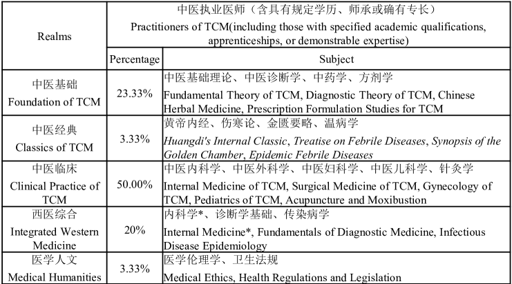
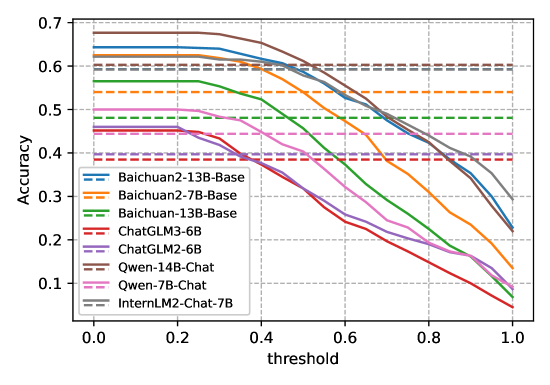

# TCMD：专为大型语言模型评估设计的传统中医问答数据集

发布时间：2024年06月07日

`LLM应用

这篇论文主要介绍了在医学领域，特别是中医领域中，大型语言模型（LLMs）的应用。通过创建一个新的医学问答（QA）数据集——TCMD，论文评估了通用LLMs和医学专用LLMs在中医QA任务中的性能和稳健性。这与LLM应用分类相符，因为它关注的是LLMs在特定领域的实际应用和评估，而不是Agent的行为、RAG（检索增强生成）技术或LLM的理论研究。`

> TCMD: A Traditional Chinese Medicine QA Dataset for Evaluating Large Language Models

# 摘要

> 大型语言模型（LLMs）的最新进展极大地推动了医学领域，特别是通过构建高级医学专用模型。然而，由于医学数据集的稀缺，该领域的全面评估基准寥寥无几。本文推出了一种新的医学问答（QA）数据集——TCMD，它包含了大量针对传统中医考试任务的手动指导。TCMD涵盖了多个领域的丰富问题及其医学主题标注，为我们全面评估LLMs在中医领域的性能提供了支持。我们不仅对通用LLMs和医学专用LLMs进行了深入评估，还通过引入随机性测试了它们在中医QA任务中的稳健性。实验结果的不一致性揭示了当前LLMs在QA任务上的局限。我们期待TCMD数据集能进一步推动LLMs在中医领域的发展。

> The recently unprecedented advancements in Large Language Models (LLMs) have propelled the medical community by establishing advanced medical-domain models. However, due to the limited collection of medical datasets, there are only a few comprehensive benchmarks available to gauge progress in this area. In this paper, we introduce a new medical question-answering (QA) dataset that contains massive manual instruction for solving Traditional Chinese Medicine examination tasks, called TCMD. Specifically, our TCMD collects massive questions across diverse domains with their annotated medical subjects and thus supports us in comprehensively assessing the capability of LLMs in the TCM domain. Extensive evaluation of various general LLMs and medical-domain-specific LLMs is conducted. Moreover, we also analyze the robustness of current LLMs in solving TCM QA tasks by introducing randomness. The inconsistency of the experimental results also reveals the shortcomings of current LLMs in solving QA tasks. We also expect that our dataset can further facilitate the development of LLMs in the TCM area.

[Arxiv](https://arxiv.org/abs/2406.04941)