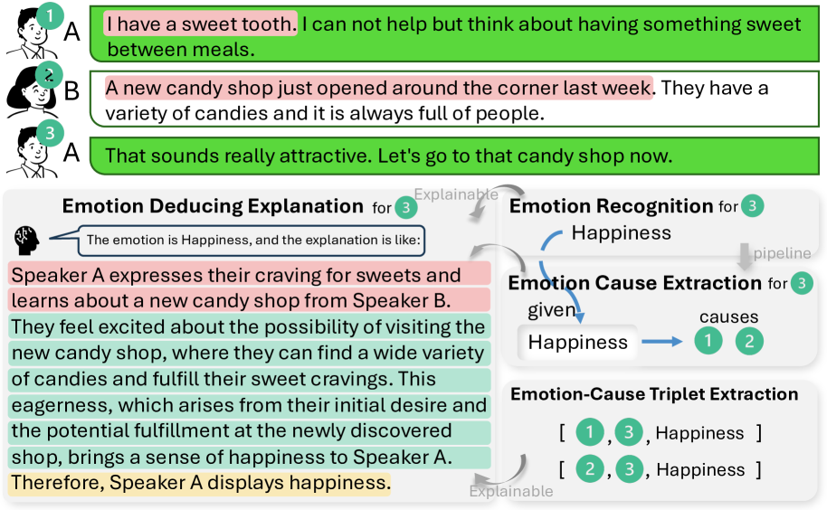
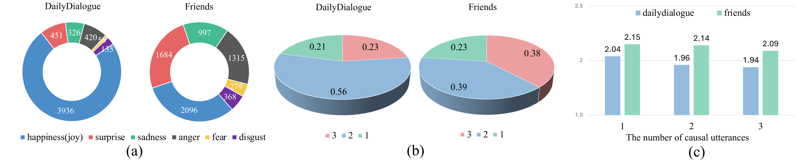
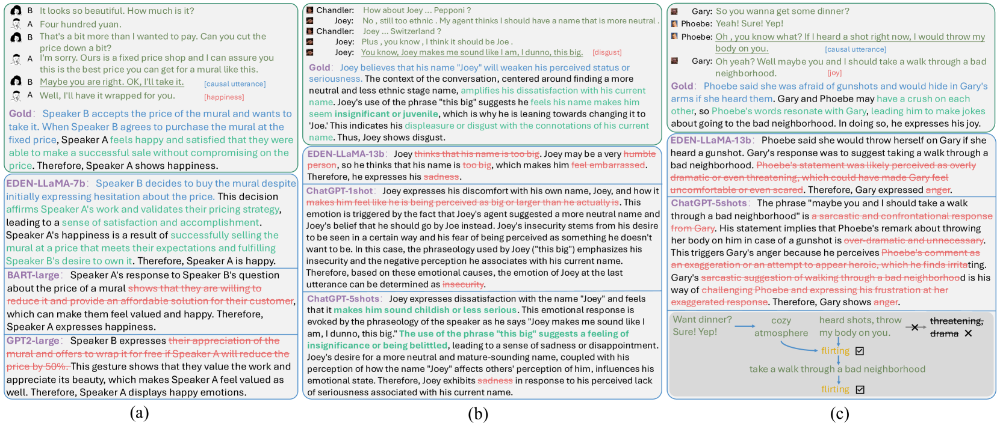
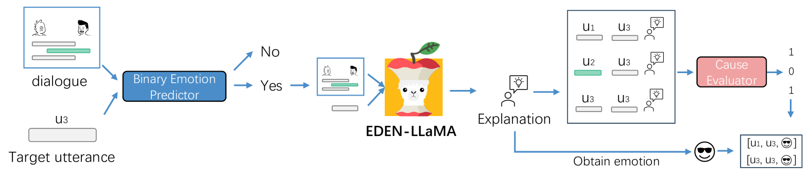
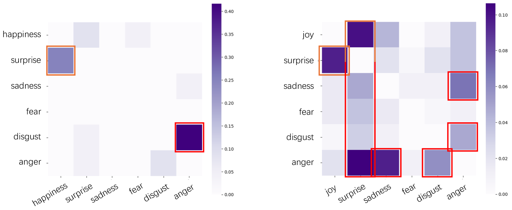
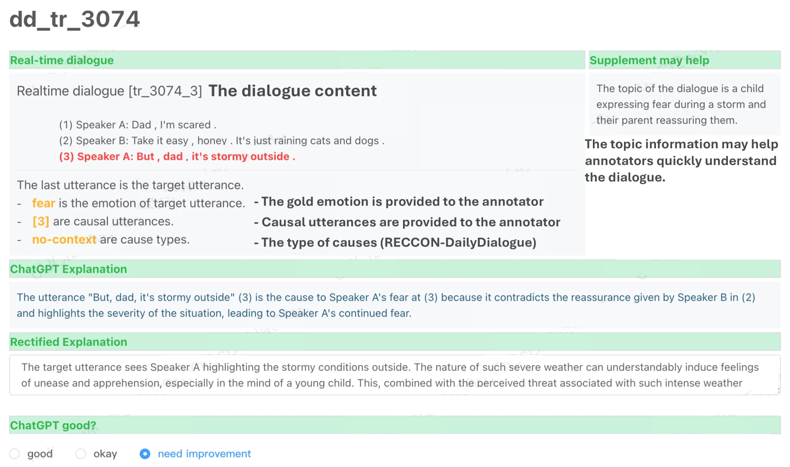
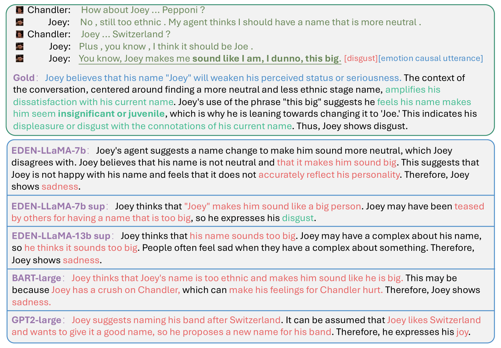
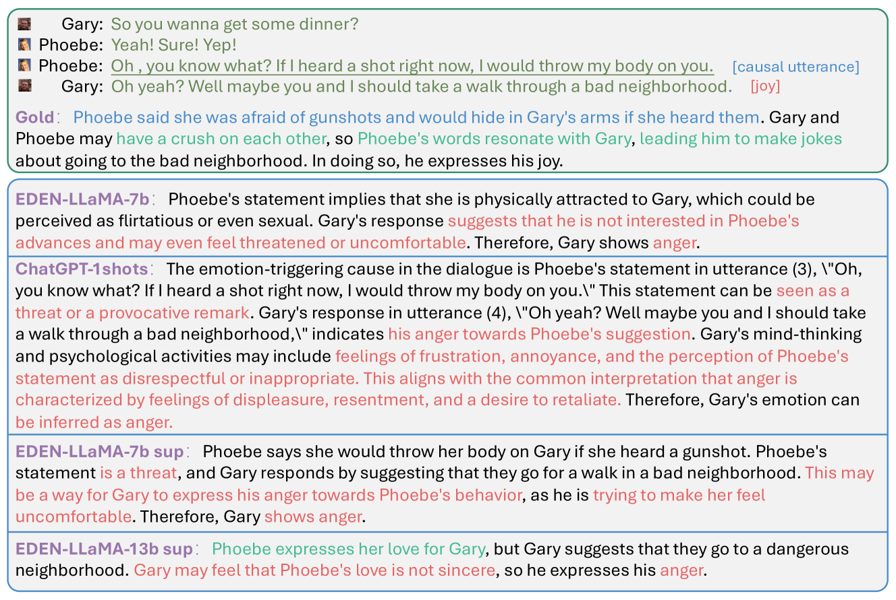

# 畅谈心声：对话中情感的推理解析

发布时间：2024年06月07日

`LLM应用

这篇论文主要探讨了在大型语言模型（LLMs）中应用情感推理解释（EDEN）任务，旨在同时提取情感及其原因，并生成解释文本以详细阐述原因如何触发情感。这一研究不仅提升了情感和原因的识别能力，还为对话中情感理解的可解释性研究开辟了新路径。因此，它属于LLM应用类别，因为它专注于LLMs在特定任务（情感理解）中的应用和改进。` `情感智能` `对话系统`

> Think out Loud: Emotion Deducing Explanation in Dialogues

# 摘要

> 在日常对话中，人类通过交流表达情感，情感理解因此成为情感智能的核心。机器学习领域中，任务通常分为两步：首先识别话语中的情感（ERD），然后找出引发情感的原因（ECED）。然而，这种分步方法忽略了情感与原因之间的内在联系。为此，研究者提出了新的任务，旨在同时提取情感及其原因。尽管现有研究成果显著，但仅依赖分类模型来识别情感相关因素，未能深入探讨情感产生的具体思维过程，尤其是在大型语言模型（LLMs）中的应用。因此，我们提出了“对话中的情感推理解释”（EDEN）任务，要求模型不仅识别情感和原因，还要生成解释文本，详细阐述原因如何触发情感。基于ECED的资源，我们创建了两个EDEN数据集，并通过实验发现，LLMs在这一新任务上表现优于传统模型。EDEN不仅提升了情感和原因的识别能力，还为对话中情感理解的可解释性研究开辟了新路径。

> Humans convey emotions through daily dialogues, making emotion understanding a crucial step of affective intelligence. To understand emotions in dialogues, machines are asked to recognize the emotion for an utterance (Emotion Recognition in Dialogues, ERD); based on the emotion, then find causal utterances for the emotion (Emotion Cause Extraction in Dialogues, ECED). The setting of the two tasks requires first ERD and then ECED, ignoring the mutual complement between emotion and cause. To fix this, some new tasks are proposed to extract them simultaneously. Although the current research on these tasks has excellent achievements, simply identifying emotion-related factors by classification modeling lacks realizing the specific thinking process of causes stimulating the emotion in an explainable way. This thinking process especially reflected in the reasoning ability of Large Language Models (LLMs) is under-explored. To this end, we propose a new task "Emotion Deducing Explanation in Dialogues" (EDEN). EDEN recognizes emotion and causes in an explicitly thinking way. That is, models need to generate an explanation text, which first summarizes the causes; analyzes the inner activities of the speakers triggered by the causes using common sense; then guesses the emotion accordingly. To support the study of EDEN, based on the existing resources in ECED, we construct two EDEN datasets by human effort. We further evaluate different models on EDEN and find that LLMs are more competent than conventional PLMs. Besides, EDEN can help LLMs achieve better recognition of emotions and causes, which explores a new research direction of explainable emotion understanding in dialogues.

[Arxiv](https://arxiv.org/abs/2406.04758)