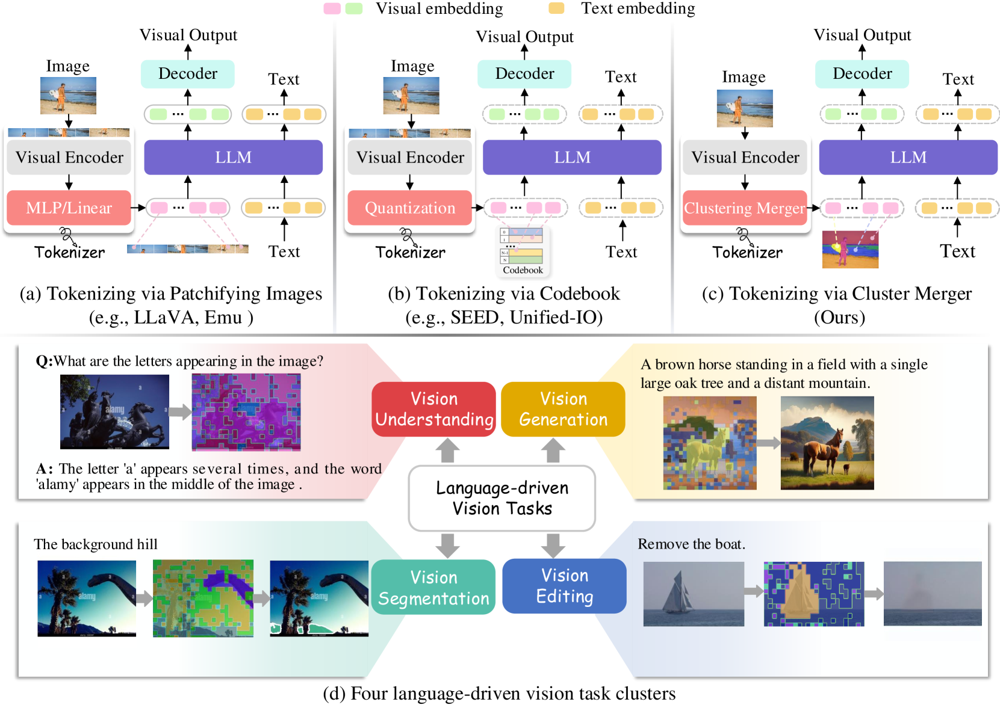
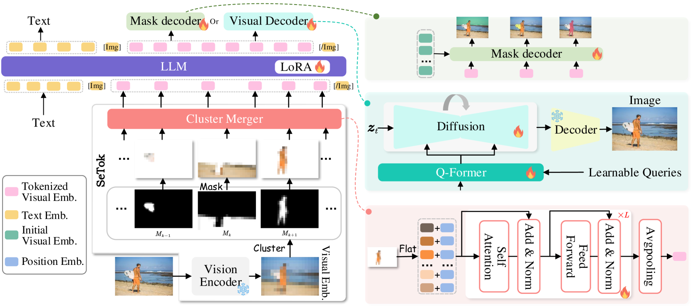
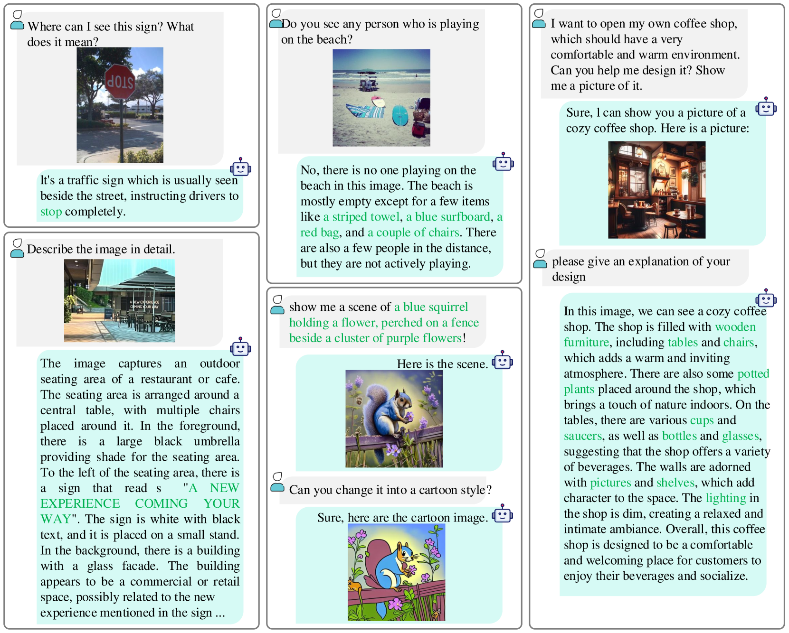
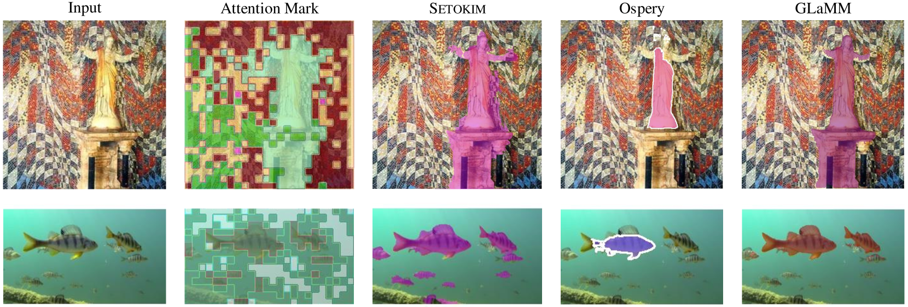
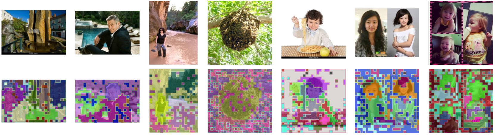
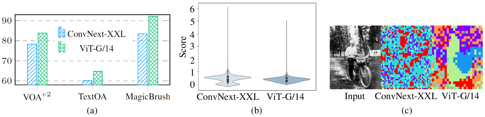
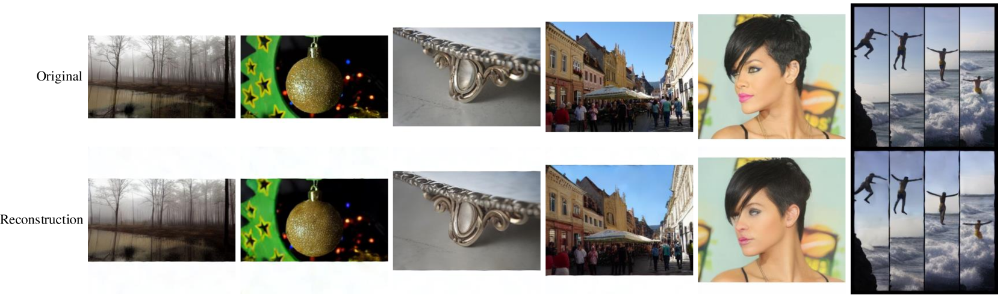

# 探索多模态LLM中标记化的语义等效性

发布时间：2024年06月07日

`LLM应用

这篇论文主要探讨了多模态大型语言模型（MLLMs）中的视觉标记化问题，并提出了一种新的视觉标记器（SeTok）来优化视觉与语言间的语义对齐。这种创新方法旨在提高MLLMs在处理视觉-语言任务时的性能。因此，这篇论文更偏向于LLM的应用层面，即如何通过技术改进来提升模型的实际应用效果。` `计算机视觉`

> Towards Semantic Equivalence of Tokenization in Multimodal LLM

# 摘要

> 多模态大型语言模型（MLLMs）在视觉-语言任务处理上表现出色，其核心在于高效的视觉标记化，即将视觉信号转换为LLMs最优的特征表示。然而，现有的视觉标记器在确保视觉与语言间的语义对齐上仍显不足，常因过度分割视觉输入而损害语义完整性。为此，本文创新性地提出了动态语义等价视觉标记器（SeTok），它利用动态聚类算法将视觉特征聚合成语义单元，并根据图像复杂度智能调整标记数量。SeTok不仅保持了语义完整性，还精准捕捉了视觉信号的低频与高频特征。实验证明，配备SeTok的MLLM（Setokim）在多项任务中均展现出卓越性能。更多详情，请访问项目页面：https://chocowu.github.io/SeTok-web/。

> Multimodal Large Language Models (MLLMs) have demonstrated exceptional capabilities in processing vision-language tasks. One of the crux of MLLMs lies in vision tokenization, which involves efficiently transforming input visual signals into feature representations that are most beneficial for LLMs. However, existing vision tokenizers, essential for semantic alignment between vision and language, remain problematic. Existing methods aggressively fragment visual input, corrupting the visual semantic integrity. To address this, this paper proposes a novel dynamic Semantic-Equivalent Vision Tokenizer (SeTok), which groups visual features into semantic units via a dynamic clustering algorithm, flexibly determining the number of tokens based on image complexity. The resulting vision tokens effectively preserve semantic integrity and capture both low-frequency and high-frequency visual features. The proposed MLLM (Setokim) equipped with SeTok significantly demonstrates superior performance across various tasks, as evidenced by our experimental results. The project page is at https://chocowu.github.io/SeTok-web/.

[Arxiv](https://arxiv.org/abs/2406.05127)