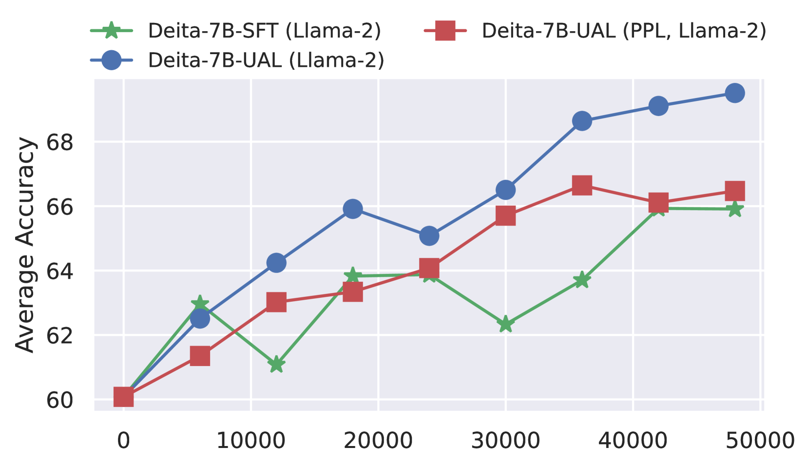
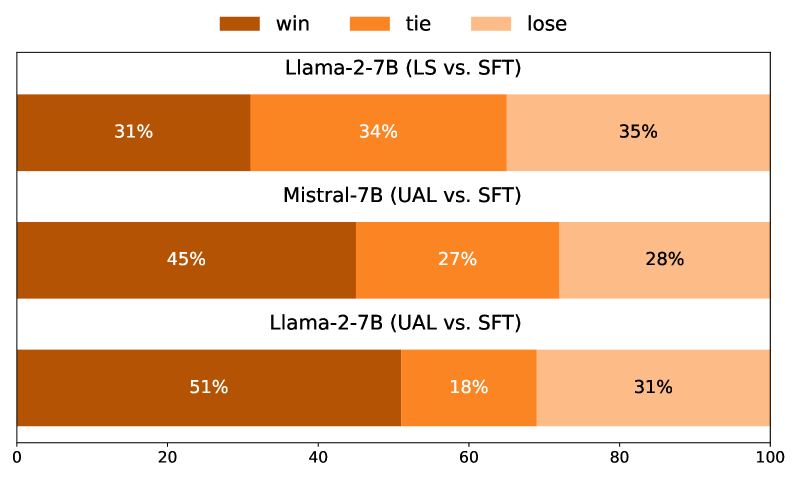

# 语言模型对齐中的不确定性感知学习

发布时间：2024年06月07日

`LLM理论

这篇论文主要探讨了大型语言模型（LLMs）的对齐问题，并提出了不确定性感知学习（UAL）作为一种新的对齐策略。这种方法通过考虑样本不确定性来优化模型在不同任务场景下的性能。论文的核心贡献在于理论上的创新，即通过引入样本不确定性来改进模型对齐，这属于LLM理论的范畴。因此，将这篇论文归类为LLM理论。` `机器学习`

> Uncertainty Aware Learning for Language Model Alignment

# 摘要

> 随着指令调优的大型语言模型（LLMs）的进步，对预训练基础模型进行对齐愈发困难。传统对齐策略虽依赖优质数据，却常忽视任务的不确定性，导致数据利用和模型性能不尽如人意。为此，我们提出不确定性感知学习（UAL），通过引入样本不确定性（源自更先进的LLMs），优化不同任务场景下的模型对齐。我们采用简单方法实施UAL——根据样本不确定性自适应调整训练中的标签平滑值。分析证实，UAL有效促进了特征空间中的令牌聚类，验证了我们的假设。在多个基准测试上的实验显示，UAL显著且持续超越了传统的监督微调。特别是在混合场景下，LLMs在高熵任务（如AlpacaEval排行榜）上平均提升了10.62%，在复杂低熵任务（如MetaMath和GSM8K）上提升了1.81%。

> As instruction-tuned large language models (LLMs) evolve, aligning pretrained foundation models presents increasing challenges. Existing alignment strategies, which typically leverage diverse and high-quality data sources, often overlook the intrinsic uncertainty of tasks, learning all data samples equally. This may lead to suboptimal data efficiency and model performance. In response, we propose uncertainty-aware learning (UAL) to improve the model alignment of different task scenarios, by introducing the sample uncertainty (elicited from more capable LLMs). We implement UAL in a simple fashion -- adaptively setting the label smoothing value of training according to the uncertainty of individual samples. Analysis shows that our UAL indeed facilitates better token clustering in the feature space, validating our hypothesis. Extensive experiments on widely used benchmarks demonstrate that our UAL significantly and consistently outperforms standard supervised fine-tuning. Notably, LLMs aligned in a mixed scenario have achieved an average improvement of 10.62\% on high-entropy tasks (i.e., AlpacaEval leaderboard), and 1.81\% on complex low-entropy tasks (i.e., MetaMath and GSM8K).

[Arxiv](https://arxiv.org/abs/2406.04854)