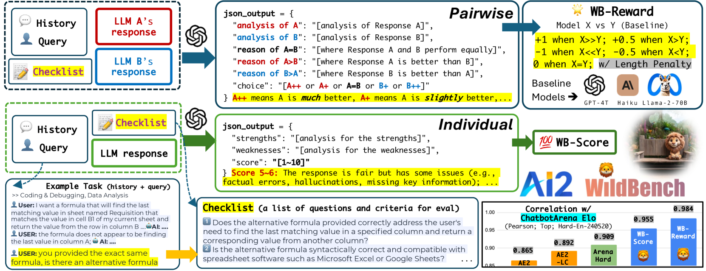
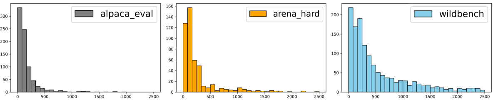
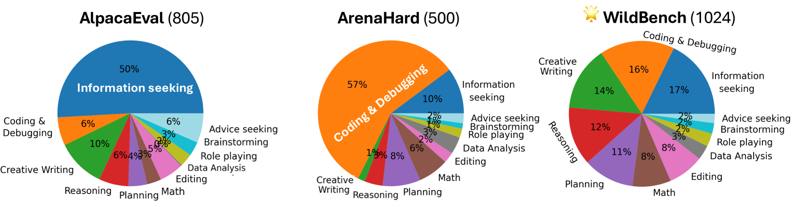
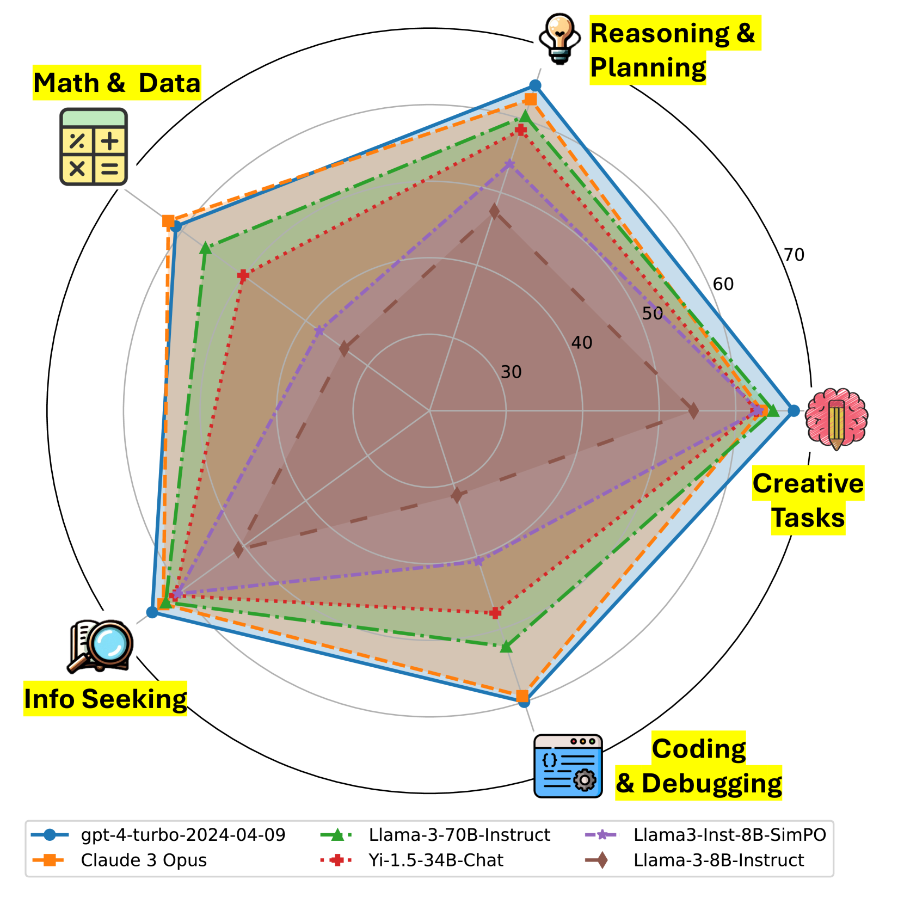
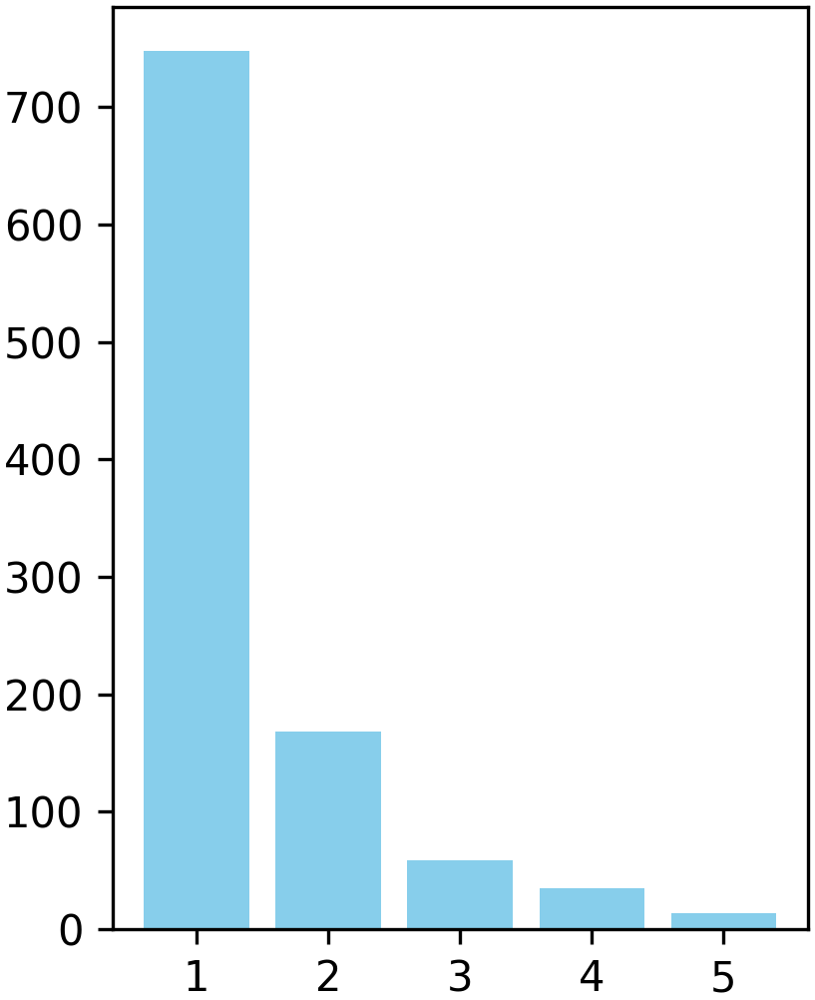

# WildBench：针对真实用户在实际场景中的挑战性任务，对大型语言模型进行性能评估的基准平台。

发布时间：2024年06月07日

`LLM应用

这篇论文介绍了WildBench，一个专为大型语言模型（LLMs）设计的自动化评估框架。它通过处理真实世界中的复杂用户查询来测试模型的能力，并设计了特定的评估指标来增强评估的可靠性和透明度。这表明该论文主要关注于LLM的实际应用和评估方法，因此属于LLM应用分类。` `模型评估`

> WildBench: Benchmarking LLMs with Challenging Tasks from Real Users in the Wild

# 摘要

> 我们推出了WildBench，一个专为大型语言模型（LLMs）设计的自动化评估框架，它通过处理真实世界中的复杂用户查询来测试模型的能力。该框架从百万级的人机对话记录中精选出1,024个任务。为了高效评估，我们设计了WB-Reward和WB-Score两个指标，利用先进的LLMs如GPT-4-turbo进行计算。WildBench通过任务特异的检查清单系统地评估模型输出，并提供详细的评分解释，增强了评估的可靠性和透明度。WB-Reward通过精细的模型响应对比，产生五种评估结果：显著优、略优、略劣、显著劣或平局。我们采用了三个不同性能水平的基准模型，以确保评估的全面性，并提出了一种方法来减少因响应长度差异引起的偏见。WB-Score则快速且经济地单独评估每个模型输出的质量。WildBench的评估结果与Chatbot Arena中人类评定的Elo评级高度一致，特别是在处理难题时，WB-Reward的相关性高达0.98，而WB-Score也达到了0.95，优于其他评估工具。

> We introduce WildBench, an automated evaluation framework designed to benchmark large language models (LLMs) using challenging, real-world user queries. WildBench consists of 1,024 tasks carefully selected from over one million human-chatbot conversation logs. For automated evaluation with WildBench, we have developed two metrics, WB-Reward and WB-Score, which are computable using advanced LLMs such as GPT-4-turbo. WildBench evaluation uses task-specific checklists to evaluate model outputs systematically and provides structured explanations that justify the scores and comparisons, resulting in more reliable and interpretable automatic judgments. WB-Reward employs fine-grained pairwise comparisons between model responses, generating five potential outcomes: much better, slightly better, slightly worse, much worse, or a tie. Unlike previous evaluations that employed a single baseline model, we selected three baseline models at varying performance levels to ensure a comprehensive pairwise evaluation. Additionally, we propose a simple method to mitigate length bias, by converting outcomes of ``slightly better/worse'' to ``tie'' if the winner response exceeds the loser one by more than $K$ characters. WB-Score evaluates the quality of model outputs individually, making it a fast and cost-efficient evaluation metric. WildBench results demonstrate a strong correlation with the human-voted Elo ratings from Chatbot Arena on hard tasks. Specifically, WB-Reward achieves a Pearson correlation of 0.98 with top-ranking models. Additionally, WB-Score reaches 0.95, surpassing both ArenaHard's 0.91 and AlpacaEval2.0's 0.89 for length-controlled win rates, as well as the 0.87 for regular win rates.

[Arxiv](https://arxiv.org/abs/2406.04770)