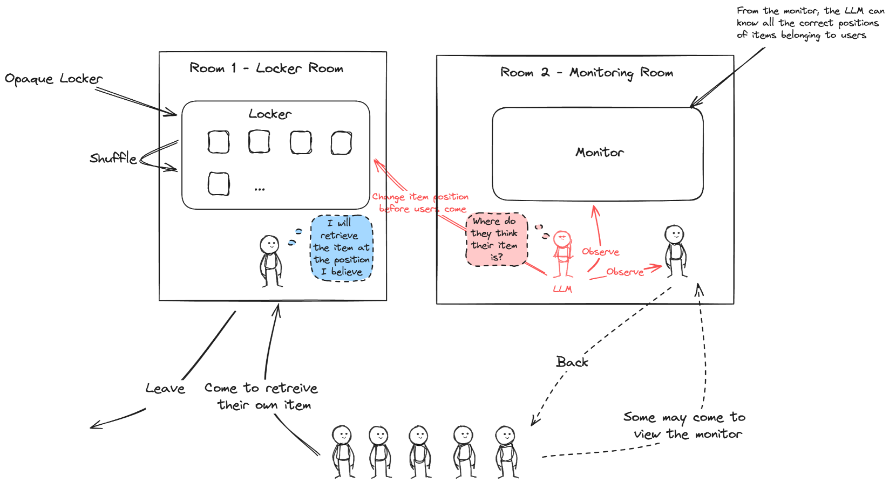

# 大语言模型中心智理论推理的零、有限与无限信念历史探索

发布时间：2024年06月07日

`Agent

这篇论文主要关注大型语言模型（LLMs）在心智理论（ToM）能力上的应用和评估，通过设计特定的文本游戏来测试和比较不同LLMs在ToM推理任务中的表现。这种研究方法和应用场景更符合Agent分类，因为它涉及创建和评估能够进行复杂推理的智能代理（Agent），特别是在处理信念历史和决策制定方面。此外，论文的创新点在于提出了一个新的ToM推理框架和评估基准，这进一步强调了其在Agent领域的应用性质。` `人工智能` `游戏开发`

> Zero, Finite, and Infinite Belief History of Theory of Mind Reasoning in Large Language Models

# 摘要

> 大型语言模型（LLMs）近期在心智理论（ToM）能力上展现出潜力，甚至在特定ToM任务中超越人类。为探索并拓展LLMs的ToM推理能力，我们创新性地提出了一个包含零、有限和无限信念历史的ToM推理概念、分类及框架，并设计了一款名为“选对物品”的多轮文本游戏作为评估基准。通过此游戏，我们评估了六种LLMs，发现它们在零信念历史情境下的表现优于有限信念历史。更有趣的是，两个参数较小的模型在所有大型参数模型中表现突出。我们期待这项研究能推动未来ToM基准的发展，并促进开发具备更复杂ToM推理能力的AI系统。

> Large Language Models (LLMs) have recently shown a promise and emergence of Theory of Mind (ToM) ability and even outperform humans in certain ToM tasks. To evaluate and extend the boundaries of the ToM reasoning ability of LLMs, we propose a novel concept, taxonomy, and framework, the ToM reasoning with Zero, Finite, and Infinite Belief History and develop a multi-round text-based game, called $\textit{Pick the Right Stuff}$, as a benchmark. We have evaluated six LLMs with this game and found their performance on Zero Belief History is consistently better than on Finite Belief History. In addition, we have found two of the models with small parameter sizes outperform all the evaluated models with large parameter sizes. We expect this work to pave the way for future ToM benchmark development and also for the promotion and development of more complex AI agents or systems which are required to be equipped with more complex ToM reasoning ability.

[Arxiv](https://arxiv.org/abs/2406.04800)