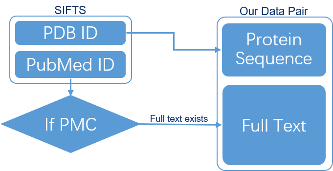
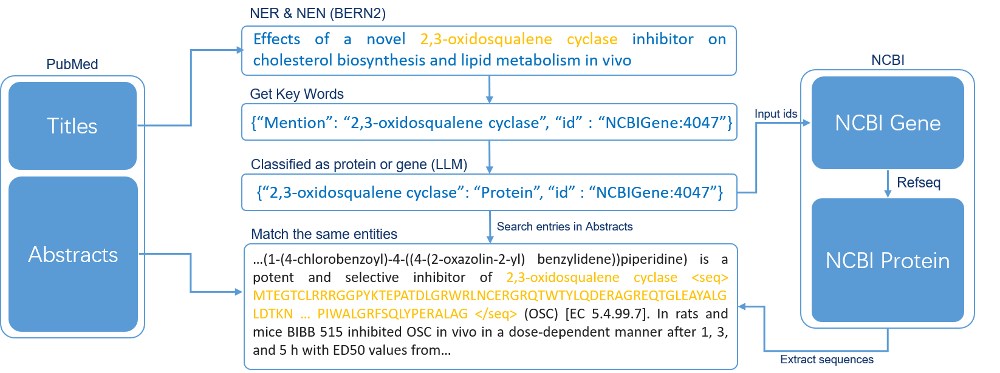
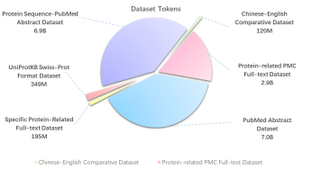
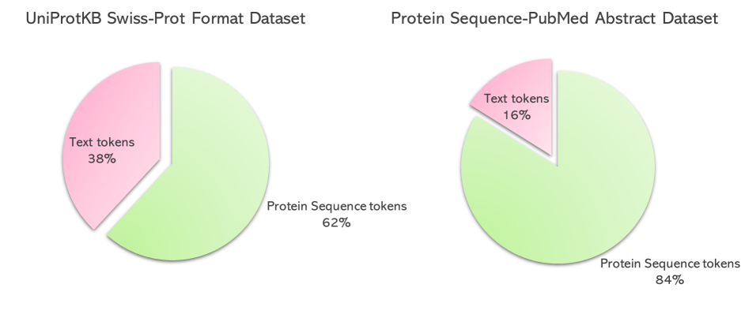
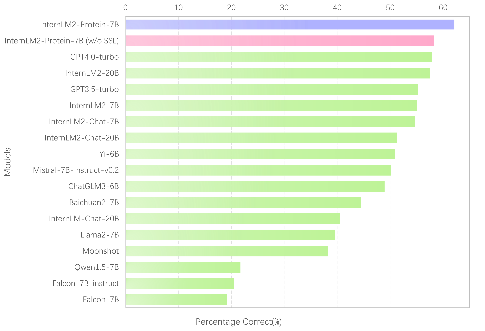

# 针对大型语言模型在蛋白质理解领域的微调数据集与基准评估

发布时间：2024年06月08日

`LLM应用

这篇论文主要探讨了如何将大型语言模型（LLMs）应用于蛋白质序列的理解，通过创建专门的数据集（ProteinLMDataset）和基准测试（ProteinLMBench）来评估和提升LLMs在蛋白质领域的理解能力。这种方法和应用场景直接关联到LLMs的具体应用，因此属于LLM应用分类。` `生物信息学` `蛋白质研究`

> A Fine-tuning Dataset and Benchmark for Large Language Models for Protein Understanding

# 摘要

> 蛋白质序列与自然语言的序列结构相似性启发了将大型语言模型（LLMs）用于蛋白质理解的研究。尽管LLMs在NLP领域表现出色，但其在蛋白质序列理解上的有效性仍存疑，主要原因是缺乏将蛋白质序列与描述性文本关联的数据集。为此，研究者尝试将蛋白质序列编码器与预训练的LLMs结合，以适应蛋白质理解。但这一尝试引发了一个核心问题：“专为NLP设计的LLMs能否有效理解蛋白质序列？”现有数据集因缺乏蛋白质序列与其文本描述的直接关联，难以有效训练和评估LLMs的蛋白质理解能力。为此，我们推出了ProteinLMDataset，专为LLMs的预训练和微调设计，以增强其对蛋白质序列的理解。该数据集包含174.6亿预训练令牌和893,000条微调指令。同时，我们发布了ProteinLMBench，首个包含944个手动验证的多项选择题的基准数据集，用于评估LLMs的蛋白质理解能力，涵盖多种语言的蛋白质相关细节和序列。经过ProteinLMDataset预训练和微调的InternLM2-7B在ProteinLMBench上超越了GPT-4，达到了最高准确率。数据集和基准可在https://huggingface.co/datasets/tsynbio/ProteinLMBench获取。

> The parallels between protein sequences and natural language in their sequential structures have inspired the application of large language models (LLMs) to protein understanding. Despite the success of LLMs in NLP, their effectiveness in comprehending protein sequences remains an open question, largely due to the absence of datasets linking protein sequences to descriptive text. Researchers have then attempted to adapt LLMs for protein understanding by integrating a protein sequence encoder with a pre-trained LLM. However, this adaptation raises a fundamental question: "Can LLMs, originally designed for NLP, effectively comprehend protein sequences as a form of language?" Current datasets fall short in addressing this question due to the lack of a direct correlation between protein sequences and corresponding text descriptions, limiting the ability to train and evaluate LLMs for protein understanding effectively. To bridge this gap, we introduce ProteinLMDataset, a dataset specifically designed for further self-supervised pretraining and supervised fine-tuning (SFT) of LLMs to enhance their capability for protein sequence comprehension. Specifically, ProteinLMDataset includes 17.46 billion tokens for pretraining and 893,000 instructions for SFT. Additionally, we present ProteinLMBench, the first benchmark dataset consisting of 944 manually verified multiple-choice questions for assessing the protein understanding capabilities of LLMs. ProteinLMBench incorporates protein-related details and sequences in multiple languages, establishing a new standard for evaluating LLMs' abilities in protein comprehension. The large language model InternLM2-7B, pretrained and fine-tuned on the ProteinLMDataset, outperforms GPT-4 on ProteinLMBench, achieving the highest accuracy score. The dataset and the benchmark are available at https://huggingface.co/datasets/tsynbio/ProteinLMBench.

[Arxiv](https://arxiv.org/abs/2406.05540)