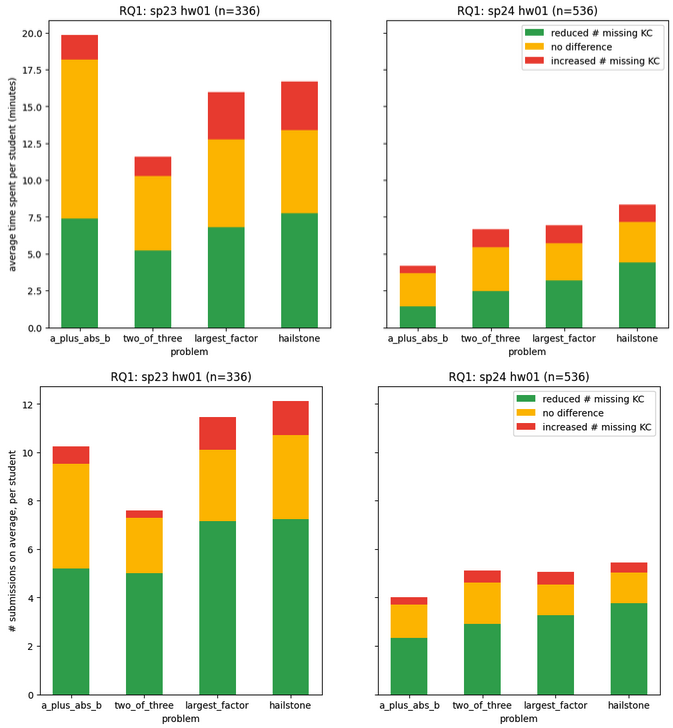
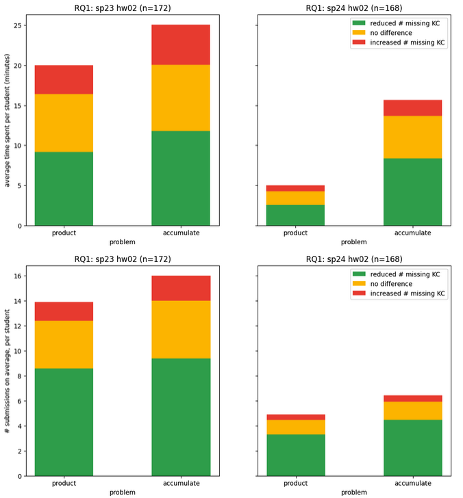
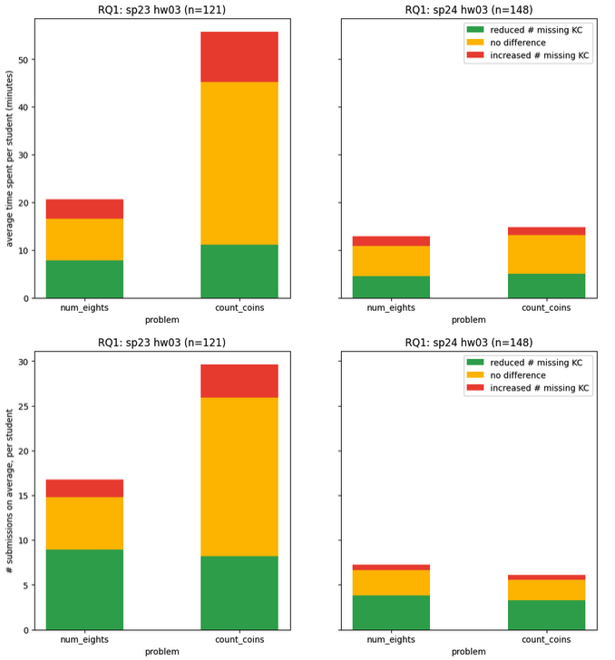
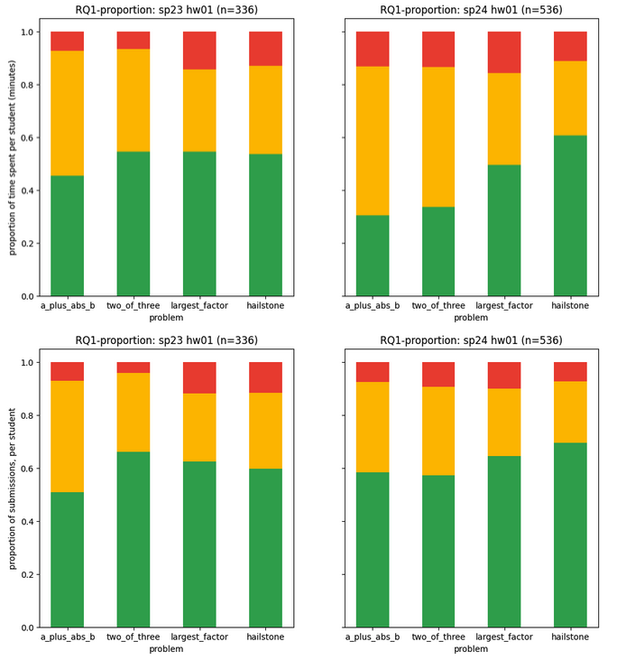
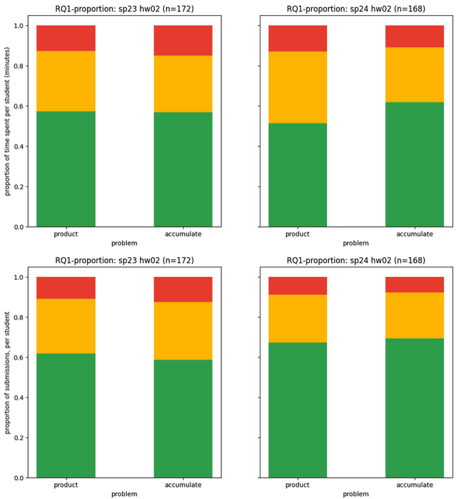
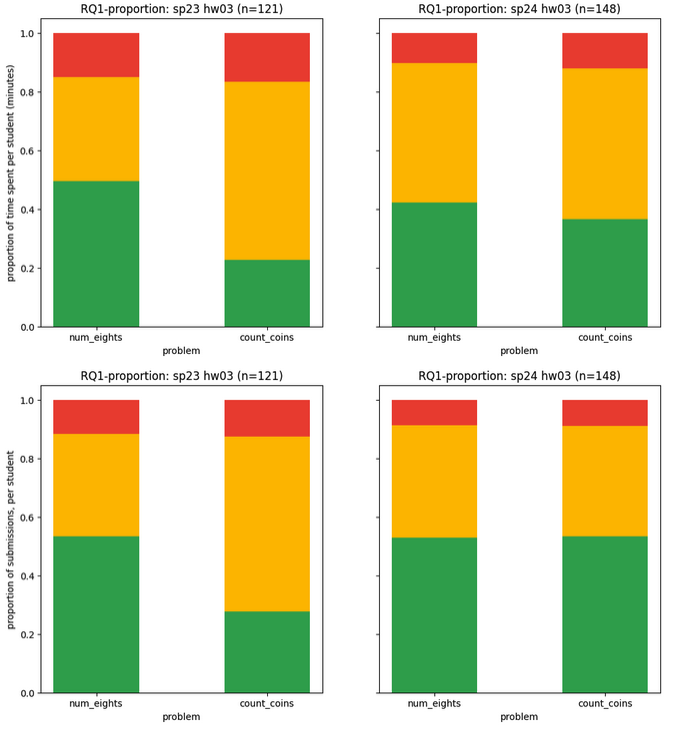
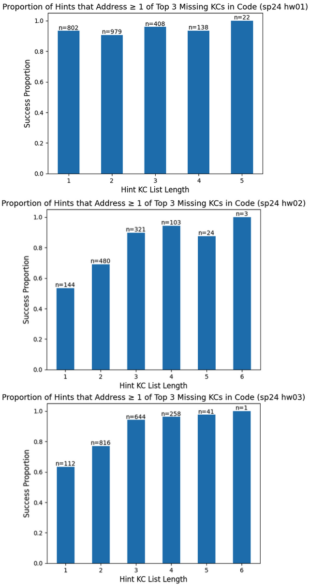
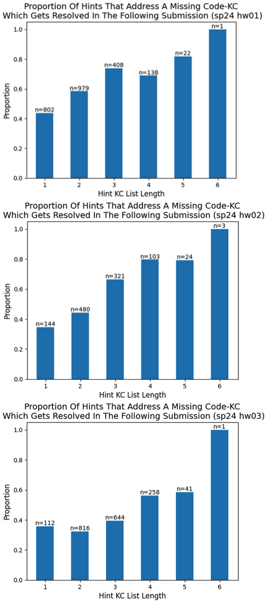

# 基于知识组件的方法论：评估AI助手的有效途径

发布时间：2024年06月08日

`Agent

理由：这篇论文描述了一个基于GPT-4的自动提示系统，该系统针对CS1编程作业提供自然语言指导，帮助学生改进错误代码。这个系统可以被视为一个智能代理（Agent），因为它能够根据学生的需求（测试失败时）提供帮助，并评估其对学生代码质量的影响。这种类型的研究通常关注于如何设计和评估智能系统在特定任务中的表现，特别是在教育领域的应用，因此更适合归类为Agent。` `编程教学`

> A Knowledge-Component-Based Methodology for Evaluating AI Assistants

# 摘要

> 我们评估了一个基于GPT-4的自动提示系统，该系统为CS1编程作业提供自然语言指导，帮助学生改进错误代码。每当学生遇到测试失败，即可获取提示。我们的研究围绕三个关键问题展开：RQ1：提示是否有效提升学生代码质量？RQ2：提示在识别学生代码问题上的效果如何？RQ3：学生实际解决的问题与提示中指出的问题是否一致？通过分析两门CS1课程的数据，我们发现，提示不仅加速了问题解决，还能准确捕捉关键错误，尤其是那些同时解决多个问题的提示，更能直接推动学生的进步。

> We evaluate an automatic hint generator for CS1 programming assignments powered by GPT-4, a large language model. This system provides natural language guidance about how students can improve their incorrect solutions to short programming exercises. A hint can be requested each time a student fails a test case. Our evaluation addresses three Research Questions:
  RQ1: Do the hints help students improve their code? RQ2: How effectively do the hints capture problems in student code? RQ3: Are the issues that students resolve the same as the issues addressed in the hints?
  To address these research questions quantitatively, we identified a set of fine-grained knowledge components and determined which ones apply to each exercise, incorrect solution, and generated hint. Comparing data from two large CS1 offerings, we found that access to the hints helps students to address problems with their code more quickly, that hints are able to consistently capture the most pressing errors in students' code, and that hints that address a few issues at once rather than a single bug are more likely to lead to direct student progress.

[Arxiv](https://arxiv.org/abs/2406.05603)