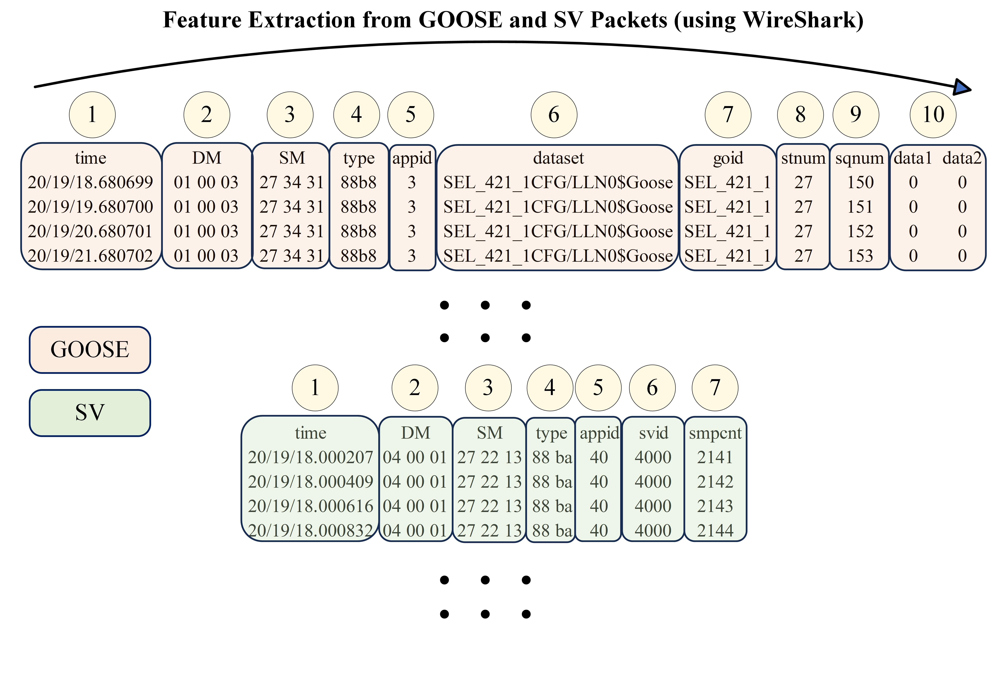
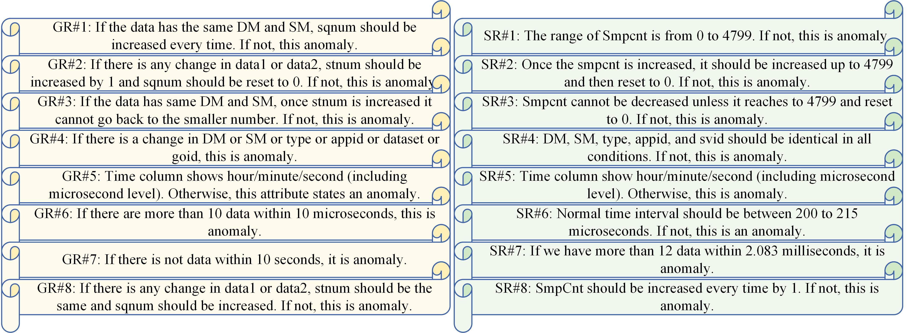
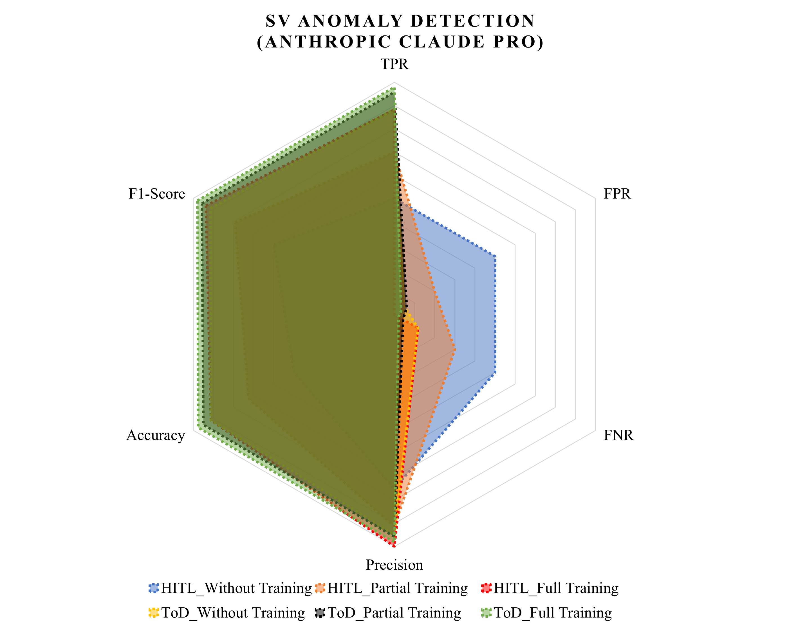
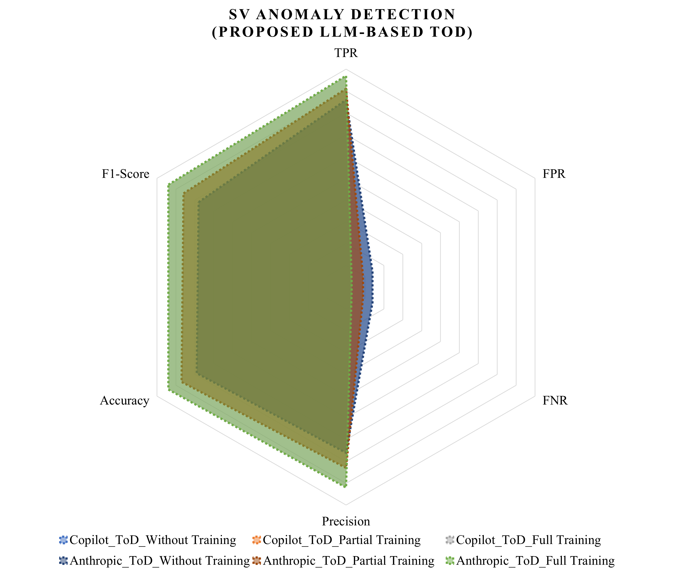
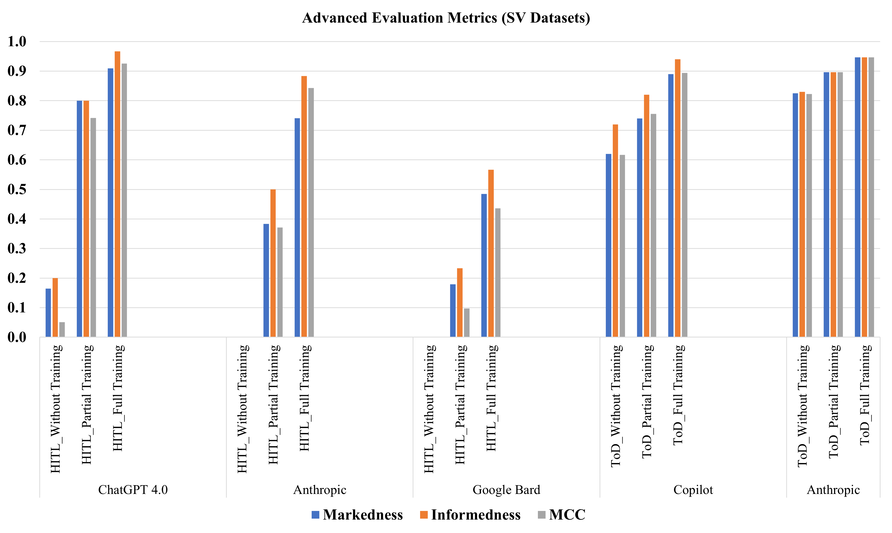
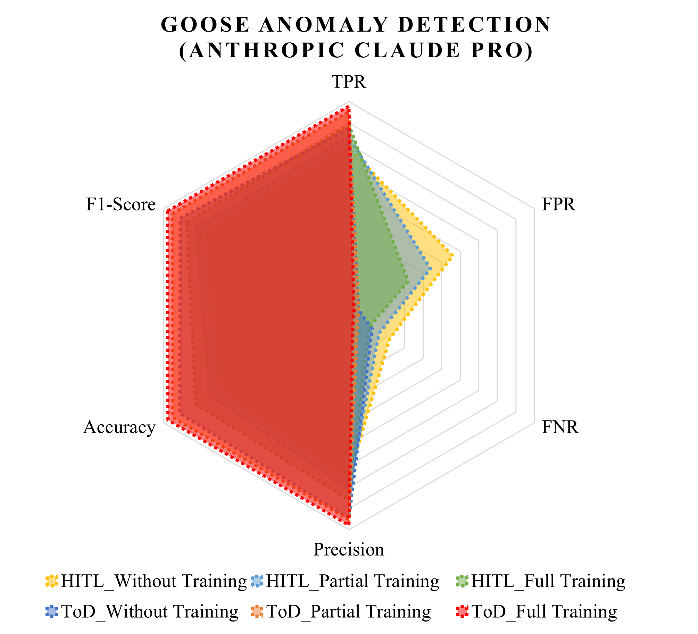
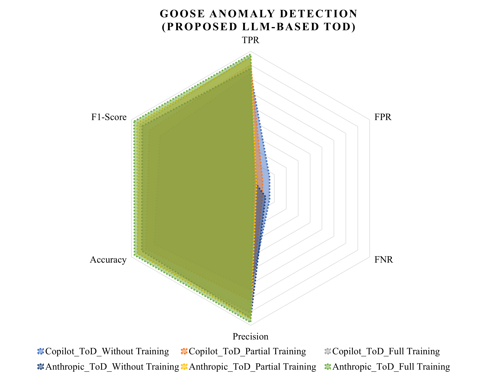
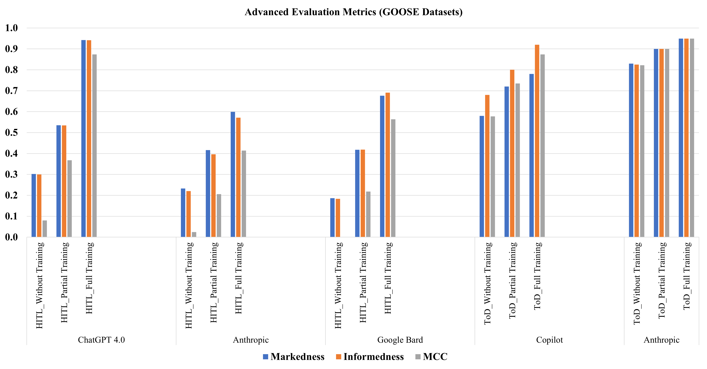
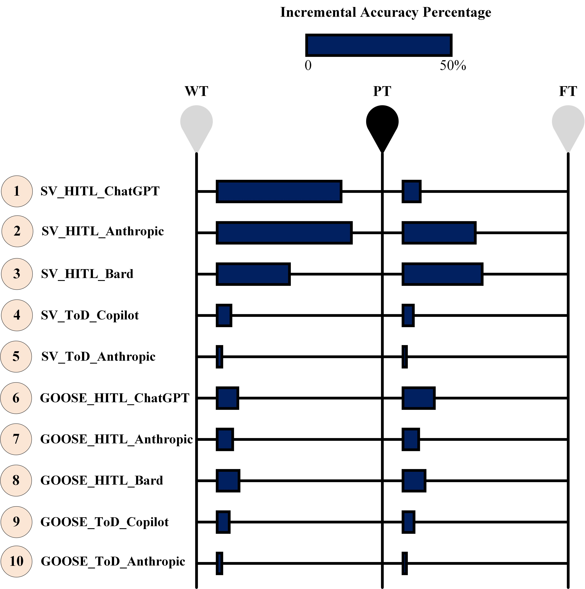

# 智能电网通信中多播消息异常检测的新型生成式AI框架

发布时间：2024年06月08日

`Agent

理由：这篇论文介绍了一种基于大型语言模型的任务导向对话系统，专门设计用于检测数字变电站中的网络安全异常。这种系统可以被视为一个智能代理（Agent），因为它能够自主地执行任务（检测异常）并作出决策。此外，该系统通过与环境的交互（检测多播消息的异常）来实现其目标，这是代理的一个关键特征。因此，这篇论文更适合归类为Agent。` `电力系统` `网络安全`

> A Novel Generative AI-Based Framework for Anomaly Detection in Multicast Messages in Smart Grid Communications

# 摘要

> 数字变电站的网络安全漏洞对电力系统的稳定性和可靠性构成严峻挑战。为此，本文提出了一种基于大型语言模型的任务导向对话系统，专门用于检测数字变电站中多播消息（如GOOSE和SV）的异常。该系统相比依赖人类网络安全指南的HITL过程，展现出更低的错误率、更佳的扩展性和适应性。与传统的机器学习方法相比，该方法在应对新型网络威胁时更为高效，因为它保持了模型的复杂性和精度，并实现了快速部署。通过采用标准和先进的性能评估指标，本文对提出的异常检测框架与HITL过程进行了全面比较。为获取IEC 61850通信数据集，本文还采用了硬件在环测试平台。

> Cybersecurity breaches in digital substations can pose significant challenges to the stability and reliability of power system operations. To address these challenges, defense and mitigation techniques are required. Identifying and detecting anomalies in information and communication technology (ICT) is crucial to ensure secure device interactions within digital substations. This paper proposes a task-oriented dialogue (ToD) system for anomaly detection (AD) in datasets of multicast messages e.g., generic object oriented substation event (GOOSE) and sampled value (SV) in digital substations using large language models (LLMs). This model has a lower potential error and better scalability and adaptability than a process that considers the cybersecurity guidelines recommended by humans, known as the human-in-the-loop (HITL) process. Also, this methodology significantly reduces the effort required when addressing new cyber threats or anomalies compared with machine learning (ML) techniques, since it leaves the models complexity and precision unaffected and offers a faster implementation. These findings present a comparative assessment, conducted utilizing standard and advanced performance evaluation metrics for the proposed AD framework and the HITL process. To generate and extract datasets of IEC 61850 communications, a hardware-in-the-loop (HIL) testbed was employed.

[Arxiv](https://arxiv.org/abs/2406.05472)