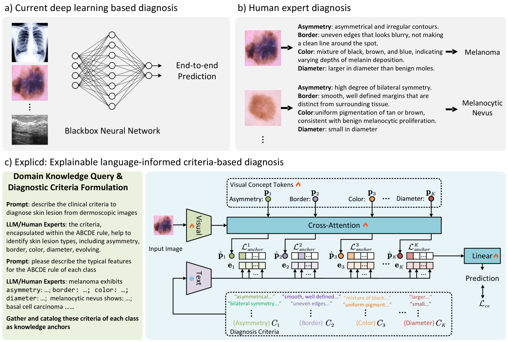
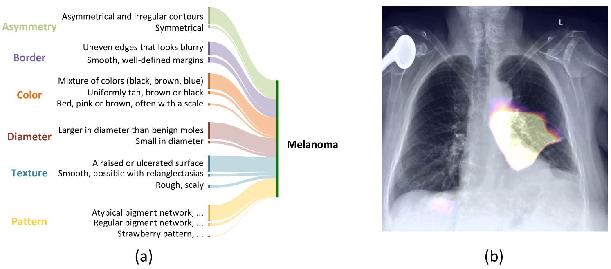

# 融合人类知识与视觉概念，探索医学图像分类的可解释之路

发布时间：2024年06月08日

`Agent

这篇论文介绍了一种名为Explicd的可解释模型，它结合了领域知识来模拟人类专家的决策过程，并应用于临床诊断中。该模型从大型语言模型（LLMs）或专家那里获取知识，并将其转化为知识锚点，以帮助学习医学图像中的视觉概念。这种模型可以被视为一个智能Agent，因为它能够处理输入数据（医学图像），并基于其内部的知识和决策过程产生输出（诊断结果）。因此，这篇论文属于Agent分类。` `图像识别`

> Aligning Human Knowledge with Visual Concepts Towards Explainable Medical Image Classification

# 摘要

> 在临床诊断中，模型的可解释性至关重要，然而多数深度学习模型仍如黑箱般，不揭示其决策过程。本研究开发了一种可解释模型——Explicd，它融合了明确的诊断标准领域知识，模拟人类专家的决策过程。Explicd首先从LLMs或专家处获取知识，确立跨多维度的诊断标准。借助预训练的视觉-语言模型，它将这些标准转化为知识锚点，助力医学图像中视觉概念的学习。诊断结果依据视觉与文本标准的相似度得出。经过五大医学图像分类基准的验证，Explicd不仅展现了其可解释性，还提升了分类性能，超越了传统黑盒模型。

> Although explainability is essential in the clinical diagnosis, most deep learning models still function as black boxes without elucidating their decision-making process. In this study, we investigate the explainable model development that can mimic the decision-making process of human experts by fusing the domain knowledge of explicit diagnostic criteria. We introduce a simple yet effective framework, Explicd, towards Explainable language-informed criteria-based diagnosis. Explicd initiates its process by querying domain knowledge from either large language models (LLMs) or human experts to establish diagnostic criteria across various concept axes (e.g., color, shape, texture, or specific patterns of diseases). By leveraging a pretrained vision-language model, Explicd injects these criteria into the embedding space as knowledge anchors, thereby facilitating the learning of corresponding visual concepts within medical images. The final diagnostic outcome is determined based on the similarity scores between the encoded visual concepts and the textual criteria embeddings. Through extensive evaluation of five medical image classification benchmarks, Explicd has demonstrated its inherent explainability and extends to improve classification performance compared to traditional black-box models.

[Arxiv](https://arxiv.org/abs/2406.05596)