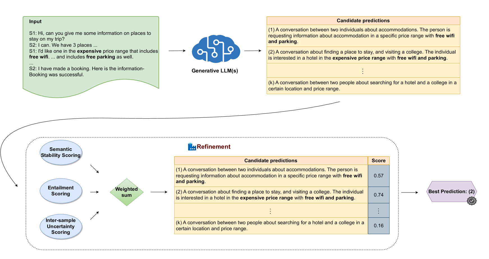
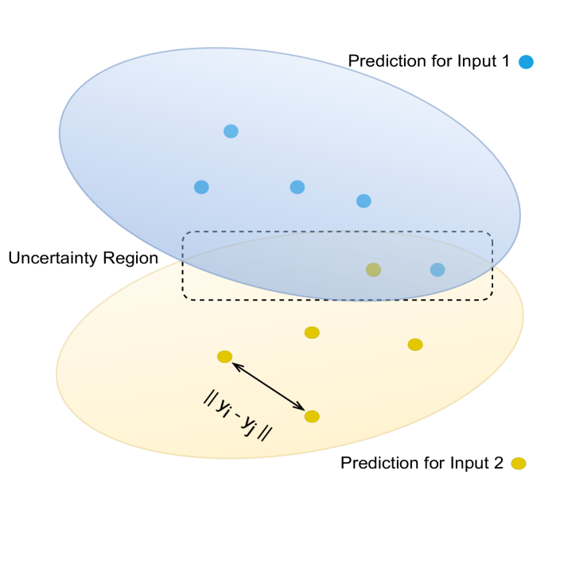
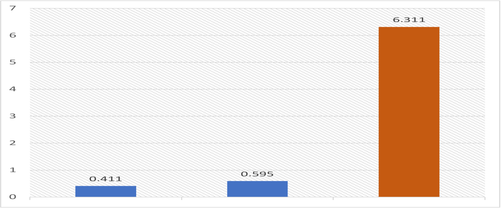
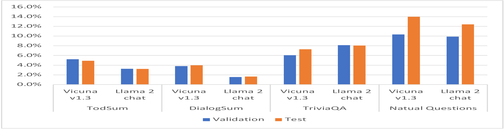
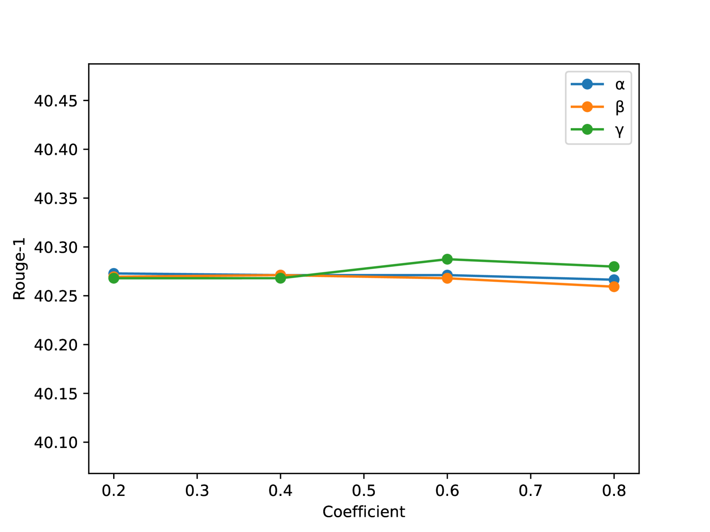
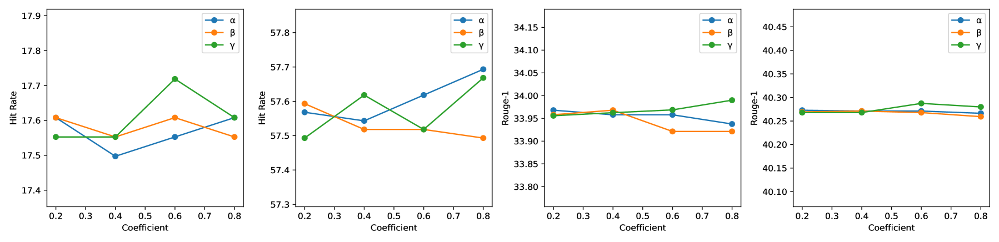

# CERET：文本生成的高效外在精炼策略

发布时间：2024年06月08日

`LLM应用

这篇论文摘要描述了一种名为CERET的新方法，用于优化大型语言模型（LLMs）的文本生成质量。该方法通过评估语义稳定性、蕴含关系及样本间的不确定性来实现这一目标。论文中提到的实验结果显示，CERET在摘要生成和问答任务等多种场景下均优于现有的自一致性和自重排基线，同时具有更低的延迟和更高的经济效益。这表明论文主要关注的是LLM在实际应用中的性能提升，因此属于LLM应用分类。` `文本生成`

> CERET: Cost-Effective Extrinsic Refinement for Text Generation

# 摘要

> 大型语言模型（LLMs）虽在生成任务中表现出色，但初次尝试往往难以产出高质量内容。除了传统的模型微调，提升预测质量的方法多依赖于LLM的自省与自我提升，通过模型自身的反馈进行优化。然而，这些方法虽有效，却因高昂的计算成本和有限的扩展性而受限。为此，我们开发了CERET方法，它通过评估语义稳定性、蕴含关系及样本间的不确定性来优化文本生成。实验数据显示，CERET在多种任务场景下均超越了自一致性和自重排基线，例如在摘要生成中Rouge-1提升了约1.6%，问答任务中命中率提高了约3.5%。相较于LLM自重排技术，CERET不仅延迟减少了90.6%，而且更具经济效益。

> Large Language Models (LLMs) are powerful models for generation tasks, but they may not generate good quality outputs in their first attempt. Apart from model fine-tuning, existing approaches to improve prediction accuracy and quality typically involve LLM self-improvement / self-reflection that incorporate feedback from models themselves. Despite their effectiveness, these methods are hindered by their high computational cost and lack of scalability. In this work, we propose CERET, a method for refining text generations by considering semantic stability, entailment and inter-sample uncertainty measures. Experimental results show that CERET outperforms Self-consistency and Self-rerank baselines consistently under various task setups, by ~1.6% in Rouge-1 for abstractive summarization and ~3.5% in hit rate for question answering. Compared to LLM Self-rerank method, our approach only requires 9.4% of its latency and is more cost-effective.

[Arxiv](https://arxiv.org/abs/2406.05588)