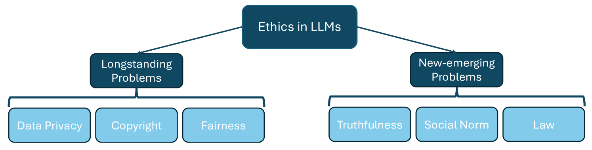
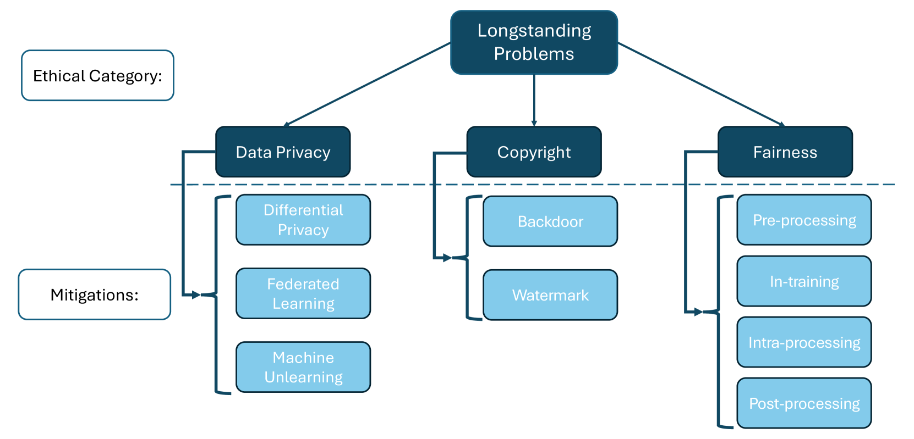
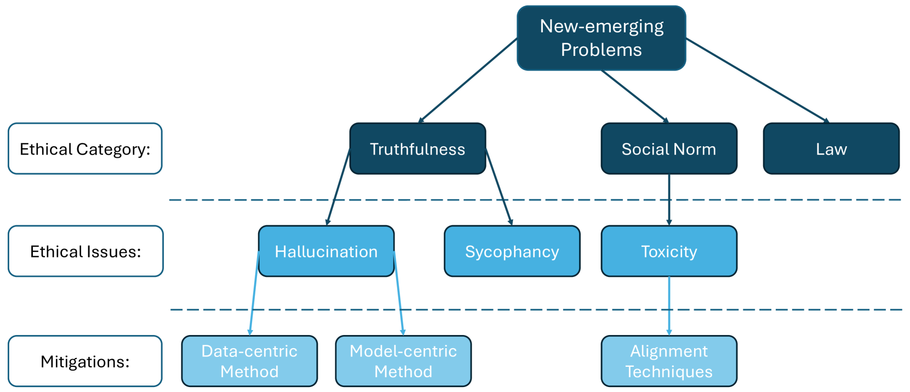

# 探索大型语言模型的伦理边界：从传统难题到新兴挑战

发布时间：2024年06月08日

`LLM理论

这篇论文主要探讨了大型语言模型（LLMs）在伦理方面的挑战，包括版权侵犯、系统性偏见、数据隐私等问题，以及如何通过批判性分析现有研究来洞察、评估并缓解这些伦理风险。这些内容更多地涉及LLMs的理论和伦理层面，而不是具体的应用、代理（Agent）或检索增强生成（RAG）技术。因此，将其归类为LLM理论是合适的。` `语言模型`

> Deconstructing The Ethics of Large Language Models from Long-standing Issues to New-emerging Dilemmas

# 摘要

> 近年来，大型语言模型（LLMs）在语言建模领域取得了辉煌成就，但伴随而来的伦理问题也日益凸显，限制了其在日常生活中的应用。本文深入探讨了LLMs面临的伦理挑战，涵盖了版权侵犯、系统性偏见、数据隐私等老问题，以及真实性和社会规范等新问题。我们通过批判性分析现有研究，旨在洞察、评估并缓解这些伦理风险。本研究强调，在LLMs的开发过程中必须融入伦理标准和社会价值观，以引导我们构建既负责任又符合伦理的语言模型。

> Large Language Models (LLMs) have achieved unparalleled success across diverse language modeling tasks in recent years. However, this progress has also intensified ethical concerns, impacting the deployment of LLMs in everyday contexts. This paper provides a comprehensive survey of ethical challenges associated with LLMs, from longstanding issues such as copyright infringement, systematic bias, and data privacy, to emerging problems like truthfulness and social norms. We critically analyze existing research aimed at understanding, examining, and mitigating these ethical risks. Our survey underscores integrating ethical standards and societal values into the development of LLMs, thereby guiding the development of responsible and ethically aligned language models.

[Arxiv](https://arxiv.org/abs/2406.05392)