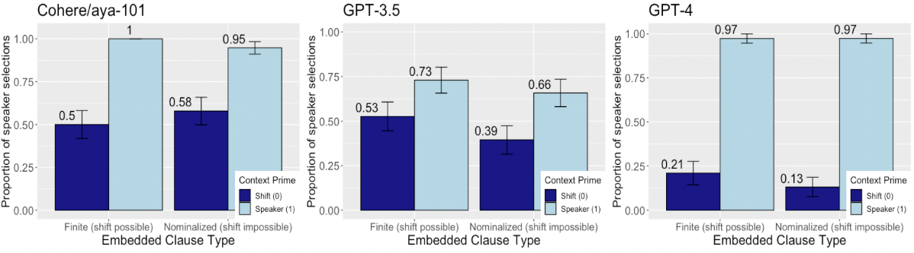

# 在“我”非我之时，LLMs 能否识我：探究 LLMs 在指示词转换背景下对土耳其指示代词的理解能力

发布时间：2024年06月08日

`LLM应用

这篇论文关注的是大型语言模型（LLMs）在特定语言（土耳其语）中的应用问题，特别是在处理指示性转移这一语法难题时的表现。研究通过创建一个专为评估LLMs在少量样本环境下的表现而设计的土耳其语数据集，并评估了多个LLMs模型在此数据集上的表现。这表明研究的重点是如何应用现有的LLMs技术来解决特定语言中的具体问题，因此属于LLM应用分类。` `语言学` `机器翻译`

> Do LLMs Recognize me, When I is not me: Assessment of LLMs Understanding of Turkish Indexical Pronouns in Indexical Shift Contexts

# 摘要

> 大型语言模型（LLMs）在机器翻译、文本摘要、问答和复杂数学问题解决等任务中表现出色，但主要依赖英语等数据丰富的语言进行训练，导致在低资源语言上的表现受限。本研究聚焦于土耳其语中的指示性转移问题，这是一个在英语等高资源语言中不存在的语法难题，涉及在特定语境中解析代词。我们首次探索了这一问题，并发布了一个专为评估LLMs在少量样本环境下的表现而设计的土耳其语数据集。该数据集包含156个附有详尽语言学信息的多项选择题。我们评估了包括GPT-4、GPT-3.5、Cohere-AYA、Trendyol-LLM和Turkcell-LLM在内的多语言LLMs。结果显示，即便是最先进的模型如GPT-4，在处理土耳其语中指示性转移的语法细节时也仅达到中等水平。这凸显了针对低资源语言的语法挑战进行深入研究的重要性。数据集和代码已公开发布。

> Large language models (LLMs) have shown impressive capabilities in tasks such as machine translation, text summarization, question answering, and solving complex mathematical problems. However, their primary training on data-rich languages like English limits their performance in low-resource languages. This study addresses this gap by focusing on the Indexical Shift problem in Turkish. The Indexical Shift problem involves resolving pronouns in indexical shift contexts, a grammatical challenge not present in high-resource languages like English. We present the first study examining indexical shift in any language, releasing a Turkish dataset specifically designed for this purpose. Our Indexical Shift Dataset consists of 156 multiple-choice questions, each annotated with necessary linguistic details, to evaluate LLMs in a few-shot setting. We evaluate recent multilingual LLMs, including GPT-4, GPT-3.5, Cohere-AYA, Trendyol-LLM, and Turkcell-LLM, using this dataset. Our analysis reveals that even advanced models like GPT-4 struggle with the grammatical nuances of indexical shift in Turkish, achieving only moderate performance. These findings underscore the need for focused research on the grammatical challenges posed by low-resource languages. We released the dataset and code \href{https://anonymous.4open.science/r/indexical_shift_llm-E1B4} {here}.

[Arxiv](https://arxiv.org/abs/2406.05569)