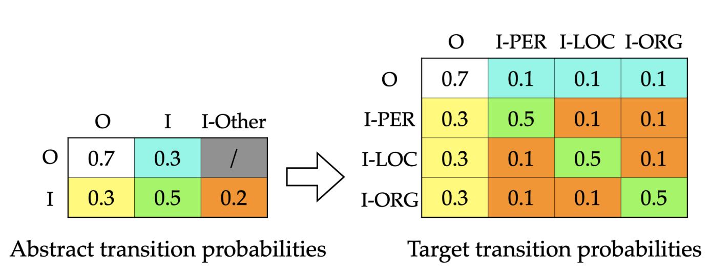
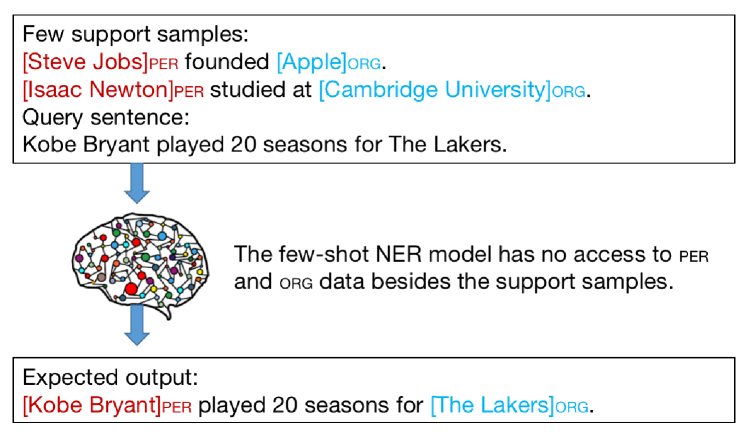
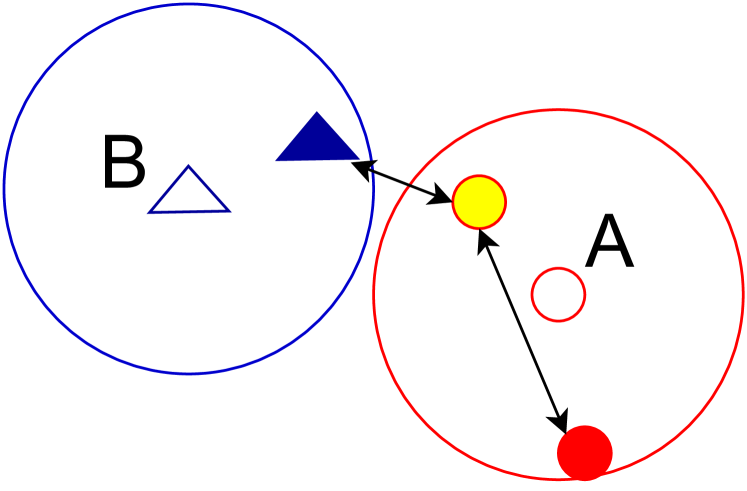
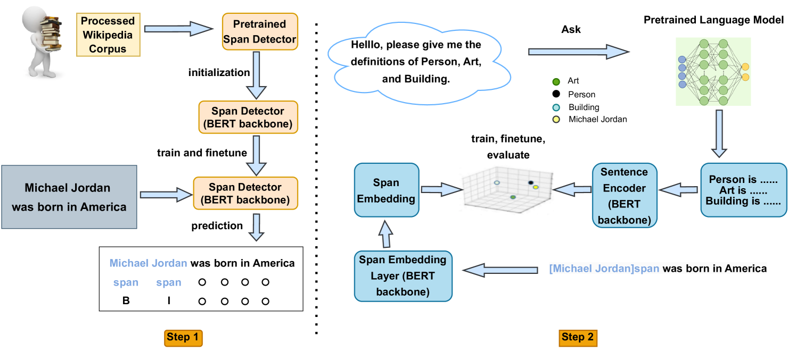
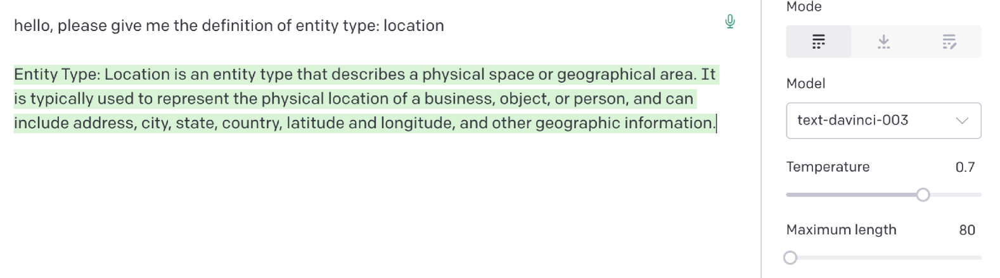
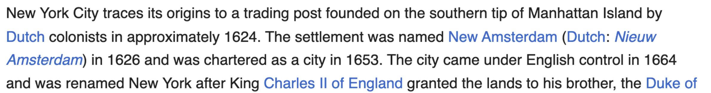
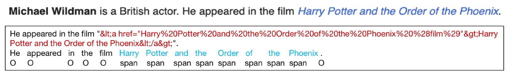
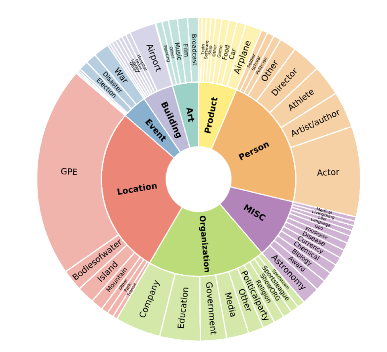

# 解决少样本命名实体识别中的重复训练与样本依赖难题

发布时间：2024年06月08日

`LLM应用

这篇论文介绍了一种新的少样本命名实体识别（NER）系统，该系统利用预训练的跨度检测器和大型语言模型（LLM）来减少对大量手动标注数据的依赖，并提高实体类型分类的可靠性。这种方法在减少训练和标注数据的同时，提升了系统性能，超越了现有的基线模型，如ChatGPT。因此，这篇论文属于LLM应用类别，因为它展示了如何将LLM技术应用于具体的NLP任务中，即命名实体识别。` `机器学习`

> Fighting Against the Repetitive Training and Sample Dependency Problem in Few-shot Named Entity Recognition

# 摘要

> 少样本命名实体识别（NER）系统通过少量标注样本来识别实体，其核心包括跨度检测器和实体类型分类器。现有系统依赖大量手动标注，且需重复训练基本特征。我们提出的新方法首先使用预训练的跨度检测器，减少重复训练；其次，利用大型语言模型（LLM）确保实体类型参照的可靠性，摆脱对有限样本的依赖。实验证明，我们的模型在减少训练和标注数据的情况下，性能超越了包括ChatGPT在内的基线。我们将公开相关代码、数据集及模型输出。

> Few-shot named entity recognition (NER) systems recognize entities using a few labeled training examples. The general pipeline consists of a span detector to identify entity spans in text and an entity-type classifier to assign types to entities. Current span detectors rely on extensive manual labeling to guide training. Almost every span detector requires initial training on basic span features followed by adaptation to task-specific features. This process leads to repetitive training of the basic span features among span detectors. Additionally, metric-based entity-type classifiers, such as prototypical networks, typically employ a specific metric that gauges the distance between the query sample and entity-type referents, ultimately assigning the most probable entity type to the query sample. However, these classifiers encounter the sample dependency problem, primarily stemming from the limited samples available for each entity-type referent. To address these challenges, we proposed an improved few-shot NER pipeline. First, we introduce a steppingstone span detector that is pre-trained on open-domain Wikipedia data. It can be used to initialize the pipeline span detector to reduce the repetitive training of basic features. Second, we leverage a large language model (LLM) to set reliable entity-type referents, eliminating reliance on few-shot samples of each type. Our model exhibits superior performance with fewer training steps and human-labeled data compared with baselines, as demonstrated through extensive experiments on various datasets. Particularly in fine-grained few-shot NER settings, our model outperforms strong baselines, including ChatGPT. We will publicly release the code, datasets, LLM outputs, and model checkpoints.

[Arxiv](https://arxiv.org/abs/2406.05460)